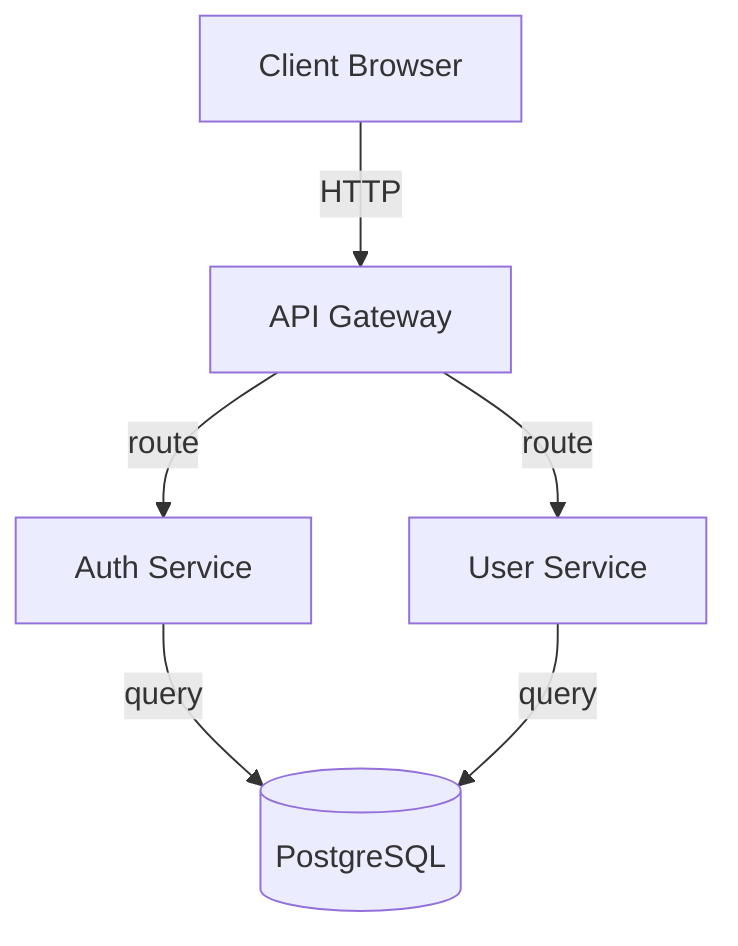
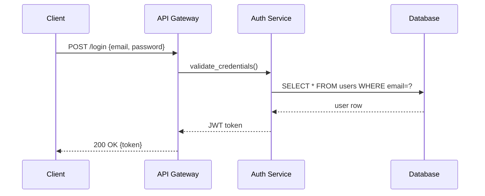

# Code-to-Docs: Shared Reference & Templates

This file defines shared conventions, templates, and standards used by all code-to-docs skill files.
It is NOT a command itself — it is referenced by the Phase 1 and Phase 2 skills.

---

## Output Folder Structure

```
course/
  00-index.json              # Machine-readable metadata: modules, deps, complexity, timestamps
  01-overview.md             # Level 1: Executive overview — what, why, who
  02-architecture.md         # System architecture + diagrams + knowledge graph
  modules/
    01-<module-name>.md      # One file per module, numbered for reading order
    02-<module-name>.md
    ...
  flows/
    <flow-name>.md           # Cross-module trace-based flow explanations
  assets/
    theme.css                # Dark/light theme stylesheet (copy from templates/theme.css)
    viewer.html              # Interactive HTML viewer (copy from templates/viewer.html)
  .last-generation-sha       # Git SHA at last generation (for diff-aware re-runs)
```

---

## Code Reference Format

All code references MUST point to real, verified locations in the target repo.

```
Format:   relative/path/to/file.ext:LINE_NUMBER
Example:  src/services/auth.rs:42
```

- Always use paths relative to repo root
- Always verify the file exists before referencing it
- Always read the file to confirm line numbers
- When quoting code, copy the exact text from source — never paraphrase or fabricate
- When referencing functions, search for the exact signature first

---

## Complexity Tag Definitions

| Tag        | Criteria                                                                 |
|------------|--------------------------------------------------------------------------|
| Simple     | < 100 LOC, single responsibility, no external deps, straightforward     |
| Moderate   | 100–500 LOC, some dependencies, clear interfaces, well-bounded          |
| Complex    | 500+ LOC, multiple responsibilities, tricky state management            |
| Critical   | Performance-sensitive, security-sensitive, or failure = outage           |

---

## Multi-Audience Sections

Every module explanation MUST include three depth levels using collapsible sections:

```markdown
### Understanding [Topic]

**The Big Picture:** [1-2 sentence analogy-based explanation anyone can follow]

<details>
<summary>Intermediate: How it works</summary>

[Implementation details, key data structures, function relationships.
Include code references with real file paths and line numbers.]

</details>

<details>
<summary>Advanced: Under the hood</summary>

[Performance characteristics, concurrency model, edge cases,
design tradeoffs, failure modes. Reference specific code paths.]

</details>
```

---

## Interactive Visualization Elements

The course uses fenced code blocks with special language tags to embed interactive elements.
The `viewer.html` detects these blocks and renders them as rich, interactive JS components.

When generating markdown, use these block types INSTEAD OF ASCII diagrams.

**IMPORTANT:** All data inside these blocks MUST be valid JSON.

---

### 1. Architecture Diagram (`mermaid`)

Use for system architecture, component relationships, and high-level structure.
Mermaid.js renders these as interactive SVG diagrams with click-to-navigate and hover tooltips.

````markdown

````

- Use `click` directives to make nodes navigate to module pages
- Use standard Mermaid syntax: `graph TD`, `graph LR`, `subgraph`
- Supports: flowcharts, class diagrams, ER diagrams, state diagrams

---

### 2. Sequence Diagram (`mermaid` with `sequenceDiagram`)

Use for request flows, API interactions, and temporal processes.

````markdown

````

---

### 3. Dependency Graph (`dep-graph`)

Use for module dependency visualization. Renders as an interactive D3.js force-directed graph
with zoom/pan, hover highlighting, and click-to-navigate.

````markdown
```dep-graph
{
  "nodes": [
    {"id": "auth", "label": "Auth Service", "complexity": "complex", "file": "modules/01-auth.md"},
    {"id": "users", "label": "User Service", "complexity": "moderate", "file": "modules/02-users.md"},
    {"id": "db", "label": "PostgreSQL", "complexity": "critical", "file": null},
    {"id": "cache", "label": "Redis Cache", "complexity": "simple", "file": null}
  ],
  "edges": [
    {"source": "auth", "target": "db", "label": "queries"},
    {"source": "auth", "target": "cache", "label": "session store"},
    {"source": "users", "target": "db", "label": "CRUD"},
    {"source": "users", "target": "auth", "label": "token validation"}
  ]
}
```
````

- Nodes colored by complexity tag
- Hovering a node highlights its connections, dims everything else
- Clicking a node with a `file` navigates to that page

---

### 4. Animated Flow Trace (`flow-trace`)

Use for step-by-step request lifecycle walkthroughs. Renders as an animated component
with Next/Prev controls, highlighted lanes, and file references.

````markdown
```flow-trace
{
  "title": "Login Request Flow",
  "steps": [
    {
      "component": "Client",
      "action": "POST /api/login with {email, password}",
      "file": "src/routes/auth.rs:15",
      "detail": "The login_handler() extracts credentials from the JSON body"
    },
    {
      "component": "Auth Service",
      "action": "validate_credentials()",
      "file": "src/services/auth.rs:42",
      "detail": "Hashes the provided password with bcrypt and compares to stored hash"
    },
    {
      "component": "Database",
      "action": "SELECT * FROM users WHERE email = $1",
      "file": "src/db/users.rs:28",
      "detail": "Executes parameterized query via sqlx connection pool"
    },
    {
      "component": "Auth Service",
      "action": "generate_token()",
      "file": "src/services/auth.rs:89",
      "detail": "Creates a signed JWT with user_id claim and 24h expiry"
    }
  ]
}
```
````

- Each step highlights the active component lane
- File references are clickable
- Controls: Prev / Next / Play All / step counter

---

### 5. Group Chat Animation (`chat`)

Use to explain component interactions in a conversational, accessible way.
Renders as an iMessage-style chat with typing indicators and technical detail toggles.

````markdown
```chat
{
  "title": "Login Flow: Component Conversation",
  "participants": {
    "Client": {"color": "#4A90D9", "icon": "laptop"},
    "API Gateway": {"color": "#50C878", "icon": "server"},
    "Auth Service": {"color": "#FF6B6B", "icon": "shield"},
    "Database": {"color": "#FFB347", "icon": "database"}
  },
  "messages": [
    {"from": "Client", "text": "Hey API, I need to log in. Here are my credentials.", "technical": "POST /api/login {email: 'user@example.com', password: '***'}"},
    {"from": "API Gateway", "text": "Got it. Let me forward this to Auth.", "technical": "Routes to auth_handler via path matching"},
    {"from": "Auth Service", "text": "Let me check these credentials. DB, got a sec?", "technical": "validate_credentials() called at auth.rs:42"},
    {"from": "Database", "text": "Found the user. Here's their hashed password.", "technical": "SELECT * FROM users WHERE email=$1 — returns 1 row"},
    {"from": "Auth Service", "text": "Password matches! Here's a token.", "technical": "bcrypt::verify() succeeds, JWT signed with RS256"},
    {"from": "Client", "text": "Thanks! I'll use this token for future requests.", "technical": "Stores JWT in httpOnly cookie"}
  ]
}
```
````

- Messages appear one at a time with typing indicator animation
- Each bubble has a "Show Technical" toggle for the `technical` field
- "Show All" button to skip animation

---

### 6. Code Walkthrough (`code-walkthrough`)

Use for line-by-line explanation of important functions. Renders as a split-panel
with syntax-highlighted code on the left and step annotations on the right.

````markdown
```code-walkthrough
{
  "title": "Understanding the Auth Middleware",
  "language": "rust",
  "code": "pub async fn auth_middleware(\n    req: Request,\n    next: Next\n) -> Result<Response, AuthError> {\n    let token = req.headers()\n        .get(\"Authorization\")\n        .ok_or(AuthError::MissingToken)?;\n    \n    let claims = decode_jwt(token)\n        .map_err(|_| AuthError::InvalidToken)?;\n    \n    req.extensions_mut()\n        .insert(claims.user_id);\n    \n    Ok(next.run(req).await)\n}",
  "steps": [
    {"lines": [1, 2, 3, 4], "annotation": "The middleware takes the incoming request and the next handler in the chain. It returns either a valid response or an AuthError."},
    {"lines": [5, 6, 7], "annotation": "Extract the Authorization header. If missing, immediately return MissingToken error — the request never reaches the handler."},
    {"lines": [9, 10], "annotation": "Decode and verify the JWT. The decode_jwt function checks signature, expiry, and issuer claims."},
    {"lines": [12, 13], "annotation": "Attach the authenticated user_id to the request extensions. Downstream handlers can extract this without re-parsing the token."},
    {"lines": [15], "annotation": "Call the next handler. This is the 'chain of responsibility' pattern — if auth passes, the request continues normally."}
  ]
}
```
````

- Active step's lines get highlighted; non-active lines dimmed
- Code auto-scrolls to bring highlighted lines into view
- Syntax highlighting via Prism.js

---

### 7. Drag-and-Drop Matching (`drag-match`)

Use for practice exercises matching concepts to descriptions.
Supports both mouse drag and tap-to-place for mobile.

````markdown
```drag-match
{
  "title": "Match the Component to its Responsibility",
  "pairs": [
    {"concept": "auth_middleware()", "description": "Validates JWT tokens and attaches user identity to requests"},
    {"concept": "rate_limiter()", "description": "Tracks request counts per IP and returns 429 when exceeded"},
    {"concept": "connection_pool", "description": "Maintains reusable database connections to avoid per-request overhead"},
    {"concept": "event_bus", "description": "Decouples publishers from subscribers using async message passing"}
  ]
}
```
````

- Descriptions are shuffled randomly
- Correct match: green border + checkmark, locks in place
- Incorrect match: red flash, item returns
- Score display and Reset button

---

### 8. Spot-the-Bug (`spot-the-bug`)

Use for debugging exercises. Renders code with clickable lines.
Wrong guesses give progressive hints; correct guess reveals explanation.

````markdown
```spot-the-bug
{
  "title": "Find the Security Bug",
  "language": "rust",
  "code": "pub fn verify_admin(token: &str) -> bool {\n    let claims = decode_jwt(token).unwrap();\n    if claims.role == \"admin\" {\n        return true;\n    }\n    false\n}",
  "bug_lines": [2],
  "hints": [
    "What happens if the token is invalid or expired?",
    "The unwrap() will panic on invalid tokens — this is a denial-of-service vector"
  ],
  "explanation": "Line 2 uses unwrap() on JWT decoding. An attacker can send a malformed token to crash the server. Fix: use pattern matching or the ? operator to return an error instead of panicking."
}
```
````

- Each line is clickable
- Wrong click: red flash + next hint revealed
- Correct click: green highlight + confetti animation + explanation
- "Give Up" button to reveal answer

---

### 9. Complexity Heatmap (`complexity-heatmap`)

Use in architecture pages to visualize codebase structure by size and complexity.
Renders as a D3.js treemap with color-coded rectangles.

````markdown
```complexity-heatmap
{
  "title": "Codebase Complexity Map",
  "root": "src",
  "items": [
    {"path": "src/routes", "files": 8, "complexity": "simple", "loc": 450},
    {"path": "src/services/auth.rs", "files": 1, "complexity": "critical", "loc": 380},
    {"path": "src/services/users.rs", "files": 1, "complexity": "moderate", "loc": 220},
    {"path": "src/db", "files": 4, "complexity": "complex", "loc": 600},
    {"path": "src/middleware", "files": 3, "complexity": "moderate", "loc": 180},
    {"path": "src/config", "files": 2, "complexity": "simple", "loc": 90}
  ]
}
```
````

- Rectangle size = lines of code
- Color = complexity tag (uses `--tag-*` CSS vars)
- Hover: tooltip with path, file count, LOC
- Click: navigate to module page if mapped

---

### 10. Architecture Minimap (`arch-minimap`)

Use at the top of architecture pages. Renders as a small interactive SVG map
that highlights the current page's component.

````markdown
```arch-minimap
{
  "components": [
    {"id": "overview", "label": "Overview", "page": "01-overview.md", "x": 50, "y": 10},
    {"id": "api", "label": "API Layer", "page": "modules/01-api.md", "x": 50, "y": 30},
    {"id": "auth", "label": "Auth", "page": "modules/02-auth.md", "x": 25, "y": 55},
    {"id": "users", "label": "Users", "page": "modules/03-users.md", "x": 75, "y": 55},
    {"id": "db", "label": "Database", "page": "modules/04-db.md", "x": 50, "y": 80}
  ],
  "connections": [
    {"from": "api", "to": "auth"},
    {"from": "api", "to": "users"},
    {"from": "auth", "to": "db"},
    {"from": "users", "to": "db"}
  ]
}
```
````

- Coordinates are percentages (0–100)
- Current page's component highlighted with accent color + pulse animation
- Clicking any component navigates to its page

---

## Markdown-Only Fallback Elements

These elements work in plain markdown (GitHub, any reader) without the HTML viewer.
Use them alongside interactive blocks — they serve as the fallback.

### Quiz

```markdown
> **Quiz: [Topic Name]**
>
> Looking at `path/to/file.ext:LINE`, what happens when [scenario]?
>
> - A) [option]
> - B) [option]
> - C) [option]
>
> <details>
> <summary>Show Answer</summary>
>
> **B)** [Explanation referencing actual code behavior at the cited location]
>
> </details>
```

### Code Exploration Exercise

```markdown
> **Exercise: [Title]**
>
> **Starting point:** `path/to/file.ext:LINE`
>
> 1. Read the function `function_name()` and trace what happens when [input]
> 2. Follow the call chain to `path/to/other.ext:LINE`
> 3. What value does [variable] hold at line LINE?
>
> <details>
> <summary>Solution</summary>
>
> [Step-by-step walkthrough with real code references]
>
> </details>
```

### Debugging Challenge

```markdown
> **Debug Challenge: [Title]**
>
> The flow starting at `path/to/file.ext:LINE` has a subtle issue
> when [edge case scenario].
>
> **Your task:** Trace through the execution path and identify:
> 1. Where the bug manifests
> 2. Why it happens
> 3. How you would fix it
>
> <details>
> <summary>Walkthrough</summary>
>
> [Detailed trace with code references showing the issue]
>
> </details>
```

### Mini-Project

```markdown
> **Mini-Project: [Title]**
>
> **Goal:** [What to build/extend]
> **Starting point:** `path/to/file.ext:LINE`
> **Estimated complexity:** [Simple/Moderate/Complex]
>
> **Steps:**
> 1. [Step with file reference]
> 2. [Step with file reference]
> 3. [Step with file reference]
>
> **Hints:**
> <details>
> <summary>Hint 1</summary>
> [Hint referencing real code patterns in the repo]
> </details>
```

---

## Module File Template

Every generated module file MUST follow this structure:

```markdown
# [Module Name]

<!-- metadata: complexity=[Simple|Moderate|Complex|Critical] | files=N | last-generated=YYYY-MM-DD -->

## Purpose

[What this module does and WHY it exists — the problem it solves]

## Key Files

| File | Purpose |
|------|---------|
| `path/to/file.ext` | [Brief description] |

## Architecture

[Use a `mermaid` block showing internal module structure and connections to other modules]

## How It Works

### Understanding [Core Concept]

**The Big Picture:** [Analogy-based explanation]

<details>
<summary>Intermediate: How it works</summary>
[Implementation details with code refs]
</details>

<details>
<summary>Advanced: Under the hood</summary>
[Deep internals with code refs]
</details>

## Key Flows

[Use `flow-trace` blocks for important flows through this module]
[Use `chat` blocks to make flows accessible to beginners]

## Hot Paths

[Performance-critical sections marked and explained]

## Gotchas

- [Non-obvious behavior with code reference]

## Practice

[Use `drag-match` or `spot-the-bug` blocks for interactive exercises]
[Include at least one markdown quiz as fallback]

---
[< Previous: Module Name](./prev.md) | [Index](../01-overview.md) | [Next: Module Name >](./next.md)
```

---

## Navigation

Every course page must include:
- A breadcrumb or link back to `01-overview.md`
- Previous/Next module links at the bottom
- Cross-references to related modules where relevant

---

## Asset Generation

After generating all course content, create `course/assets/` with theme.css and viewer.html.

Copy these files from the `templates/` directory in the code-to-docs repo:
- `templates/viewer.html` → `course/assets/viewer.html`
- `templates/theme.css` → `course/assets/theme.css`

If the template files are not available, generate them following these specifications:

### theme.css Requirements
- CSS custom properties on `:root` / `[data-theme="light"]` and `[data-theme="dark"]`
- Light theme: warm palette (paper-like `#FAF7F2`, charcoal text `#2C2A28`, vermillion accent `#D94F30`)
- Dark theme: Catppuccin Mocha palette (`#1E1E2E` base, `#CDD6F4` text, `#F38BA8` accent)
- Typography: DM Sans body, Bricolage Grotesque headings, JetBrains Mono code
- Styles for all interactive elements, cards, tables, details/summary, code blocks
- Responsive breakpoint at 768px

### viewer.html Requirements
- Loads theme.css, Mermaid.js, D3.js, Prism.js, markdown-it (all from CDN)
- Sidebar navigation built from `00-index.json`
- Dark/light toggle (persisted in localStorage)
- Scroll progress bar
- Post-processing pipeline: after markdown render, detect `language-*` code blocks and dispatch to interactive renderers
- Theme-aware re-rendering (Mermaid SVGs re-render on theme change, D3 reads CSS vars)
- SPA navigation (pushState, no full reloads)

### Theme Toggle in Markdown Output

Include this note at the top of `01-overview.md`:

```markdown
> **Tip:** Open `course/assets/viewer.html` in a browser for an interactive view with dark/light theme, navigable diagrams, and animated walkthroughs.
```

---

## Diff-Aware Generation

When regenerating after code changes:

1. Read `.last-generation-sha` to get the previous baseline
2. Diff against current HEAD to find changed files
3. Map changed files to affected modules via `00-index.json`
4. Regenerate only affected modules
5. Add a "What Changed" section at the top of updated modules:

```markdown
> **Updated:** [date] — Changes in `file1.ext`, `file2.ext`
>
> [Brief summary of what changed and impact on this module's behavior]
```
