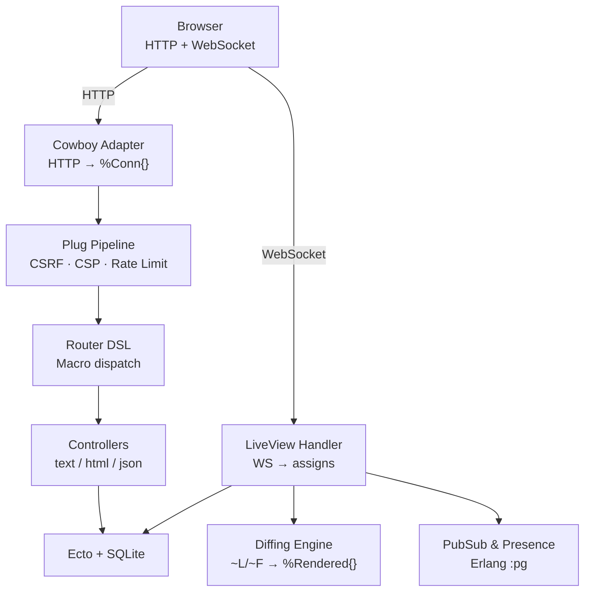

# Ignite — Build Your Own Web Framework in Elixir

> **Tip:** Open `course/assets/viewer.html` in a browser for an interactive view with dark/light theme, navigable diagrams, and animated walkthroughs.

[← Index](00-index.json) | [Architecture →](02-architecture.md)

---

## What Is This?

Ignite is a **from-scratch Phoenix-like web framework** built as a 45-step tutorial. It teaches Elixir by building a real framework — from raw TCP sockets to LiveView with WebSocket diffing — without abstracting away the hard parts.

By the end, you have a working framework with: routing macros, middleware pipelines, server-side rendering, real-time LiveView, PubSub, presence tracking, file uploads, database integration, CSRF/CSP security, and production releases.

## Why Build a Framework?

Most tutorials teach language features in isolation. Ignite teaches Elixir by solving real problems:

- **Pattern matching** → HTTP request parsing and route dispatch
- **Macros/metaprogramming** → Router DSL (`get "/path"` compiles to function clauses)
- **OTP/GenServer** → Supervised TCP server that self-heals on crash
- **Behaviours** → LiveView callback contract (`mount`, `render`, `handle_event`)
- **Process communication** → PubSub via Erlang `:pg` process groups
- **Binary protocols** → WebSocket file upload chunking

## Technology Choices

| Choice | Why |
|--------|-----|
| **Zero deps for Steps 1–9** | Forces understanding of `:gen_tcp`, HTTP parsing, EEx — no magic |
| **Cowboy (Step 10+)** | Production HTTP server; teaches adapter pattern |
| **SQLite via Ecto** | Zero-infrastructure database; same Ecto API as PostgreSQL |
| **Custom EEx engines** | `~L` and `~F` sigils for compile-time template separation |
| **Erlang `:pg`** | PubSub without external deps; teaches OTP primitives |
| **morphdom** | Client-side DOM diffing — same approach as Phoenix LiveView |

## Architecture at a Glance

The HTTP path (left) and LiveView path (right) share the same Conn struct, session system, and security middleware, but diverge at the transport layer.

## How the Pieces Fit Together

1. **Cowboy** accepts connections: HTTP → `Ignite.Adapters.Cowboy`, WebSocket → `Ignite.LiveView.Handler`
2. **The Adapter** converts Cowboy's request to `%Ignite.Conn{}`, decodes sessions, then passes through the **Router**
3. **The Router** runs plugs (rate limit → CSRF → CSP), dispatches to a **Controller** via compiled pattern matching
4. **Controllers** use response helpers (`text/html/json/render/redirect`) to set fields on the conn
5. **LiveView** bypasses the router — each view is a long-lived process receiving events over WebSocket
6. **PubSub** enables LiveView processes to broadcast to each other
7. **Ecto** provides database access for controllers and LiveViews alike

## Learning Progression

| Module | Steps | Focus |
|--------|-------|-------|
| HTTP Foundations | 1–5 | TCP, parsing, Conn, routing, params |
| OTP & Rendering | 6–9 | Supervision, templates, middleware, POST |
| Production HTTP | 10–11 | Cowboy adapter, error handling |
| LiveView Core | 12–16 | WebSocket, diffing, hot reload, morphdom |
| Real-Time | 17–20 | PubSub, navigation, components, JS hooks |
| REST & API | 21–23 | JSON, HTTP methods, scoped routes |
| Advanced LiveView | 24–28 | Fine-grained diffs, streams, uploads, flash |
| Security & Ops | 29–37 | Presence, Ecto, CSRF, CSP, logging, health, static assets |
| Production | 38–44 | Testing, SSL, releases, rate limiting, todo capstone |

For the full architecture deep dive, see [02-architecture.md](02-architecture.md).
