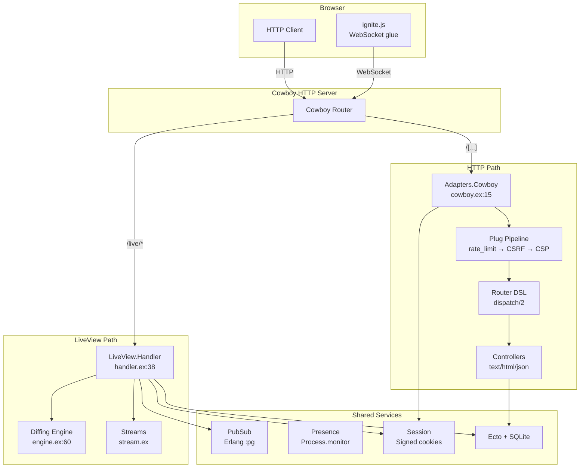

# Architecture Deep Dive

[← Overview](01-overview.md) | [Index](00-index.json)

---

```arch-minimap
{
  "components": [
    {"id": "overview", "label": "Overview", "page": "01-overview.md", "x": 50, "y": 5},
    {"id": "adapter", "label": "Cowboy Adapter", "page": "modules/03-cowboy-adapter.md", "x": 25, "y": 25},
    {"id": "liveview", "label": "LiveView", "page": "modules/04-liveview.md", "x": 75, "y": 25},
    {"id": "security", "label": "Security", "page": "modules/06-security.md", "x": 10, "y": 45},
    {"id": "router", "label": "Router", "page": "modules/02-router-dsl.md", "x": 35, "y": 45},
    {"id": "pubsub", "label": "PubSub", "page": "modules/05-pubsub-presence.md", "x": 65, "y": 45},
    {"id": "engine", "label": "Diffing", "page": "modules/04-liveview.md", "x": 85, "y": 45},
    {"id": "controllers", "label": "Controllers", "page": "modules/12-sample-app.md", "x": 25, "y": 65},
    {"id": "frontend", "label": "Frontend JS", "page": "modules/09-frontend-js.md", "x": 75, "y": 65},
    {"id": "ecto", "label": "Ecto/SQLite", "page": "modules/08-persistence.md", "x": 35, "y": 85},
    {"id": "otp", "label": "OTP Supervisor", "page": "modules/07-otp-supervision.md", "x": 65, "y": 85}
  ],
  "connections": [
    {"from": "overview", "to": "adapter"},
    {"from": "overview", "to": "liveview"},
    {"from": "adapter", "to": "security"},
    {"from": "adapter", "to": "router"},
    {"from": "liveview", "to": "pubsub"},
    {"from": "liveview", "to": "engine"},
    {"from": "router", "to": "controllers"},
    {"from": "liveview", "to": "frontend"},
    {"from": "controllers", "to": "ecto"},
    {"from": "otp", "to": "ecto"}
  ]
}
```

## System Architecture



## Module Dependency Graph

```dep-graph
{
  "nodes": [
    {"id": "core-http", "label": "Core HTTP", "complexity": "moderate", "file": "modules/01-core-http.md"},
    {"id": "router-dsl", "label": "Router DSL", "complexity": "complex", "file": "modules/02-router-dsl.md"},
    {"id": "cowboy-adapter", "label": "Cowboy Adapter", "complexity": "complex", "file": "modules/03-cowboy-adapter.md"},
    {"id": "liveview", "label": "LiveView", "complexity": "critical", "file": "modules/04-liveview.md"},
    {"id": "pubsub", "label": "PubSub & Presence", "complexity": "moderate", "file": "modules/05-pubsub-presence.md"},
    {"id": "security", "label": "Security", "complexity": "moderate", "file": "modules/06-security.md"},
    {"id": "otp", "label": "OTP Supervision", "complexity": "moderate", "file": "modules/07-otp-supervision.md"},
    {"id": "persistence", "label": "Persistence", "complexity": "moderate", "file": "modules/08-persistence.md"},
    {"id": "frontend", "label": "Frontend JS", "complexity": "moderate", "file": "modules/09-frontend-js.md"},
    {"id": "sample-app", "label": "Sample App", "complexity": "moderate", "file": "modules/12-sample-app.md"},
    {"id": "todo-app", "label": "Todo App", "complexity": "complex", "file": "modules/13-todo-app.md"}
  ],
  "edges": [
    {"source": "router-dsl", "target": "core-http", "label": "uses %Conn{}"},
    {"source": "cowboy-adapter", "target": "core-http", "label": "builds %Conn{}"},
    {"source": "cowboy-adapter", "target": "router-dsl", "label": "calls Router.call/1"},
    {"source": "cowboy-adapter", "target": "security", "label": "decodes session"},
    {"source": "liveview", "target": "pubsub", "label": "broadcasts"},
    {"source": "liveview", "target": "frontend", "label": "WS protocol"},
    {"source": "security", "target": "core-http", "label": "transforms conn"},
    {"source": "otp", "target": "persistence", "label": "supervises Repo"},
    {"source": "sample-app", "target": "router-dsl", "label": "uses DSL"},
    {"source": "sample-app", "target": "liveview", "label": "demo views"},
    {"source": "todo-app", "target": "liveview", "label": "uses LiveView"},
    {"source": "todo-app", "target": "persistence", "label": "Ecto CRUD"}
  ]
}
```

## HTTP Request Data Flow

```flow-trace
{
  "title": "HTTP Request Lifecycle (GET /users/42)",
  "steps": [
    {"component": "Cowboy", "action": "Accept TCP connection, match /[...] route", "file": "lib/ignite/application.ex:37", "detail": "Cowboy dispatch sends non-LiveView requests to Ignite.Adapters.Cowboy"},
    {"component": "Cowboy Adapter", "action": "Build %Ignite.Conn{} from request", "file": "lib/ignite/adapters/cowboy.ex:29", "detail": "Read body, parse cookies, decode signed session, generate request ID"},
    {"component": "Plug Pipeline", "action": "Run middleware: rate_limit → HSTS → CSP → CSRF", "file": "lib/my_app/router.ex:12", "detail": "Each plug transforms conn. If halted: true, remaining plugs skipped."},
    {"component": "Router", "action": "Pattern-match dispatch to controller", "file": "lib/ignite/router.ex:280", "detail": "conn.path split into segments, matched against compiled dispatch/2 clauses"},
    {"component": "Controller", "action": "Set response on conn", "file": "lib/ignite/controller.ex:21", "detail": "text/html/json helper sets status, resp_body, content-type, halted: true"},
    {"component": "Cowboy Adapter", "action": "Encode session, send response", "file": "lib/ignite/adapters/cowboy.ex:42", "detail": "Sign session cookie, log timing, :cowboy_req.reply/4"}
  ]
}
```

## LiveView Event Conversation

```chat
{
  "title": "LiveView Increment: How Components Talk",
  "participants": {
    "Browser": {"color": "#4A90D9", "icon": "laptop"},
    "ignite.js": {"color": "#50C878", "icon": "code"},
    "Handler": {"color": "#FF6B6B", "icon": "server"},
    "Engine": {"color": "#9B59B6", "icon": "cpu"}
  },
  "messages": [
    {"from": "Browser", "text": "User clicked +1!", "technical": "Click on element with ignite-click=\"increment\""},
    {"from": "ignite.js", "text": "Sending the event to the server.", "technical": "socket.send(JSON.stringify({event: 'increment', params: {}}))"},
    {"from": "Handler", "text": "Got it! Calling CounterLive.handle_event.", "technical": "websocket_handle at handler.ex:68 → apply(view, :handle_event, ...)"},
    {"from": "Engine", "text": "Only index 0 changed: '42' → '43'. Sparse diff!", "technical": "Engine.diff([\"42\"], [\"43\"]) → %{\"0\" => \"43\"} — 15 bytes"},
    {"from": "ignite.js", "text": "Patching just the text node. Button untouched!", "technical": "dynamics[0] = \"43\"; morphdom mutates only the changed text node"}
  ]
}
```

## Key Architectural Decisions

### Conn-Centric Pipeline

**The Big Picture:** Every transformation is `conn → conn`. Middleware, routing, controllers — they all take a conn and return a modified conn, like an assembly line where each worker modifies the same clipboard.

<details>
<summary>Intermediate: How it works</summary>

The Conn struct at `lib/ignite/conn.ex:13` carries request data in, response data out. The plug pipeline at `lib/ignite/router.ex:345` is `Enum.reduce/3` — each plug receives and returns a conn. `halted: true` short-circuits.

</details>

### Compile-Time Routing

**The Big Picture:** Routes compile to function clauses. The BEAM's pattern matching IS the router — no map lookups, no regex.

### LiveView Diffing

**The Big Picture:** Templates split into "fill-in-the-blanks" at compile time. Only changed blanks are sent on updates.

---

[← Overview](01-overview.md) | [Index](00-index.json)
