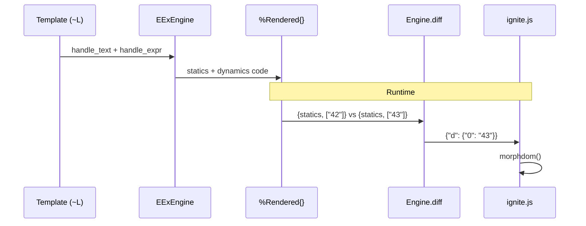

# Flow: Fine-Grained Diffing Pipeline

[< Overview](../01-overview.md) | [Index](../00-index.json)

---

```flow-trace
{
  "title": "Template → Compile → Diff → Patch",
  "steps": [
    {"component": "Compiler", "action": "~L sigil invokes EExEngine", "file": "lib/ignite/live_view.ex:166", "detail": "EEx.compile_string(template, engine: EExEngine)"},
    {"component": "EExEngine", "action": "Separate statics from dynamics", "file": "lib/ignite/live_view/eex_engine.ex:35", "detail": "handle_text accumulates pending; handle_expr flushes as static"},
    {"component": "EExEngine", "action": "Produce %Rendered{} AST", "file": "lib/ignite/live_view/eex_engine.ex:71", "detail": "handle_body reverses lists → %Rendered{statics, dynamics}"},
    {"component": "Engine", "action": "Render: evaluate dynamics", "file": "lib/ignite/live_view/engine.ex:36", "detail": "render(view, assigns) → {statics, [\"42\"]}"},
    {"component": "Engine", "action": "Diff old vs new", "file": "lib/ignite/live_view/engine.ex:60", "detail": "zip, find changed → %{\"0\" => \"43\"}"},
    {"component": "ignite.js", "action": "Merge diff, morphdom", "file": "assets/ignite.js:518", "detail": "dynamics[0] = '43'; buildHtml(); morphdom()"}
  ]
}
```

## Key Insight

| Template | Mount payload | Per-update |
|----------|-------------|-----------|
| 50KB HTML, 1 dynamic | ~50KB | ~5 bytes |
| 50KB HTML, 10 dynamics (1 changed) | ~50KB | ~15 bytes |
| Plain string (no sigil) | 0 | ~50KB every time |



---

[< Overview](../01-overview.md) | [Index](../00-index.json)

---
