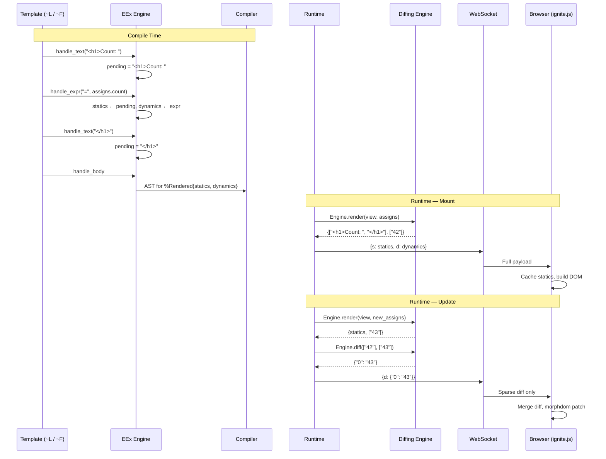

# Fine-Grained Diffing Pipeline

<!-- metadata: modules=LiveView, Frontend JS | last-generated=2026-03-24 -->

## Flow Overview

This flow traces how Ignite's template engines (`~L` and `~F` sigils) separate HTML into static fragments and dynamic expressions at **compile time**, how the diffing engine produces sparse patches at **runtime**, and how the JavaScript client reconstructs and patches the DOM. This pipeline is the key performance optimization that makes LiveView efficient — only changed data crosses the wire, never the full HTML.

## End-to-End Trace

```flow-trace
{
  "title": "Compile-Time → Runtime → Wire → DOM",
  "steps": [
    {
      "component": "EEx Compiler",
      "action": "Parse ~L sigil template into text/expression callbacks",
      "file": "lib/ignite/live_view/eex_engine.ex:1",
      "detail": "EEx parses '<h1>Count: <%= assigns.count %></h1>' into callbacks: handle_text('<h1>Count: '), handle_expr('=', assigns.count AST), handle_text('</h1>'). The custom engine accumulates these."
    },
    {
      "component": "EExEngine",
      "action": "handle_text — accumulate static text in pending buffer",
      "file": "lib/ignite/live_view/eex_engine.ex:48",
      "detail": "Static text is appended to the pending buffer. No code is generated yet — statics are literal strings that will be baked into the compiled module."
    },
    {
      "component": "EExEngine",
      "action": "handle_expr('=', expr) — flush static, add dynamic",
      "file": "lib/ignite/live_view/eex_engine.ex:54",
      "detail": "When a <%= expr %> is encountered: (1) the pending text buffer is flushed as a new static string, (2) the expression AST is wrapped in to_string/1 and added to the dynamics list, (3) the pending buffer resets to empty."
    },
    {
      "component": "EExEngine",
      "action": "handle_body — build %Rendered{} AST",
      "file": "lib/ignite/live_view/eex_engine.ex:71",
      "detail": "After all callbacks, handle_body reverses the accumulated lists and generates quoted AST that constructs %Rendered{statics: [\"<h1>Count: \", \"</h1>\"], dynamics: [to_string(assigns.count)]} at runtime."
    },
    {
      "component": "Compiled Module",
      "action": "render/1 returns %Rendered{} with evaluated dynamics",
      "file": "lib/ignite/live_view/rendered.ex:1",
      "detail": "At runtime, render(assigns) executes the compiled AST. Statics are literal strings (no computation). Dynamics evaluate the expressions with current assigns — e.g., to_string(assigns.count) → \"42\"."
    },
    {
      "component": "Engine",
      "action": "normalize — extract {statics, dynamics} tuple",
      "file": "lib/ignite/live_view/engine.ex:91",
      "detail": "Engine.render/2 calls the view's render/1, then normalizes the result. For %Rendered{}, it extracts statics and dynamics directly. For legacy strings, it wraps in [\"\", \"\"] statics."
    },
    {
      "component": "Engine",
      "action": "diff — compare old and new dynamics index-by-index",
      "file": "lib/ignite/live_view/engine.ex:60",
      "detail": "Engine.diff/2 zips old and new dynamics with their indices. For each pair, if old == new, the index is skipped. If different, it's added to the changes map. Result: %{\"0\" => \"43\"} for a single count change."
    },
    {
      "component": "Handler",
      "action": "JSON-encode sparse diff and send over WebSocket",
      "file": "lib/ignite/live_view/handler.ex:188",
      "detail": "The diff map is included in a JSON payload: {d: {\"0\": \"43\"}}. prev_dynamics is updated in the handler state for the next comparison."
    },
    {
      "component": "Browser",
      "action": "Merge diff into cached dynamics, rebuild HTML, morphdom patch",
      "file": "assets/ignite.js",
      "detail": "The client applies the sparse diff to its cached dynamics array (only updating changed indices), interleaves with cached statics to produce new HTML, and uses morphdom to patch only the changed DOM nodes."
    }
  ]
}
```

## Beginner-Friendly Explanation

```chat
{
  "title": "How Templates Get Split for Efficiency",
  "participants": {
    "Template": {"color": "#4A90D9", "icon": "code"},
    "EEx Engine": {"color": "#FF6B6B", "icon": "gear"},
    "Compiler": {"color": "#50C878", "icon": "server"},
    "Runtime": {"color": "#FFB347", "icon": "zap"},
    "Wire": {"color": "#9B59B6", "icon": "plug"}
  },
  "messages": [
    {"from": "Template", "text": "I'm '<h1>Count: <%= assigns.count %></h1>'. I have one part that never changes and one that does.", "technical": "~L sigil template with one static-dynamic-static pattern"},
    {"from": "EEx Engine", "text": "I see! '<h1>Count: ' is static — it's always the same. 'assigns.count' is dynamic — it changes with each render. Let me separate them.", "technical": "handle_text accumulates statics, handle_expr('=', ...) splits on dynamic boundaries. Result: statics=[\"<h1>Count: \", \"</h1>\"], dynamics=[to_string(assigns.count)]"},
    {"from": "Compiler", "text": "I've baked the statics right into the compiled module as literal strings. The dynamics become expressions that evaluate at runtime. Zero string concatenation for the static parts!", "technical": "handle_body returns quoted AST: %Rendered{statics: [\"<h1>Count: \", \"</h1>\"], dynamics: [to_string(assigns.count)]}"},
    {"from": "Runtime", "text": "First render: statics are sent once. They're like the frame of a picture that never changes. Only the dynamics (the picture inside) get sent each time.", "technical": "Mount: {s: [\"<h1>Count: \", \"</h1>\"], d: [\"42\"]}. Update: {d: {\"0\": \"43\"}}"},
    {"from": "Wire", "text": "On updates, I only carry the changed values. Instead of sending 50 bytes of HTML, I send 15 bytes of diff. For a page with 20 dynamic values where only 1 changed, that's a 95% bandwidth reduction!", "technical": "Engine.diff zips old and new dynamics, emits only changed indices as a sparse map"}
  ]
}
```

## Sequence Diagram



## How ~L vs ~F Differs

| Feature | `~L` (EExEngine) | `~F` (FEExEngine) |
|---------|------------------|-------------------|
| Engine | `Ignite.LiveView.EExEngine` | `Ignite.LiveView.FEExEngine` |
| `@` shorthand | No — must write `assigns.name` | Yes — `@name` compiles to `assigns.name` |
| Block expressions | Not supported (`<% if %>` ignored) | Supported — blocks become single dynamics |
| HTML escaping | No auto-escaping | Auto-escapes `& < > " '` via `escape/1` |
| `raw/1` helper | Not available | `{:safe, val}` bypasses escaping |
| Output struct | `%Rendered{}` | `%Rendered{}` (same) |

The FEEx engine (`lib/ignite/live_view/feex_engine.ex`) adds block support via `handle_begin/1` and `handle_end/1`. When EEx encounters `<% if cond do %>`, it creates a sub-buffer. All text and expressions inside the block accumulate in this sub-buffer. `handle_end/1` (line 45) compiles the sub-buffer into a string-producing AST. The entire block becomes a single dynamic in the outer template.

## State Transitions

| Phase | Statics | Dynamics | Wire |
|-------|---------|---------|------|
| Compile | `["<h1>Count: ", "</h1>"]` baked in | Expression ASTs stored | — |
| Mount render | (unchanged) | `["42"]` evaluated | `{s: [...], d: ["42"]}` |
| Event render | (unchanged) | `["43"]` evaluated | — |
| Diff | (unchanged) | prev=`["42"]`, new=`["43"]` | `{d: {"0": "43"}}` |
| All changed | (unchanged) | prev=`["42"]`, new=`["43"]` | `{d: ["43"]}` (array form) |
| None changed | (unchanged) | prev=`["42"]`, new=`["42"]` | `{d: {}}` (empty map) |

## Error Paths

### Legacy String Render (No %Rendered{})
If a view's `render/1` returns a plain string instead of `%Rendered{}`, the engine normalizes it at `lib/ignite/live_view/engine.ex:96-97`: the entire HTML becomes one dynamic with empty statics `["", ""]`. This works but eliminates all diffing benefits — the full HTML is sent on every update.

### Mismatched Dynamic Count
If the template structure changes between renders (e.g., conditional branches produce different numbers of `<%= %>`), `Engine.diff/2` detects `length(old) != length(new)` at line 62 and falls back to sending the full dynamics list. This is correct but means no sparse optimization for that update.

### XSS via ~L (No Escaping)
The `~L` sigil does NOT escape HTML. If `assigns.name` contains `<script>alert('xss')</script>`, it will be rendered as-is. The `~F` sigil (`lib/ignite/live_view/feex_engine.ex:130-137`) auto-escapes `& < > " '`. Use `~F` for user-facing content.

## Practice

```drag-match
{
  "title": "Match Diffing Concepts to Their Role",
  "pairs": [
    {"concept": "handle_text", "description": "Accumulates static HTML fragments in a pending buffer during EEx compilation"},
    {"concept": "handle_expr('=')", "description": "Flushes the pending buffer as a static and adds the expression as a new dynamic"},
    {"concept": "handle_body", "description": "Produces the final AST that constructs %Rendered{statics, dynamics} at runtime"},
    {"concept": "%Rendered{}", "description": "Struct holding separated statics (N+1 strings) and dynamics (N values) for efficient diffing"},
    {"concept": "Engine.diff/2", "description": "Compares old and new dynamics index-by-index, producing a sparse map of only changed values"},
    {"concept": "normalize/1", "description": "Converts a legacy string render into a single-dynamic %Rendered{} for backward compatibility"}
  ]
}
```

```spot-the-bug
{
  "title": "Find the Template Engine Bug",
  "language": "elixir",
  "code": "def handle_expr(state, \"=\", expr) do\n  {statics, dynamics, pending} = state\n  wrapped = quote do: to_string(unquote(expr))\n  {[pending | statics], [wrapped | dynamics], pending}\nend",
  "bug_lines": [4],
  "hints": [
    "After flushing the pending buffer as a static, what should the new pending buffer be?",
    "The pending buffer should reset to empty string, not keep its old value"
  ],
  "explanation": "Line 4 keeps `pending` as the third element instead of resetting to \"\". The real code (lib/ignite/live_view/eex_engine.ex:61) uses {[pending | statics], [wrapped | dynamics], \"\"}. Without the reset, the same static text would be duplicated — every subsequent dynamic would re-include the previous static fragment, producing corrupted HTML."
}
```

> **Quiz: Sparse vs Full Diff**
>
> A template has 10 dynamic expressions. After a user event, 3 of them changed. What does `Engine.diff/2` (`lib/ignite/live_view/engine.ex:60`) return?
>
> - A) A list of 10 elements (3 new values, 7 old values)
> - B) A map with 3 entries: `%{"2" => "new_a", "5" => "new_b", "8" => "new_c"}`
> - C) A list of 3 elements (just the new values)
> - D) The full HTML string
>
> <details>
> <summary>Show Answer</summary>
>
> **B)** Since only 3 out of 10 dynamics changed, `map_size(changes)` (3) does not equal `length(new_dynamics)` (10), so the sparse map path at line 82-83 is taken. The result is a map keyed by string indices of changed positions with their new values. This means only ~30% of the data is transmitted instead of 100%.
>
> </details>

---
[< Previous: PubSub Broadcast](./pubsub-broadcast.md) | [Index](../01-overview.md)
