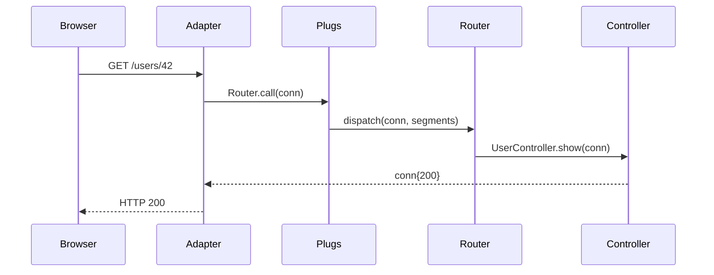

# Flow: HTTP Request Lifecycle

[< Overview](../01-overview.md) | [Index](../00-index.json)

---

## Flow Overview

Traces GET /users/42 from Cowboy through middleware, dispatch, controller, and response.

```flow-trace
{
  "title": "HTTP Request Lifecycle",
  "steps": [
    {"component": "Cowboy", "action": "Accept connection, match route", "file": "lib/ignite/application.ex:37", "detail": "Dispatch to Adapters.Cowboy"},
    {"component": "Adapter", "action": "Build %Conn{}, generate request ID", "file": "lib/ignite/adapters/cowboy.ex:18", "detail": "Parse cookies, decode session, start timer"},
    {"component": "Pipeline", "action": "Run plugs: rate_limit → CSP → CSRF", "file": "lib/my_app/router.ex:12", "detail": "Each plug transforms conn. halted: true skips rest."},
    {"component": "Router", "action": "Pattern-match dispatch", "file": "lib/ignite/router.ex:280", "detail": "dispatch(conn, [\"users\", \"42\"]) → UserController.show"},
    {"component": "Controller", "action": "Set response", "file": "lib/ignite/controller.ex:21", "detail": "text/html/json sets status + body + halted: true"},
    {"component": "Adapter", "action": "Encode session, send response", "file": "lib/ignite/adapters/cowboy.ex:42", "detail": "Sign cookie, log timing, :cowboy_req.reply/4"}
  ]
}
```



## Error Paths

| Error | Result |
|-------|--------|
| Session tampered | Empty session `%{}` |
| Rate limit exceeded | 429, halted |
| CSRF mismatch (POST) | 403 Forbidden |
| No route match | 404 via finalize_routes |
| Controller crash | 500 via DebugPage |

---

[< Overview](../01-overview.md) | [Index](../00-index.json)

---
