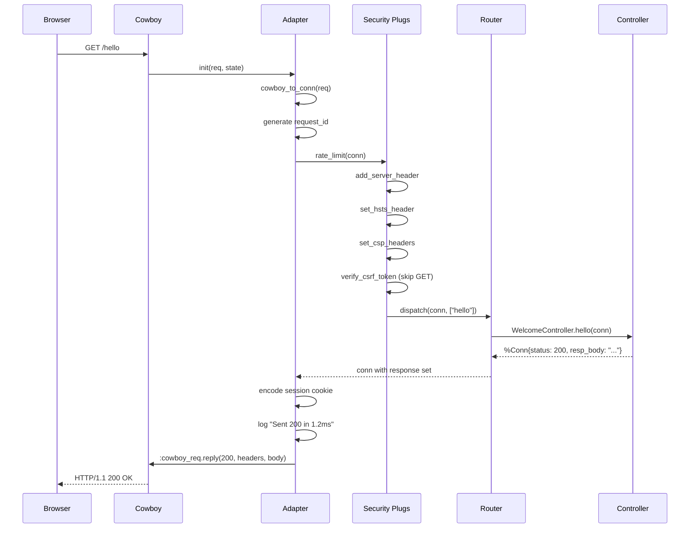

# HTTP Request Lifecycle

<!-- metadata: modules=Cowboy Adapter, Security, Router DSL, Core HTTP | last-generated=2026-03-24 -->

## Flow Overview

This flow traces a complete HTTP request from the moment it arrives at the Cowboy web server through the Ignite framework's middleware pipeline, router dispatch, controller action, and back out as an HTTP response. Every HTTP request in Ignite follows this exact path — understanding it means understanding the framework's core architecture.

## End-to-End Trace

```flow-trace
{
  "title": "GET /hello — Full Request Lifecycle",
  "steps": [
    {
      "component": "Cowboy",
      "action": "Accepts TCP connection, parses HTTP request, calls handler",
      "file": "lib/ignite/adapters/cowboy.ex:15",
      "detail": "Cowboy calls init/2 on Ignite.Adapters.Cowboy for every HTTP request. This is the entry point into the Ignite framework."
    },
    {
      "component": "Adapter",
      "action": "Generate request ID and start timer",
      "file": "lib/ignite/adapters/cowboy.ex:18",
      "detail": "A 16-byte random request_id is generated for log correlation. System.monotonic_time() starts the clock for request duration tracking."
    },
    {
      "component": "Adapter",
      "action": "Convert Cowboy request to %Ignite.Conn{}",
      "file": "lib/ignite/adapters/cowboy.ex:29",
      "detail": "cowboy_to_conn/1 extracts method, path, headers, body params, cookies, and session from the Cowboy request struct. Also ensures a CSRF token exists in the session."
    },
    {
      "component": "Adapter",
      "action": "Parse cookies and decode signed session",
      "file": "lib/ignite/adapters/cowboy.ex:106",
      "detail": "Cookies are parsed from the Cookie header. The _ignite_session cookie is verified via Plug.Crypto.MessageVerifier and deserialized into a map. Flash messages are popped from session into conn.private."
    },
    {
      "component": "Router",
      "action": "MyApp.Router.call/1 — run middleware pipeline",
      "file": "lib/ignite/adapters/cowboy.ex:37",
      "detail": "The adapter calls MyApp.Router.call(conn). This function was generated by @before_compile and chains all registered plugs via Enum.reduce."
    },
    {
      "component": "Security",
      "action": "Rate limit check",
      "file": "lib/my_app/router.ex:12",
      "detail": "First plug: rate_limit/1 calls Ignite.RateLimiter.call(conn). If the IP has exceeded the configured max_requests per window, the conn is halted with 429 status."
    },
    {
      "component": "Security",
      "action": "Add server header, HSTS, CSP, CSRF",
      "file": "lib/my_app/router.ex:13",
      "detail": "Remaining plugs run in order: add x-powered-by header, set HSTS strict-transport-security header, generate CSP nonce and set content-security-policy header, verify CSRF token (skipped for GET requests)."
    },
    {
      "component": "Router",
      "action": "dispatch/3 — pattern-match route",
      "file": "lib/ignite/router.ex:280",
      "detail": "conn.path is split into segments and matched against compiled dispatch/3 function clauses. For GET /hello, it matches the clause generated by 'get \"/hello\", to: MyApp.WelcomeController, action: :hello'."
    },
    {
      "component": "Controller",
      "action": "WelcomeController.hello/1 — build response",
      "file": "lib/my_app/controllers/welcome_controller.ex",
      "detail": "The controller action receives the conn, calls response helpers (text/3, html/3, render/3) which set conn.status, conn.resp_body, conn.resp_headers, and conn.halted = true."
    },
    {
      "component": "Adapter",
      "action": "Encode session cookie",
      "file": "lib/ignite/adapters/cowboy.ex:42",
      "detail": "The updated conn.session is serialized via :erlang.term_to_binary and signed with Plug.Crypto.MessageVerifier. The signed value is set as a cookie via :cowboy_req.set_resp_cookie."
    },
    {
      "component": "Adapter",
      "action": "Log duration and send response",
      "file": "lib/ignite/adapters/cowboy.ex:56",
      "detail": "Elapsed time is calculated from monotonic_time, formatted as µs/ms/s. Logger.info logs 'Sent 200 in 1.2ms'. Finally, :cowboy_req.reply sends status + headers + body back to the client."
    }
  ]
}
```

## Beginner-Friendly Explanation

```chat
{
  "title": "HTTP Request: A Day in the Life",
  "participants": {
    "Browser": {"color": "#4A90D9", "icon": "laptop"},
    "Cowboy": {"color": "#50C878", "icon": "server"},
    "Adapter": {"color": "#FF6B6B", "icon": "gear"},
    "Security": {"color": "#FFB347", "icon": "shield"},
    "Router": {"color": "#9B59B6", "icon": "map"},
    "Controller": {"color": "#1ABC9C", "icon": "code"}
  },
  "messages": [
    {"from": "Browser", "text": "Hey, I'd like the /hello page please!", "technical": "GET /hello HTTP/1.1\\nHost: localhost:4001\\nCookie: _ignite_session=SFMy..."},
    {"from": "Cowboy", "text": "Got it! Let me hand this off to the Ignite adapter.", "technical": "Cowboy calls Ignite.Adapters.Cowboy.init(req, state) — this is the :cowboy_handler behaviour callback"},
    {"from": "Adapter", "text": "Let me translate this into something our framework understands. I'll create a Conn struct with all the request info.", "technical": "cowboy_to_conn(req) builds %Ignite.Conn{method: \"GET\", path: \"/hello\", headers: %{...}, session: %{...}}"},
    {"from": "Adapter", "text": "I'll also stamp this with a request ID and start a timer so we can track how long it takes.", "technical": ":crypto.strong_rand_bytes(16) generates request_id, Logger.metadata stores it for all downstream logs"},
    {"from": "Security", "text": "Hold on — let me check you're not flooding us with requests. Rate limit looks good. I'll also add some security headers.", "technical": "Plugs run in order: rate_limit → add_server_header → set_hsts_header → set_csp_headers → verify_csrf_token (skipped for GET)"},
    {"from": "Router", "text": "OK, /hello... let me check my route table. Found it! That goes to the WelcomeController.", "technical": "dispatch(%Conn{method: \"GET\"}, [\"hello\"]) matches the compiled clause from 'get \"/hello\", to: WelcomeController, action: :hello'"},
    {"from": "Controller", "text": "Here's your page! I've set the response body and a 200 status.", "technical": "text(conn, \"Hello, world!\") returns %Conn{status: 200, resp_body: \"Hello, world!\", halted: true}"},
    {"from": "Adapter", "text": "Great, let me sign the session cookie and send everything back through Cowboy.", "technical": "Ignite.Session.encode(conn.session) → Plug.Crypto.MessageVerifier.sign → :cowboy_req.reply(200, headers, body, req)"},
    {"from": "Browser", "text": "Got the response! 200 OK with the page content. That was fast!", "technical": "HTTP/1.1 200 OK\\nContent-Type: text/plain\\nX-Request-Id: abc123\\nSet-Cookie: _ignite_session=..."}
  ]
}
```

## Sequence Diagram



## State Transitions

| Step | What Changes |
|------|-------------|
| `cowboy_to_conn` | Creates `%Conn{}` with request fields populated, session decoded from cookie |
| CSRF token check | If session lacks `_csrf_token`, one is generated and stored in `conn.session` |
| Flash pop | `_flash` is moved from `session` → `conn.private[:flash]` (one-time read semantics) |
| Rate limit plug | Increments ETS counter for client IP. May halt conn with 429 |
| Security plugs | `conn.resp_headers` gains `x-powered-by`, `strict-transport-security`, `content-security-policy` |
| Controller action | `conn.status`, `conn.resp_body`, `conn.resp_headers` are set; `conn.halted = true` |
| Session encode | `conn.session` serialized + HMAC-signed → `Set-Cookie` header added |

## Error Paths

### Controller Raises an Exception
When any code in the pipeline raises (`lib/ignite/adapters/cowboy.ex:61`), the `rescue` block catches it:
1. The error and stacktrace are logged with `Logger.error`
2. `Ignite.DebugPage.render/3` generates a rich HTML error page (in dev) or a generic 500 page (in prod)
3. Cowboy sends the 500 response with the error page body

### Rate Limit Exceeded
When `Ignite.RateLimiter.call/1` detects the client IP has exceeded `max_requests` within `window_ms`:
1. The conn is halted with `status: 429` and a "Too Many Requests" body
2. Because `conn.halted == true`, the `call/1` function skips remaining plugs and dispatch
3. The 429 response is sent back through Cowboy

### Invalid Session Cookie
When `Ignite.Session.decode/1` returns `:error` (`lib/ignite/adapters/cowboy.ex:111`):
1. The session is initialized as an empty map `%{}`
2. A new CSRF token is generated
3. The request proceeds normally — the user simply has no session data

## Practice

```drag-match
{
  "title": "Match Each Layer to Its Responsibility",
  "pairs": [
    {"concept": "Cowboy", "description": "Accepts TCP connections and calls the handler's init/2 callback"},
    {"concept": "Adapter (cowboy_to_conn)", "description": "Translates Cowboy's request struct into %Ignite.Conn{}"},
    {"concept": "Middleware plugs", "description": "Transform the conn with security headers, rate limiting, and CSRF checks"},
    {"concept": "Router dispatch/3", "description": "Pattern-matches the method and path segments to find the right controller"},
    {"concept": "Controller action", "description": "Sets the response status, body, and content-type on the conn"},
    {"concept": "Session.encode/1", "description": "Serializes and HMAC-signs the session map into a cookie value"}
  ]
}
```

```spot-the-bug
{
  "title": "Find the Request Lifecycle Bug",
  "language": "elixir",
  "code": "def init(req, state) do\n  conn = cowboy_to_conn(req)\n  conn = MyApp.Router.call(conn)\n  cookie_value = Ignite.Session.encode(conn.session)\n  req = :cowboy_req.set_resp_cookie(\"_ignite_session\", cookie_value, req, %{})\n  :cowboy_req.reply(conn.status, conn.resp_headers, conn.resp_body, req)\n  {:ok, req, state}\nend",
  "bug_lines": [2, 3],
  "hints": [
    "What happens if the controller action raises an exception?",
    "There's no try/rescue — an unhandled crash would bring down the Cowboy process"
  ],
  "explanation": "The real init/2 (lib/ignite/adapters/cowboy.ex:15) wraps the router call in try/rescue. Without it, a controller exception crashes the Cowboy handler process, and the client gets a connection reset instead of a helpful error page. The real code also generates a request_id and starts timing before the try block."
}
```

> **Quiz: Request Pipeline Order**
>
> Looking at `lib/my_app/router.ex:12-16`, what happens if the `rate_limit` plug halts the conn?
>
> - A) The remaining plugs still run, but dispatch is skipped
> - B) All remaining plugs AND dispatch are skipped — the halted conn is returned
> - C) An exception is raised
> - D) The conn is reset and the request starts over
>
> <details>
> <summary>Show Answer</summary>
>
> **B)** The generated `call/1` function (`lib/ignite/router.ex:347-348`) uses `Enum.reduce` with a check: `if acc.halted, do: acc, else: apply(...)`. When any plug sets `conn.halted = true`, all subsequent plugs are skipped. After the reduce, another `if conn.halted` check skips `dispatch/3` entirely.
>
> </details>

---
[Index](../01-overview.md) | [Next: LiveView Mount & Event >](./liveview-mount-and-event.md)
