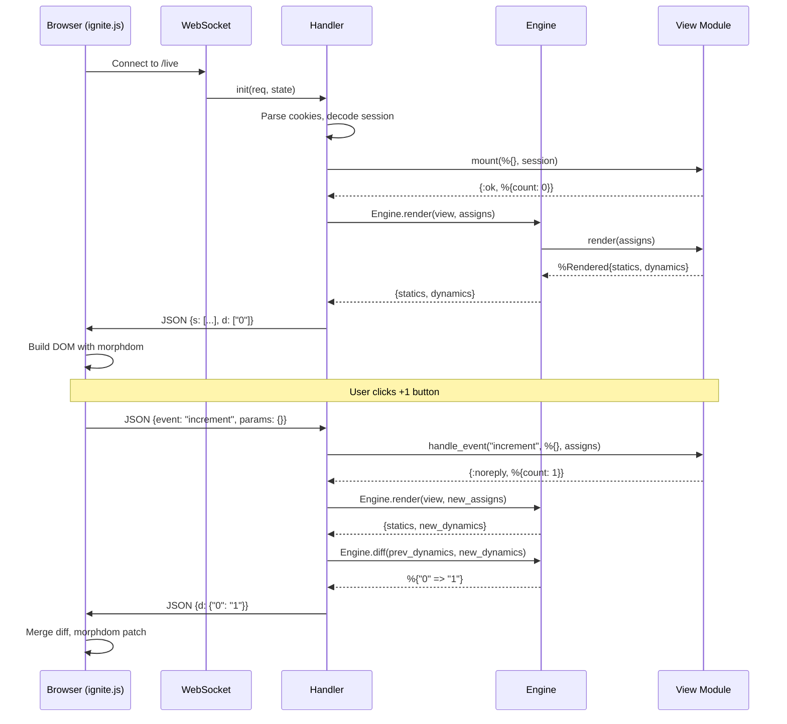

# LiveView Mount & Event

<!-- metadata: modules=LiveView, Frontend JS, PubSub & Presence | last-generated=2026-03-24 -->

## Flow Overview

This flow traces the complete lifecycle of a LiveView connection: the initial WebSocket handshake, the mount that sends full HTML (statics + dynamics), and a user click event that triggers a re-render with a sparse diff. This is the flow that makes Ignite feel like a single-page app while keeping all state on the server.

## End-to-End Trace

```flow-trace
{
  "title": "LiveView: Mount → Click → DOM Patch",
  "steps": [
    {
      "component": "Browser",
      "action": "User visits /counter, page loads with WebSocket script",
      "file": "assets/ignite.js:1",
      "detail": "The initial HTML page includes ignite.js which creates a WebSocket connection to /live on page load."
    },
    {
      "component": "Handler",
      "action": "WebSocket handshake — parse cookies and decode session",
      "file": "lib/ignite/live_view/handler.ex:20",
      "detail": "Cowboy upgrades the HTTP request to WebSocket. Handler.init/2 parses cookies from the handshake request and decodes the signed session, same as the HTTP adapter does."
    },
    {
      "component": "Handler",
      "action": "websocket_init — call view_module.mount/2",
      "file": "lib/ignite/live_view/handler.ex:38",
      "detail": "After the WebSocket is established, websocket_init calls apply(view_module, :mount, [%{}, session]). The view returns {:ok, assigns} with its initial state (e.g., %{count: 0})."
    },
    {
      "component": "Engine",
      "action": "Engine.render — separate statics from dynamics",
      "file": "lib/ignite/live_view/engine.ex:36",
      "detail": "The engine calls view_module.render(assigns). If the view uses ~L sigil, it returns a %Rendered{statics: [...], dynamics: [...]}. The engine normalizes this into {statics, dynamics} tuple."
    },
    {
      "component": "Handler",
      "action": "Send mount payload: {s: statics, d: dynamics}",
      "file": "lib/ignite/live_view/handler.ex:58",
      "detail": "The full mount payload is JSON-encoded: statics (HTML fragments that never change) + dynamics (current values of expressions). Stream operations are included if present. prev_dynamics is stored for future diffing."
    },
    {
      "component": "Browser",
      "action": "ignite.js receives mount payload, builds DOM",
      "file": "assets/ignite.js",
      "detail": "The client interleaves statics and dynamics to produce full HTML, then uses morphdom to patch the DOM. Statics are cached — they won't be sent again."
    },
    {
      "component": "Browser",
      "action": "User clicks [ignite-click='increment'] button",
      "file": "assets/ignite.js",
      "detail": "Event delegation catches the click. ignite.js sends a JSON message over WebSocket: {event: 'increment', params: {}}."
    },
    {
      "component": "Handler",
      "action": "websocket_handle — route event to view",
      "file": "lib/ignite/live_view/handler.ex:96",
      "detail": "The handler decodes the JSON, extracts event name and params, and calls apply(state.view, :handle_event, ['increment', params, state.assigns])."
    },
    {
      "component": "View",
      "action": "handle_event updates assigns",
      "file": "lib/my_app/live/counter_live.ex",
      "detail": "The view's handle_event returns {:noreply, %{assigns | count: assigns.count + 1}}. The assigns map now has count: 1."
    },
    {
      "component": "Engine",
      "action": "Re-render and compute sparse diff",
      "file": "lib/ignite/live_view/engine.ex:60",
      "detail": "Engine.render produces new dynamics. Engine.diff compares old_dynamics with new_dynamics index-by-index. Only changed slots appear in the result — e.g., %{'0' => '1'} means only dynamic index 0 changed."
    },
    {
      "component": "Handler",
      "action": "Send diff payload: {d: {'0': '1'}}",
      "file": "lib/ignite/live_view/handler.ex:188",
      "detail": "The sparse diff is JSON-encoded and sent over WebSocket. Only the changed dynamic values are transmitted — statics are never re-sent."
    },
    {
      "component": "Browser",
      "action": "ignite.js applies diff with morphdom",
      "file": "assets/ignite.js",
      "detail": "The client merges the sparse diff into its cached dynamics, re-interleaves with statics to produce new HTML, and uses morphdom to patch only the changed DOM nodes."
    }
  ]
}
```

## Beginner-Friendly Explanation

```chat
{
  "title": "LiveView: How Clicks Update the Page Without Reloading",
  "participants": {
    "Browser": {"color": "#4A90D9", "icon": "laptop"},
    "WebSocket": {"color": "#50C878", "icon": "plug"},
    "Handler": {"color": "#FF6B6B", "icon": "server"},
    "Engine": {"color": "#FFB347", "icon": "gear"},
    "View": {"color": "#9B59B6", "icon": "code"}
  },
  "messages": [
    {"from": "Browser", "text": "I just loaded the counter page. Let me open a WebSocket connection to stay in sync.", "technical": "new WebSocket('ws://localhost:4001/live') — Cowboy routes /live to Ignite.LiveView.Handler"},
    {"from": "Handler", "text": "Welcome! Let me set up your counter. Starting at 0.", "technical": "websocket_init calls CounterLive.mount(%{}, session) → {:ok, %{count: 0}}"},
    {"from": "Engine", "text": "I've rendered the template. Here are the static HTML pieces and the dynamic values.", "technical": "Engine.render returns {[\"<h1>Count: \", \"</h1><button>+1</button>\"], [\"0\"]}"},
    {"from": "Handler", "text": "Sending you the full page. The static parts won't change, so I'll only send those once.", "technical": "JSON payload: {s: [\"<h1>Count: \", \"</h1>...\"], d: [\"0\"]}"},
    {"from": "Browser", "text": "Got it! I'll stitch the statics and dynamics together and show the page. The user sees 'Count: 0'.", "technical": "statics[0] + dynamics[0] + statics[1] = '<h1>Count: 0</h1>...' → morphdom patches DOM"},
    {"from": "Browser", "text": "The user just clicked the +1 button!", "technical": "Event delegation catches ignite-click=\"increment\" → sends {event: \"increment\", params: {}}"},
    {"from": "View", "text": "Increment! Count is now 1.", "technical": "handle_event(\"increment\", %{}, assigns) → {:noreply, %{assigns | count: 1}}"},
    {"from": "Engine", "text": "I re-rendered. Only the count changed — index 0 went from '0' to '1'. Everything else is the same.", "technical": "diff([\"0\"], [\"1\"]) → %{\"0\" => \"1\"} — sparse diff, only 1 changed value"},
    {"from": "Handler", "text": "Here's the tiny update — just the number that changed.", "technical": "JSON payload: {d: {\"0\": \"1\"}} — just a few bytes instead of re-sending all HTML"},
    {"from": "Browser", "text": "Updated! I merged the diff, rebuilt the HTML, and morphdom only touched the text node inside the h1. Smooth!", "technical": "dynamics[0] = \"1\" → re-interleave → morphdom patches only the changed text node"}
  ]
}
```

## Sequence Diagram



## State Transitions

| Step | Server State | Client State | Wire Data |
|------|-------------|-------------|-----------|
| Connect | Handler process spawned | WebSocket open | Handshake |
| Mount | `assigns: %{count: 0}`, `prev_dynamics: ["0"]` | Waiting | — |
| First render | — | Statics cached, DOM built | `{s: [...], d: ["0"]}` (~100 bytes) |
| Click event | — | — | `{event: "increment"}` (~30 bytes) |
| Re-render | `assigns: %{count: 1}`, `prev_dynamics: ["1"]` | — | — |
| Diff sent | — | dynamics[0] = "1", DOM patched | `{d: {"0": "1"}}` (~15 bytes) |

## Error Paths

### View Mount Fails
If `mount/2` raises an exception, the WebSocket handler process crashes. Cowboy closes the WebSocket connection, and the client receives an `onclose` event. The browser can show a "Disconnected" message and attempt reconnection.

### handle_event Returns Unknown Format
If `handle_event/3` doesn't return `{:noreply, assigns}`, the `case` match fails and raises a `MatchError`. The handler process crashes, closing the WebSocket. The supervision tree does NOT restart individual LiveView processes — each is tied to a specific client connection.

### WebSocket Disconnect
When the WebSocket closes (network drop, tab close), the handler process terminates. If it was subscribed to PubSub topics, `:pg` automatically removes it from all groups. If Presence was tracking it, the `Process.monitor` fires a `:DOWN` message, triggering a leave broadcast.

## Practice

```drag-match
{
  "title": "Match LiveView Concepts to Their Role",
  "pairs": [
    {"concept": "Statics", "description": "HTML fragments between dynamic expressions — sent once on mount, never again"},
    {"concept": "Dynamics", "description": "Current values of template expressions — sent as a list on mount"},
    {"concept": "Sparse diff", "description": "A map of changed indices only — e.g., {'0': 'new_value'} — sent on updates"},
    {"concept": "morphdom", "description": "Client-side library that patches only the changed DOM nodes, preserving focus and scroll"},
    {"concept": "websocket_init", "description": "Cowboy callback that runs after WebSocket upgrade — calls mount and sends first render"},
    {"concept": "prev_dynamics", "description": "Stored in handler state to compare against new dynamics for computing diffs"}
  ]
}
```

```spot-the-bug
{
  "title": "Find the LiveView Handler Bug",
  "language": "elixir",
  "code": "def websocket_handle({:text, json}, state) do\n  {:ok, %{\"event\" => event, \"params\" => params}} = Jason.decode(json)\n  case apply(state.view, :handle_event, [event, params, state.assigns]) do\n    {:noreply, new_assigns} ->\n      {_statics, new_dynamics} = Engine.render(state.view, new_assigns)\n      payload = Jason.encode!(%{d: new_dynamics})\n      {:reply, {:text, payload}, %{state | assigns: new_assigns}}\n  end\nend",
  "bug_lines": [6],
  "hints": [
    "What's being sent on every event — the full dynamics or just what changed?",
    "Without diffing against prev_dynamics, the client receives ALL dynamics every time, even unchanged ones"
  ],
  "explanation": "Line 6 sends new_dynamics directly instead of computing a sparse diff. The real handler (lib/ignite/live_view/handler.ex:173-177) calls Engine.diff(state.prev_dynamics, new_dynamics) to produce a minimal payload. It also updates state.prev_dynamics for the next comparison. Without diffing, bandwidth usage grows linearly with template size instead of with change size."
}
```

> **Quiz: Diff Optimization**
>
> Looking at `lib/ignite/live_view/engine.ex:60-86`, when does the engine send a full dynamics list instead of a sparse map?
>
> - A) When more than half the dynamics changed
> - B) When ALL dynamics changed (a map with every index is larger than a list)
> - C) When the template structure changed (different number of dynamics)
> - D) Both B and C
>
> <details>
> <summary>Show Answer</summary>
>
> **D)** The engine sends the full list in two cases: (1) when `length(old_dynamics) != length(new_dynamics)` (line 62-64), meaning the template structure changed, and (2) when `map_size(changes) == length(new_dynamics)` (line 78-80), meaning every single dynamic changed and a list is more compact than a map with string keys for every index.
>
> </details>

---
[< Previous: HTTP Request Lifecycle](./http-request-lifecycle.md) | [Index](../01-overview.md) | [Next: Router Macro Expansion >](./router-macro-expansion.md)
