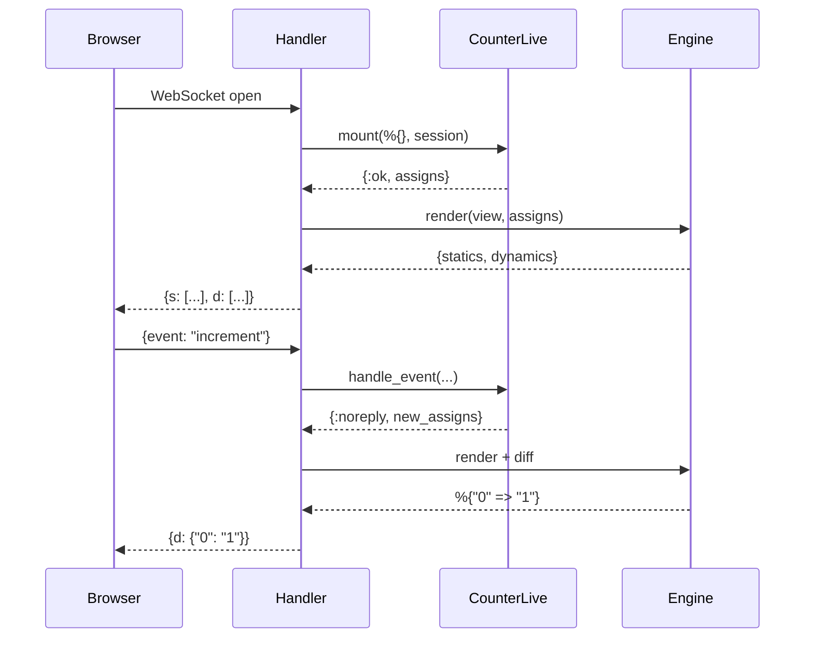

# Flow: LiveView Mount & Event

[< Overview](../01-overview.md) | [Index](../00-index.json)

---

```flow-trace
{
  "title": "LiveView Mount & Event Cycle",
  "steps": [
    {"component": "ignite.js", "action": "Open WebSocket", "file": "assets/ignite.js:709", "detail": "connect(livePath) → new WebSocket()"},
    {"component": "Handler", "action": "Parse session from WS handshake", "file": "lib/ignite/live_view/handler.ex:20", "detail": "Decode signed session from Cookie header"},
    {"component": "Handler", "action": "Call view.mount/2", "file": "lib/ignite/live_view/handler.ex:42", "detail": "CounterLive.mount(%{}, session) → {:ok, assigns}"},
    {"component": "Engine", "action": "Render → statics + dynamics", "file": "lib/ignite/live_view/handler.ex:44", "detail": "{statics, dynamics} = Engine.render(view, assigns)"},
    {"component": "Handler", "action": "Send mount payload", "file": "lib/ignite/live_view/handler.ex:61", "detail": "{s: statics, d: dynamics}"},
    {"component": "ignite.js", "action": "Save statics, morphdom()", "file": "assets/ignite.js:509", "detail": "buildHtml → applyUpdate"},
    {"component": "Browser", "action": "User clicks +1", "file": "assets/ignite.js:633", "detail": "ignite-click → sendEvent('increment', {})"},
    {"component": "Handler", "action": "handle_event → new assigns", "file": "lib/ignite/live_view/handler.ex:105", "detail": "{:noreply, %{count: 1}}"},
    {"component": "Engine", "action": "Diff → sparse map", "file": "lib/ignite/live_view/engine.ex:60", "detail": "diff([\"0\"], [\"1\"]) → %{\"0\" => \"1\"}"},
    {"component": "ignite.js", "action": "Patch dynamics, morphdom", "file": "assets/ignite.js:518", "detail": "dynamics[0] = '1'; morphdom patches text node"}
  ]
}
```



---

[< Overview](../01-overview.md) | [Index](../00-index.json)

---
