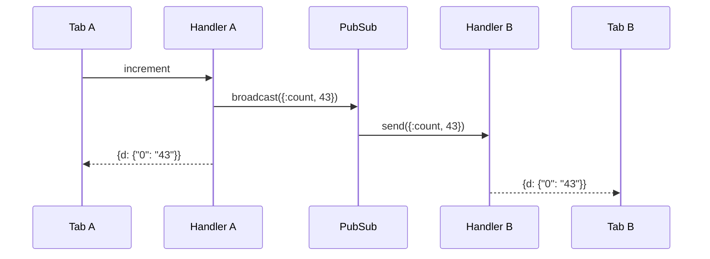

# Flow: PubSub Broadcast

[< Overview](../01-overview.md) | [Index](../00-index.json)

---

```flow-trace
{
  "title": "Shared Counter PubSub",
  "steps": [
    {"component": "Tab A", "action": "Click increment", "file": "assets/ignite.js:633", "detail": "sendEvent('increment', {})"},
    {"component": "Handler A", "action": "handle_event + broadcast", "file": "lib/ignite/live_view/handler.ex:105", "detail": "PubSub.broadcast(\"counter\", {:count, 43})"},
    {"component": "PubSub", "action": "Send to all except self()", "file": "lib/ignite/pub_sub.ex:38", "detail": ":pg members → filter self() → send to Tab B"},
    {"component": "Handler A", "action": "Re-render + push to Tab A", "file": "lib/ignite/live_view/handler.ex:167", "detail": "Direct from handle_event return"},
    {"component": "Handler B", "action": "Receive in websocket_info", "file": "lib/ignite/live_view/handler.ex:150", "detail": "handle_info → update → diff → push to Tab B"}
  ]
}
```



---

[< Overview](../01-overview.md) | [Index](../00-index.json)

---
