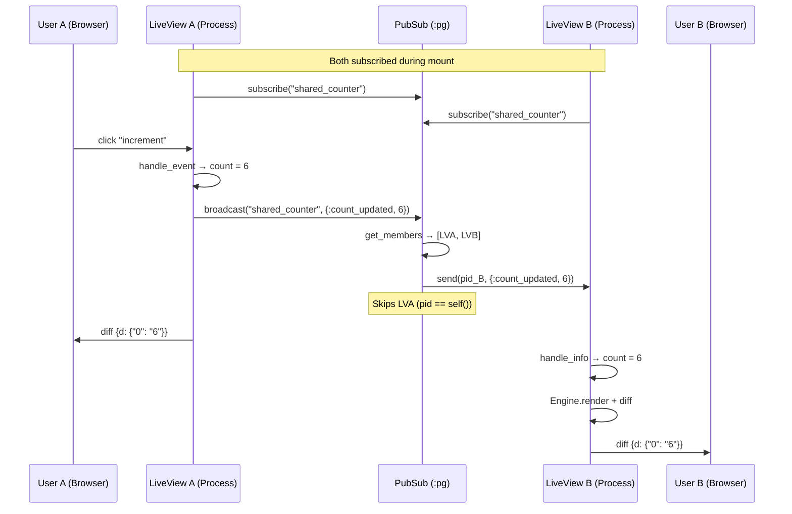

# PubSub Broadcast

<!-- metadata: modules=PubSub & Presence, LiveView | last-generated=2026-03-24 -->

## Flow Overview

This flow traces how a message broadcast from one LiveView process reaches all other subscribed LiveView processes via Erlang's `:pg` process groups, triggering re-renders and DOM patches for every connected client. This is the mechanism behind shared counters, chat rooms, and any feature where multiple users see real-time updates from each other.

## End-to-End Trace

```flow-trace
{
  "title": "PubSub: Broadcast from SharedCounter → All Clients",
  "steps": [
    {
      "component": "LiveView A",
      "action": "User A clicks increment on shared counter",
      "file": "lib/my_app/live/shared_counter_live.ex",
      "detail": "The SharedCounterLive's handle_event(\"increment\", ...) is called. After updating its own assigns, it broadcasts the new count to all subscribers."
    },
    {
      "component": "PubSub",
      "action": "Ignite.PubSub.broadcast(\"shared_counter\", {:count_updated, new_count})",
      "file": "lib/ignite/pub_sub.ex:37",
      "detail": "broadcast/2 calls :pg.get_members(Ignite.PubSub, \"shared_counter\") to get all PIDs subscribed to this topic. It then sends the message to each PID except self() to avoid echo loops."
    },
    {
      "component": "Erlang :pg",
      "action": "Return list of subscribed process PIDs",
      "file": "lib/ignite/pub_sub.ex:38",
      "detail": ":pg.get_members returns all processes that called :pg.join for this topic. Each LiveView handler process that called PubSub.subscribe(\"shared_counter\") in its mount is in this list."
    },
    {
      "component": "PubSub",
      "action": "send(pid, {:count_updated, new_count}) for each subscriber",
      "file": "lib/ignite/pub_sub.ex:39",
      "detail": "A plain Erlang send/2 delivers the message to each subscriber's mailbox. The pid != self() guard skips the sender. This is a fire-and-forget operation — no acknowledgment."
    },
    {
      "component": "LiveView B",
      "action": "Handler.websocket_info receives the broadcast",
      "file": "lib/ignite/live_view/handler.ex:150",
      "detail": "Cowboy's websocket_info/2 is called when the handler process receives any message. It checks if the view module exports handle_info/2 and calls it with the message and current assigns."
    },
    {
      "component": "LiveView B",
      "action": "View.handle_info updates assigns with new count",
      "file": "lib/my_app/live/shared_counter_live.ex",
      "detail": "handle_info({:count_updated, new_count}, assigns) returns {:noreply, %{assigns | count: new_count}}. The view's state is now in sync with the broadcaster."
    },
    {
      "component": "Engine",
      "action": "Re-render and diff for LiveView B",
      "file": "lib/ignite/live_view/handler.ex:167",
      "detail": "send_render_update/2 calls Engine.render to get new dynamics, then Engine.diff against prev_dynamics. Only the changed count value appears in the sparse diff."
    },
    {
      "component": "Browser B",
      "action": "Receives diff, patches DOM",
      "file": "assets/ignite.js",
      "detail": "The JSON diff payload arrives over Browser B's WebSocket. ignite.js merges the diff into cached dynamics and uses morphdom to update the displayed count."
    }
  ]
}
```

## Beginner-Friendly Explanation

```chat
{
  "title": "PubSub: How Two Users See the Same Counter Change",
  "participants": {
    "User A": {"color": "#4A90D9", "icon": "laptop"},
    "LiveView A": {"color": "#FF6B6B", "icon": "server"},
    "PubSub": {"color": "#50C878", "icon": "broadcast"},
    "LiveView B": {"color": "#9B59B6", "icon": "server"},
    "User B": {"color": "#FFB347", "icon": "laptop"}
  },
  "messages": [
    {"from": "User A", "text": "I clicked the +1 button on the shared counter!", "technical": "ignite-click=\"increment\" → WebSocket sends {event: \"increment\", params: {}}"},
    {"from": "LiveView A", "text": "Got it! I've updated my count to 6. Let me tell everyone else about this.", "technical": "handle_event → {:noreply, %{assigns | count: 6}} then calls PubSub.broadcast(\"shared_counter\", {:count_updated, 6})"},
    {"from": "PubSub", "text": "I'll check who's listening to 'shared_counter'. Found LiveView B! Sending the message now.", "technical": ":pg.get_members returns [pid_B, pid_A]. Sends to pid_B only (pid_A == self() is skipped)."},
    {"from": "LiveView B", "text": "Oh, I got a message! The count is now 6. Let me update my state and re-render.", "technical": "websocket_info → handle_info({:count_updated, 6}, assigns) → {:noreply, %{assigns | count: 6}}"},
    {"from": "User B", "text": "The counter just updated to 6 on my screen! I didn't even click anything!", "technical": "Engine.diff produces sparse diff, WebSocket sends {d: {\"0\": \"6\"}}, morphdom patches the DOM"}
  ]
}
```

## Sequence Diagram



## State Transitions

| Step | PubSub State | LiveView A | LiveView B |
|------|-------------|-----------|-----------|
| Mount A | `:pg` group "shared_counter" = [pid_A] | `%{count: 5}` | — |
| Mount B | `:pg` group = [pid_A, pid_B] | `%{count: 5}` | `%{count: 5}` |
| A clicks +1 | (unchanged) | `%{count: 6}` | `%{count: 5}` |
| Broadcast | (unchanged) | `%{count: 6}` | message in mailbox |
| B processes | (unchanged) | `%{count: 6}` | `%{count: 6}` |
| B disconnects | `:pg` group = [pid_A] | `%{count: 6}` | (process dead) |

## Error Paths

### Subscriber Process Has Crashed
If a subscribed process has already died but `:pg` hasn't cleaned it up yet, `send/2` silently succeeds (Erlang `send` never fails). The message goes to a dead process's mailbox and is garbage collected. `:pg` cleans up dead processes lazily on the next `get_members` call.

### handle_info Not Exported
If a LiveView doesn't define `handle_info/2`, the handler checks `function_exported?(state.view, :handle_info, 2)` at `lib/ignite/live_view/handler.ex:151`. If false, the message is silently ignored — no crash, no re-render.

### PubSub Scope Not Started
If `Ignite.PubSub` wasn't started in the supervision tree, `:pg.join/3` raises an error. This is prevented by the boot order in `lib/ignite/application.ex:46` — PubSub starts before Cowboy.

## Practice

```drag-match
{
  "title": "Match PubSub Concepts to Descriptions",
  "pairs": [
    {"concept": ":pg (process groups)", "description": "Erlang built-in module that maintains groups of processes by topic — automatic cleanup on process death"},
    {"concept": "subscribe/1", "description": "Joins the calling process to a topic group via :pg.join — must be called from the LiveView process itself"},
    {"concept": "broadcast/2", "description": "Sends a message to all group members except self() to avoid echo loops"},
    {"concept": "websocket_info/2", "description": "Cowboy callback that fires when the handler process receives any Erlang message (including PubSub broadcasts)"},
    {"concept": "pid != self()", "description": "Guard in broadcast that prevents the sender from receiving their own message"}
  ]
}
```

```spot-the-bug
{
  "title": "Find the PubSub Bug",
  "language": "elixir",
  "code": "def broadcast(topic, message) do\n  for pid <- :pg.get_members(__MODULE__, topic) do\n    send(pid, message)\n  end\n  :ok\nend",
  "bug_lines": [2, 3],
  "hints": [
    "What happens when the process that calls broadcast is also subscribed to the topic?",
    "Without filtering out self(), the sender receives their own broadcast — causing double-processing"
  ],
  "explanation": "The real broadcast/2 (lib/ignite/pub_sub.ex:38) includes a guard: pid != self(). Without it, a LiveView that broadcasts would also receive the message in its own handle_info, potentially double-counting the update. For example, a shared counter would increment twice — once from handle_event and again from handle_info."
}
```

> **Quiz: Process Group Lifecycle**
>
> Looking at `lib/ignite/pub_sub.ex:29-31`, when does a process get removed from a `:pg` group?
>
> - A) When you call `PubSub.unsubscribe(topic)`
> - B) When the process terminates (crash, normal exit, WebSocket disconnect)
> - C) After a configurable timeout
> - D) Only on explicit removal
>
> <details>
> <summary>Show Answer</summary>
>
> **B)** Erlang's `:pg` module automatically monitors all member processes. When a process terminates for any reason, `:pg` removes it from all groups it belonged to. This is noted in the moduledoc at `lib/ignite/pub_sub.ex:6-7`: "When a process dies (e.g. WebSocket disconnects), `:pg` automatically removes it from all groups — no manual cleanup needed." There is no `unsubscribe` function in Ignite's PubSub module.
>
> </details>

---
[< Previous: Router Macro Expansion](./router-macro-expansion.md) | [Index](../01-overview.md) | [Next: Fine-Grained Diffing Pipeline >](./fine-grained-diffing-pipeline.md)
