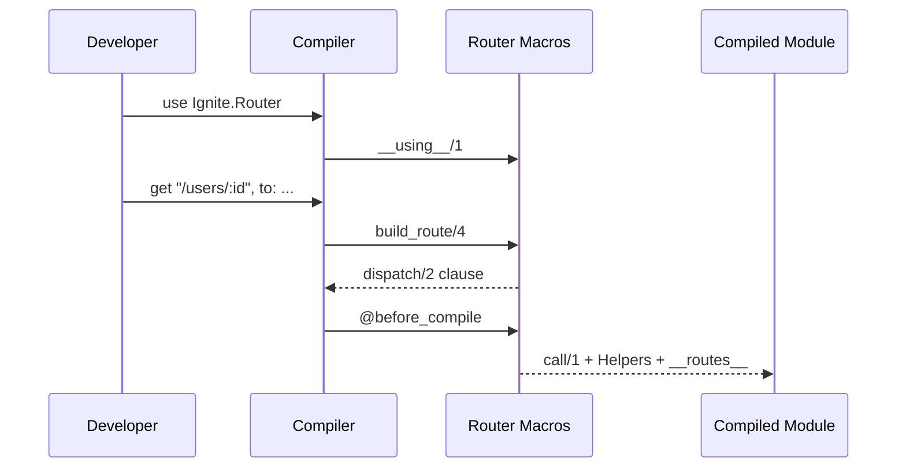

# Flow: Router Macro Expansion

[< Overview](../01-overview.md) | [Index](../00-index.json)

---

```flow-trace
{
  "title": "Route Compilation Pipeline",
  "steps": [
    {"component": "Setup", "action": "use Ignite.Router", "file": "lib/ignite/router.ex:29", "detail": "Import macros, register @plugs/@route_info, set @before_compile"},
    {"component": "Macro", "action": "get calls build_route/4", "file": "lib/ignite/router.ex:77", "detail": "get(\"/users/:id\", to: UserController, action: :show)"},
    {"component": "Macro", "action": "Build match pattern", "file": "lib/ignite/router.ex:269", "detail": "[\"users\", \":id\"] → {[\"users\", id], [:id]}"},
    {"component": "Macro", "action": "Generate dispatch/2 clause", "file": "lib/ignite/router.ex:276", "detail": "defp dispatch(%Conn{method: \"GET\"}, [\"users\", id]) do ... end"},
    {"component": "@before_compile", "action": "Generate call/1 + Helpers", "file": "lib/ignite/router.ex:328", "detail": "Plug pipeline, path helpers, __routes__/0"}
  ]
}
```



---

[< Overview](../01-overview.md) | [Index](../00-index.json)

---
