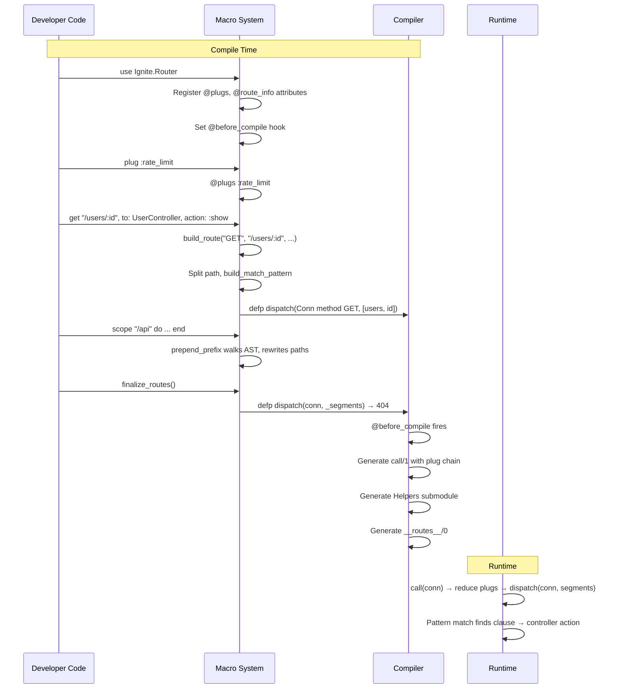

# Router Macro Expansion

<!-- metadata: modules=Router DSL | last-generated=2026-03-24 -->

## Flow Overview

This flow traces how Ignite's router DSL — `use Ignite.Router`, `plug`, `get`, `scope`, `resources`, `finalize_routes` — transforms high-level route declarations into compiled Elixir pattern-matching functions at compile time. No runtime route table lookup exists; routes are native function clauses.

## End-to-End Trace

```flow-trace
{
  "title": "Router DSL → Compiled Dispatch Functions",
  "steps": [
    {
      "component": "MyApp.Router",
      "action": "use Ignite.Router — inject macros and module attributes",
      "file": "lib/ignite/router.ex:29",
      "detail": "__using__/1 imports Ignite.Router macros, registers @plugs and @route_info as accumulating module attributes, and sets @before_compile Ignite.Router so code generation happens after all macros expand."
    },
    {
      "component": "MyApp.Router",
      "action": "plug :rate_limit — accumulate middleware",
      "file": "lib/ignite/router.ex:63",
      "detail": "The plug/1 macro simply does @plugs :rate_limit. Because @plugs has accumulate: true, each call adds to a list. Plugs are accumulated in reverse order — they'll be reversed at compile time."
    },
    {
      "component": "MyApp.Router",
      "action": "get \"/hello\", to: WelcomeController, action: :hello",
      "file": "lib/ignite/router.ex:77",
      "detail": "The get/3 macro calls build_route(\"GET\", \"/hello\", WelcomeController, :hello). This generates a defp dispatch/3 clause that pattern-matches method \"GET\" and segments [\"hello\"]."
    },
    {
      "component": "Router",
      "action": "build_route — split path into segments, build pattern",
      "file": "lib/ignite/router.ex:268",
      "detail": "The path \"/hello\" is split into [\"hello\"]. Each segment is either a literal string (for matching) or a :param (captured as a variable). The function clause and @route_info accumulation are emitted as quoted AST."
    },
    {
      "component": "Router",
      "action": "Dynamic route: get \"/users/:id\" — capture variable",
      "file": "lib/ignite/router.ex:298",
      "detail": "build_match_pattern splits [\"users\", \":id\"]. The :id segment becomes a Macro.var(:id, nil) in the pattern and is added to param_names. The generated dispatch clause will match any value in that position and bind it."
    },
    {
      "component": "Router",
      "action": "scope \"/api\" — AST transformation",
      "file": "lib/ignite/router.ex:217",
      "detail": "The scope/2 macro walks the AST of the do-block with prepend_prefix/2. Every route macro call inside the scope gets its path argument prefixed. get \"/status\" becomes get \"/api/status\". This is a compile-time AST rewrite — zero runtime overhead."
    },
    {
      "component": "Router",
      "action": "resources \"/users\", UserController — expand to CRUD routes",
      "file": "lib/ignite/router.ex:153",
      "detail": "The resources/3 macro expands into multiple route macro calls: GET /users (index), GET /users/:id (show), POST /users (create), PUT /users/:id (update), PATCH /users/:id (update), DELETE /users/:id (delete). Each integrates with scope prefixing."
    },
    {
      "component": "Router",
      "action": "finalize_routes — add catch-all 404",
      "file": "lib/ignite/router.ex:227",
      "detail": "Defines a final dispatch/3 clause with a wildcard pattern: dispatch(conn, _segments). Because Elixir pattern-matches function clauses top-to-bottom, this only triggers if no route above matched."
    },
    {
      "component": "Compiler",
      "action": "@before_compile — generate call/1, Helpers, __routes__/0",
      "file": "lib/ignite/router.ex:328",
      "detail": "__before_compile__/1 reads the accumulated @plugs (reversed to original order) and @route_info. It generates: (1) call/1 that chains plugs via Enum.reduce then calls dispatch, (2) a Helpers submodule with _path functions, (3) __routes__/0 for introspection."
    }
  ]
}
```

## Beginner-Friendly Explanation

```chat
{
  "title": "How the Router Writes Its Own Code",
  "participants": {
    "Developer": {"color": "#4A90D9", "icon": "laptop"},
    "Macro System": {"color": "#FF6B6B", "icon": "gear"},
    "Compiler": {"color": "#50C878", "icon": "server"},
    "Runtime": {"color": "#FFB347", "icon": "zap"}
  },
  "messages": [
    {"from": "Developer", "text": "I wrote 'get \"/users/:id\"' in my router. What happens with that?", "technical": "get \"/users/:id\", to: UserController, action: :show"},
    {"from": "Macro System", "text": "I see that! Let me rewrite it as an actual function. I'll split the path into segments and turn :id into a variable that captures whatever is in that URL position.", "technical": "build_match_pattern([\"users\", \":id\"]) → {[\"users\", var_id], [:id]}"},
    {"from": "Macro System", "text": "Now I'm generating a function clause: 'defp dispatch(%Conn{method: \"GET\"}, [\"users\", id]) do...'", "technical": "The quoted AST defines a dispatch/3 function clause with pattern matching on method and path segments"},
    {"from": "Developer", "text": "What about my 'scope \"/api\"' block?", "technical": "scope \"/api\" do\\n  get \"/status\", to: ApiController, action: :status\\nend"},
    {"from": "Macro System", "text": "I walk through the AST of everything inside your scope block and prepend '/api' to every route path. So '/status' becomes '/api/status'. This all happens at compile time — no if-statements at runtime!", "technical": "prepend_prefix({:get, meta, [\"/status\" | rest]}, \"/api\") → {:get, meta, [\"/api/status\" | rest]}"},
    {"from": "Compiler", "text": "All macros have expanded. Now I run @before_compile. I read all the accumulated plugs and routes, and generate the call/1 entry point that chains everything together.", "technical": "__before_compile__ reads @plugs and @route_info, generates call/1 with Enum.reduce for plugs, Helpers submodule, and __routes__/0"},
    {"from": "Runtime", "text": "When a request comes in, I just call dispatch(conn, [\"users\", \"42\"]). Elixir's pattern matching finds the right clause in O(1). The variable id is bound to \"42\" and put into conn.params.", "technical": "dispatch(%Conn{method: \"GET\"}, [\"users\", id]) → params = %{id: \"42\"} → UserController.show(conn)"}
  ]
}
```

## Sequence Diagram



## State Transitions

| Phase | What Exists |
|-------|------------|
| After `use Ignite.Router` | Module has `@plugs []`, `@route_info []`, imports macros |
| After `plug :rate_limit` | `@plugs [:rate_limit]` |
| After `get "/hello"` | New `dispatch/3` clause compiled; `@route_info` has `{"GET", "/hello", ...}` |
| After `scope "/api"` | Routes inside have paths prefixed; e.g., `dispatch(_, ["api", "status"])` |
| After `resources "/users"` | 6 new `dispatch/3` clauses (index, show, create, update×2, delete) |
| After `finalize_routes` | Catch-all `dispatch(conn, _segments)` → 404 |
| After `@before_compile` | `call/1` exists, `Helpers` submodule exists, `__routes__/0` exists |

## Error Paths

### Route Not Found
If no `dispatch/3` clause matches, the catch-all from `finalize_routes` (`lib/ignite/router.ex:229`) returns a 404 text response. If `finalize_routes` is omitted, Elixir raises a `FunctionClauseError` at runtime.

### Plug Function Doesn't Exist
If a `plug :nonexistent` is declared but the function isn't defined in the router module, the generated `call/1` will fail with `UndefinedFunctionError` at runtime when `apply(__MODULE__, :nonexistent, [conn])` is called.

### Scope with Non-String Path
If `scope` is called with a non-string argument, `prepend_prefix` won't match its guard clause (`when is_binary(path)`) and will pass through unchanged, silently producing incorrect routes.

## Practice

```drag-match
{
  "title": "Match the Macro to What It Generates",
  "pairs": [
    {"concept": "use Ignite.Router", "description": "Registers @plugs and @route_info accumulating attributes and sets @before_compile hook"},
    {"concept": "plug :name", "description": "Adds :name to the @plugs module attribute list"},
    {"concept": "get \"/path\"", "description": "Defines a defp dispatch/3 clause that pattern-matches GET and the path segments"},
    {"concept": "scope \"/prefix\"", "description": "Walks the AST of the block and prepends the prefix to all route paths at compile time"},
    {"concept": "resources \"/path\"", "description": "Expands into 6 route macro calls for index, show, create, update, and delete"},
    {"concept": "@before_compile", "description": "Generates call/1 with plug chain, Helpers submodule, and __routes__/0 introspection"}
  ]
}
```

```spot-the-bug
{
  "title": "Find the Router Definition Bug",
  "language": "elixir",
  "code": "defmodule MyApp.Router do\n  use Ignite.Router\n\n  plug :log_request\n\n  finalize_routes()\n\n  get \"/hello\", to: WelcomeController, action: :hello\n  get \"/users/:id\", to: UserController, action: :show\n\n  def log_request(conn), do: conn\nend",
  "bug_lines": [6],
  "hints": [
    "Look at the order of route definitions. What does finalize_routes() generate?",
    "finalize_routes() creates a catch-all dispatch(conn, _segments) clause — pattern matching is top-to-bottom"
  ],
  "explanation": "finalize_routes() on line 6 generates a catch-all dispatch(conn, _segments) clause BEFORE the actual routes on lines 8-9. Since Elixir matches function clauses top-to-bottom, the catch-all matches first and every request gets 404. finalize_routes() must be the LAST route definition, after all get/post/etc calls."
}
```

> **Quiz: Scope AST Transformation**
>
> Looking at `lib/ignite/router.ex:243-258`, what does `prepend_prefix` do with an expression it doesn't recognize (not a route macro or nested scope)?
>
> - A) Raises a compile error
> - B) Wraps it in a scope with the prefix
> - C) Passes it through unchanged
> - D) Deletes it from the AST
>
> <details>
> <summary>Show Answer</summary>
>
> **C)** The catch-all clause at line 261 (`defp prepend_prefix(expr, _prefix), do: expr`) passes unrecognized expressions through unchanged. This means you can safely include non-route code (comments, other macro calls, function definitions) inside a scope block — they won't be affected by the prefix transformation.
>
> </details>

---
[< Previous: LiveView Mount & Event](./liveview-mount-and-event.md) | [Index](../01-overview.md) | [Next: PubSub Broadcast >](./pubsub-broadcast.md)
