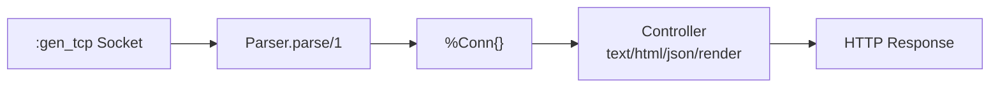

# Core HTTP

<!-- metadata: complexity=Moderate | files=6 | last-generated=2026-03-24 -->

[< Overview](../01-overview.md) | [Index](../00-index.json) | [Next: Router DSL >](./02-router-dsl.md)

---

## Purpose

The core HTTP module defines `%Ignite.Conn{}` — the data structure representing every HTTP request and response, the parser that reads raw bytes from a TCP socket, and controller helpers (`text`, `html`, `json`, `redirect`, `render`) for building responses.

## Key Files

| File | Purpose |
|------|---------|
| `lib/ignite/conn.ex` | `%Ignite.Conn{}` struct |
| `lib/ignite/parser.ex` | Reads HTTP from `:gen_tcp` socket into `%Conn{}` |
| `lib/ignite/server.ex` | GenServer TCP accept loop (educational) |
| `lib/ignite/controller.ex` | Response helpers: `text/2`, `html/2`, `json/2`, `render/3`, `redirect/2` |

## Architecture



## How It Works

### Understanding the Conn Struct

**The Big Picture:** The Conn is like a clipboard passed around an office. The mailroom (parser) writes what the visitor wants. Each department (middleware, controller) reads and annotates it. The last stop drafts the reply.

<details>
<summary>Intermediate: How it works</summary>

`%Ignite.Conn{}` at `lib/ignite/conn.ex:13` has request fields (`method`, `path`, `headers`, `params`) filled by the parser, and response fields (`status`, `resp_body`, `resp_headers`, `halted`) filled by controllers. The `halted` field at line 36 short-circuits the plug pipeline.

</details>

<details>
<summary>Advanced: Under the hood</summary>

Struct updates (`%Conn{conn | field: value}`) create new structs — immutability means safe pattern matching. The `private` field (line 28) stores framework internals (flash, request ID, CSP nonce) as a map to avoid struct field explosion.

</details>

```code-walkthrough
{
  "title": "How text/3 Builds a Response",
  "language": "elixir",
  "code": "def text(conn, body, status \\\\ 200) do\n  %Ignite.Conn{\n    conn\n    | status: status,\n      resp_body: body,\n      resp_headers: Map.put(conn.resp_headers, \"content-type\", \"text/plain\"),\n      halted: true\n  }\nend",
  "steps": [
    {"lines": [1], "annotation": "Takes the current conn, body string, and optional status (default 200)."},
    {"lines": [2, 3], "annotation": "Creates a NEW conn struct. The original is NOT modified — Elixir structs are immutable."},
    {"lines": [4, 5, 6], "annotation": "Sets status, body, and content-type on the response."},
    {"lines": [7], "annotation": "halted: true tells the router's plug pipeline to stop processing."}
  ]
}
```

## Key Flows

```flow-trace
{
  "title": "TCP Server Request Lifecycle",
  "steps": [
    {"component": "Server", "action": "Accept TCP connection", "file": "lib/ignite/server.ex:57", "detail": "loop_acceptor/1 calls :gen_tcp.accept — blocks until client connects"},
    {"component": "Server", "action": "Spawn task for request", "file": "lib/ignite/server.ex:61", "detail": "Task.start/1 — unlinked, so crashed requests don't crash the accept loop"},
    {"component": "Parser", "action": "Read request line + headers", "file": "lib/ignite/parser.ex:18", "detail": "Uses Erlang's :http packet mode to auto-parse HTTP structure"},
    {"component": "Parser", "action": "Read body if Content-Length present", "file": "lib/ignite/parser.ex:54", "detail": "Switches socket to :raw mode, reads body bytes, parses by content-type"},
    {"component": "Router", "action": "Run plugs + dispatch", "file": "lib/ignite/server.ex:71", "detail": "MyApp.Router.call(conn) runs middleware then dispatches to controller"},
    {"component": "Controller", "action": "Build HTTP response", "file": "lib/ignite/controller.ex:207", "detail": "send_resp/1 constructs raw HTTP string from conn fields"}
  ]
}
```

## Gotchas

- **`halted: true` set by all response helpers** (line 28, 45, 67, 89) — if you call `text()` then `html()`, only the last takes effect in a single action.
- **The parser only works with the TCP server** — Cowboy adapter replaces it in Step 10.
- **`render/3` re-reads EEx templates at runtime** (`lib/ignite/controller.ex:200`).

## Practice

```drag-match
{
  "title": "Match the Conn Field to Its Role",
  "pairs": [
    {"concept": "conn.method", "description": "The HTTP verb: GET, POST, PUT, PATCH, DELETE"},
    {"concept": "conn.params", "description": "URL parameters and parsed body data merged into one map"},
    {"concept": "conn.halted", "description": "When true, stops the plug pipeline — no more middleware runs"},
    {"concept": "conn.private", "description": "Framework-internal data: flash messages, request ID, CSP nonce"},
    {"concept": "conn.resp_body", "description": "The response content sent back to the client"}
  ]
}
```

```spot-the-bug
{
  "title": "Find the Response Bug",
  "language": "elixir",
  "code": "def index(conn) do\n  text(conn, \"first response\")\n  html(conn, \"<h1>second response</h1>\")\nend",
  "bug_lines": [2],
  "hints": [
    "What does text/2 return? Is the return value used?",
    "Elixir is immutable — text(conn, ...) returns a NEW conn but the original is unchanged"
  ],
  "explanation": "Line 2 calls text(conn, ...) but discards the return value. The function returns the html response from line 3 using the ORIGINAL conn. Fix: use one response helper, or pipe: conn |> text(\"hello\")."
}
```

> **Quiz: Conn Immutability**
>
> What does `text(conn, "hello")` do to the original `conn`?
>
> - A) Modifies `conn.resp_body` in place
> - B) Returns a new conn — the original is unchanged
> - C) Sends the response immediately
>
> <details>
> <summary>Show Answer</summary>
>
> **B)** `%Conn{conn | resp_body: body}` creates a new struct. The original is unchanged.
>
> </details>

---

[< Overview](../01-overview.md) | [Index](../00-index.json) | [Next: Router DSL >](./02-router-dsl.md)
