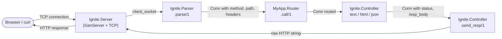
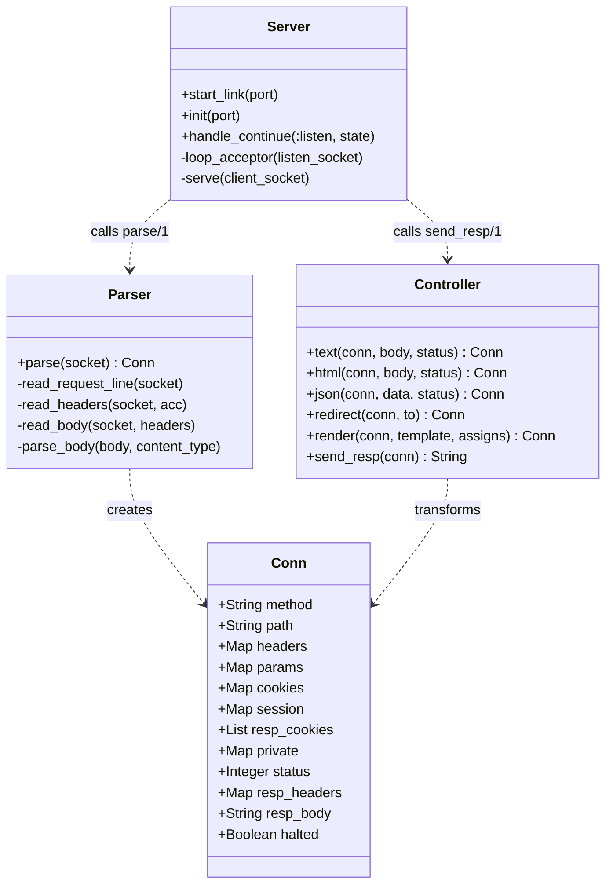

# Core HTTP

<!-- metadata: complexity=Moderate | files=4 | last-generated=2026-03-24 -->

## Purpose

The Core HTTP module is the foundation of every request and response in Ignite. It answers a single question: **how does raw TCP data become a structured request, and how does a structured response become raw TCP data again?**

Four files collaborate to make this happen:

1. **Server** -- listens on a TCP port, accepts connections, and orchestrates the parse-route-respond cycle.
2. **Parser** -- reads bytes off the socket and produces an `%Ignite.Conn{}` struct.
3. **Conn** -- a plain Elixir struct that carries *everything* about the current request and the response being built.
4. **Controller** -- helper functions (`text/3`, `html/3`, `json/3`, `render/3`) that set response fields on the Conn, plus `send_resp/1` which serialises the Conn back to raw HTTP.

The Conn struct is the single data structure that flows through the entire framework. Every plug, router, controller, and middleware receives a Conn and returns a Conn. Understanding it is the key to understanding Ignite (and Phoenix).

## Key Files

| File | Purpose |
|------|---------|
| `lib/ignite/conn.ex` | Defines `%Ignite.Conn{}` -- the request/response struct |
| `lib/ignite/parser.ex` | Reads raw HTTP from a TCP socket into a Conn |
| `lib/ignite/server.ex` | GenServer that listens, accepts, and dispatches connections |
| `lib/ignite/controller.ex` | Response helpers (`text`, `html`, `json`, `render`, `send_resp`) |

## Architecture





## How It Works

### Understanding the Conn Struct

**The Big Picture:** Think of the Conn as a **shipping manifest** that travels with a package through a warehouse. When the package arrives (HTTP request), workers write down what came in -- the sender, the contents, the destination. As the package moves through the warehouse (router, middleware, controller), workers stamp the manifest with outgoing information -- the reply, the status, the labels. At the end, the manifest is read one final time to build the outgoing shipment (HTTP response). The package itself is never mutated; each worker produces a *new* manifest with their additions.

<details><summary>Intermediate: How it works</summary>

The Conn struct is defined in `lib/ignite/conn.ex` (lines 13-37) with three groups of fields:

**Request fields** (filled by the parser):
- `method` -- `"GET"`, `"POST"`, etc.
- `path` -- `"/users/42"`
- `headers` -- `%{"host" => "localhost", "content-type" => "..."}`
- `params` -- `%{"username" => "jose"}` (from POST bodies or URL params)

**Response fields** (filled by controllers):
- `status` -- defaults to `200`
- `resp_headers` -- defaults to `%{"content-type" => "text/plain"}`
- `resp_body` -- defaults to `""`

**Control flow**:
- `halted` -- defaults to `false`; set to `true` by response helpers to signal that the pipeline should stop

Because Elixir structs are immutable, every transformation returns a *new* Conn. The update syntax `%Conn{conn | status: 404}` creates a copy with the changed field.

</details>

<details><summary>Advanced: Under the hood</summary>

The Conn struct also carries framework-internal state that most users never touch directly:

- `cookies` / `session` / `resp_cookies` (line 21-23) -- populated by the Cowboy adapter from request cookies and used by the session and flash systems.
- `private` (line 28) -- a map for framework-internal data. The flash system stores inherited flash messages here (`conn.private[:flash]`) so `get_flash/1` at `lib/ignite/controller.ex` line 124 can read them without conflicting with the session-based `put_flash/3`.

The `halted` field (line 36) is critical for the middleware pipeline. When a plug sets `halted: true`, downstream plugs check this flag and skip processing. Every response helper (`text`, `html`, `json`, `redirect`) sets `halted: true` automatically (see e.g., `lib/ignite/controller.ex` line 27).

Note the default `resp_headers` at line 32: `%{"content-type" => "text/plain"}`. This means a Conn that reaches `send_resp/1` without any controller touching it will still produce a valid HTTP response -- just an empty 200 OK with a text/plain content type.

</details>

### Understanding the HTTP Parser

**The Big Picture:** The parser is like a **mail room clerk** who opens an envelope (TCP bytes), reads the address line (request line), reads each sticky note (headers), and if there is an enclosed letter (body), reads that too. The clerk fills out a standard form (Conn struct) and passes it along.

<details><summary>Intermediate: How it works</summary>

`Ignite.Parser.parse/1` (`lib/ignite/parser.ex` lines 18-31) does three things in order:

1. **Read the request line** (line 19) -- calls `read_request_line/1` which uses `:gen_tcp.recv/2` with the socket in `packet: :http` mode. Erlang's built-in HTTP parser returns a structured tuple `{:http_request, method, {:abs_path, path}, version}` (line 34).

2. **Read headers** (line 20) -- calls `read_headers/2` which loops, reading one header at a time until it receives `:http_eoh` (end-of-headers, line 42). Each header is downcased and stored in a map (line 46-47).

3. **Read body** (line 23) -- calls `read_body/2` which checks for a `content-length` header. If present, it switches the socket from `:http` packet mode to `:raw` mode (line 63) and reads exactly that many bytes. The body is then parsed based on content type.

The result is a fresh `%Conn{}` with `method`, `path`, `headers`, and `params` populated (lines 25-30).

</details>

<details><summary>Advanced: Under the hood</summary>

**The packet-mode switch** is the subtlest part of the parser. The TCP socket starts in `packet: :http` mode (set by the server at `lib/ignite/server.ex` line 39). In this mode, Erlang's C-level HTTP parser handles the request line and headers natively -- much faster than parsing strings in Elixir. But HTTP bodies are *not* handled by this parser, so `read_body/2` must call `:inet.setopts(socket, packet: :raw)` (line 63) before reading the body bytes.

**Body parsing dispatches on content type** using pattern matching:
- `"application/x-www-form-urlencoded"` (line 76) -- uses `URI.decode_query/1` to turn `"key=val&k2=v2"` into a map.
- Anything else (line 81) -- stores the raw body under the `"_body"` key.

The `<> _` in the pattern at line 76 is important: it matches content types that have extra parameters like `application/x-www-form-urlencoded; charset=utf-8`.

</details>

### Understanding Response Helpers

**The Big Picture:** Response helpers are like **rubber stamps** at a post office. Instead of hand-writing the same return-address format every time, you pick the right stamp (`text`, `html`, `json`) and press it onto the envelope (Conn). Each stamp writes the body, sets the correct content type, and marks the envelope as "ready to send" (halted).

<details><summary>Intermediate: How it works</summary>

Each helper follows the same pattern -- take a Conn in, return a new Conn out with response fields set:

- `text/3` (`lib/ignite/controller.ex` lines 21-29) -- sets `content-type: text/plain`
- `html/3` (lines 38-46) -- sets `content-type: text/html; charset=utf-8`
- `json/3` (lines 60-68) -- encodes data with `Jason.encode!/1`, sets `content-type: application/json`
- `redirect/2` (lines 80-91) -- sets status 302 and adds a `location` header

All four set `halted: true` to signal that the pipeline should stop.

`render/3` (lines 198-202) is a higher-level helper that reads an EEx template from the `templates/` directory, evaluates it with the given assigns, and delegates to `html/2`.

</details>

<details><summary>Advanced: Under the hood</summary>

`send_resp/1` (lines 207-218) is the final step that serialises a Conn back to raw HTTP. It:

1. Builds a status line: `"HTTP/1.1 200 OK\r\n"` (line 208)
2. Auto-adds `content-length` (line 212) and `connection: close` (line 213) headers
3. Formats all headers as `"key: value\r\n"` pairs (line 214)
4. Concatenates: status line + headers + blank line + body (line 217)

The `status_text/1` function (lines 220-230) uses multi-clause pattern matching -- one function clause per status code. The catch-all on line 230 returns `"OK"` for any unrecognised code, which is pragmatic but technically incorrect for 4xx/5xx codes.

Note that `send_resp/1` uses `byte_size/1` (line 212) rather than `String.length/1`. This is correct because HTTP `Content-Length` counts *bytes*, not characters -- crucial for multi-byte UTF-8 text.

</details>

## Key Flows

```flow-trace
{
  "title": "Building a Response: From TCP Bytes to HTTP String",
  "steps": [
    {
      "file": "lib/ignite/server.ex",
      "line": 57,
      "label": "Accept TCP connection",
      "description": "loop_acceptor/1 calls :gen_tcp.accept/1 and spawns a Task to serve the connection"
    },
    {
      "file": "lib/ignite/server.ex",
      "line": 68,
      "label": "Parse the request",
      "description": "serve/1 calls Ignite.Parser.parse(client_socket) to build a %Conn{}"
    },
    {
      "file": "lib/ignite/parser.ex",
      "line": 34,
      "label": "Read request line",
      "description": "Erlang's HTTP parser extracts method and path from the first line"
    },
    {
      "file": "lib/ignite/parser.ex",
      "line": 40,
      "label": "Read headers",
      "description": "Recursive loop reads headers until :http_eoh, downcasing each key"
    },
    {
      "file": "lib/ignite/parser.ex",
      "line": 54,
      "label": "Read body (if present)",
      "description": "Switches socket to :raw mode and reads Content-Length bytes"
    },
    {
      "file": "lib/ignite/parser.ex",
      "line": 25,
      "label": "Build %Conn{}",
      "description": "Returns a new Conn struct with method, path, headers, and params"
    },
    {
      "file": "lib/ignite/server.ex",
      "line": 71,
      "label": "Route the request",
      "description": "Calls MyApp.Router.call(conn) which matches the path and dispatches to a controller"
    },
    {
      "file": "lib/ignite/controller.ex",
      "line": 21,
      "label": "Controller sets response",
      "description": "A helper like text/3 sets status, resp_body, content-type, and halted: true"
    },
    {
      "file": "lib/ignite/controller.ex",
      "line": 207,
      "label": "Serialise to HTTP",
      "description": "send_resp/1 builds the raw HTTP/1.1 response string from the Conn"
    },
    {
      "file": "lib/ignite/server.ex",
      "line": 74,
      "label": "Send and close",
      "description": ":gen_tcp.send/2 writes the response bytes, then :gen_tcp.close/1 closes the socket"
    }
  ]
}
```

```chat
{
  "title": "How the Core HTTP modules talk to each other",
  "messages": [
    {"from": "Server", "to": "Parser", "text": "Here's a client_socket -- please parse whatever the client sent."},
    {"from": "Parser", "to": "Server", "text": "Done. Here's a %Conn{method: \"GET\", path: \"/\", headers: %{\"host\" => \"localhost\"}, params: %{}}."},
    {"from": "Server", "to": "Router", "text": "Route this Conn please. (MyApp.Router.call/1)"},
    {"from": "Router", "to": "Controller", "text": "Path matched! Calling MyApp.PageController.index(conn)."},
    {"from": "Controller", "to": "Router", "text": "Here's the Conn back with status: 200, resp_body: \"Welcome!\", halted: true."},
    {"from": "Router", "to": "Server", "text": "Routing done. Returning the updated Conn."},
    {"from": "Server", "to": "Controller", "text": "Please serialise this Conn into a raw HTTP response. (send_resp/1)"},
    {"from": "Controller", "to": "Server", "text": "Here you go: \"HTTP/1.1 200 OK\\r\\ncontent-type: text/plain\\r\\n...\""},
    {"from": "Server", "to": "Client", "text": "Sending bytes over TCP and closing the socket. Bye!"}
  ]
}
```

## Hot Paths

The core HTTP path is exercised on **every single request** to the framework:

1. **`Server.serve/1`** (`lib/ignite/server.ex` line 67) -- the entry point for every connection. A new Task is spawned per request (line 61), so concurrency scales with incoming connections, but each Task is short-lived.

2. **`Parser.parse/1`** (`lib/ignite/parser.ex` line 18) -- allocates a new Conn per request. Because Erlang's native HTTP parser does the heavy lifting (`packet: :http`), this is fast. The potential bottleneck is the socket mode switch at line 63 for POST bodies.

3. **`Controller.send_resp/1`** (`lib/ignite/controller.ex` line 207) -- builds a string by concatenating status line, headers, and body. For large responses the string concatenation at line 217 could be replaced with an iolist for better performance, but for a learning framework this is fine.

## Gotchas

### 1. The socket packet-mode switch is irreversible per request

In `lib/ignite/parser.ex` line 63, the socket is switched from `:http` to `:raw` mode to read the body. If you tried to read *more* HTTP-formatted data after this (e.g., pipelined requests), the parser would fail. This is fine because the server closes the connection after each response (`lib/ignite/server.ex` line 75), but it means HTTP keep-alive is not supported.

### 2. The catch-all `status_text/1` returns "OK" for unknown codes

At `lib/ignite/controller.ex` line 230, `status_text(_)` returns `"OK"` for any unrecognised status code. This means `text(conn, "nope", 418)` would produce `HTTP/1.1 418 OK` instead of `HTTP/1.1 418 I'm a Teapot`. Not a bug in practice, but surprising if you use unusual status codes.

### 3. `halted: true` is set by helpers but not checked by `serve/1`

The response helpers all set `halted: true` (e.g., `lib/ignite/controller.ex` line 27), but `Server.serve/1` does not check this flag. The `halted` field is only meaningful later when the middleware pipeline is introduced (Step 8). Until then, nothing prevents a controller from calling `text/3` twice, with the second call silently overwriting the first.

### 4. `render/3` reads from disk on every call

At `lib/ignite/controller.ex` line 200, `EEx.eval_file/2` reads and compiles the template from the filesystem on every request. This is simple but slow. Phoenix compiles templates at build time into functions. Ignite keeps it simple for learning purposes.

## Practice

```drag-match
{
  "title": "Match each concept to its description",
  "pairs": [
    {"left": "%Ignite.Conn{}", "right": "The struct that carries request data in and response data out"},
    {"left": "packet: :http", "right": "Erlang socket mode that parses HTTP request lines and headers natively"},
    {"left": "halted: true", "right": "Flag set by response helpers to signal the pipeline should stop"},
    {"left": "send_resp/1", "right": "Serialises a Conn struct into a raw HTTP/1.1 response string"},
    {"left": ":http_eoh", "right": "The Erlang token that signals all headers have been read"},
    {"left": "byte_size/1", "right": "Used instead of String.length/1 because Content-Length counts bytes"}
  ]
}
```

```spot-the-bug
{
  "title": "Find the bug in this controller action",
  "code": "def show(conn) do\n  user = find_user(conn.params[\"id\"])\n  conn = text(conn, \"Name: #{user.name}\")\n  conn = text(conn, \"Email: #{user.email}\")\n  conn\nend",
  "bug": "text/3 is called twice, so the second call silently overwrites the first response. The user will only see the email line, not the name line. Since halted is not checked between calls, both execute without error.",
  "fix": "Combine both pieces of information into a single text/3 call:\n\n  def show(conn) do\n    user = find_user(conn.params[\"id\"])\n    text(conn, \"Name: #{user.name}\\nEmail: #{user.email}\")\n  end"
}
```

### Quick Quiz

**Q1:** Why does the parser call `:inet.setopts(socket, packet: :raw)` before reading the body?

<details><summary>Answer</summary>

Erlang's `:http` packet mode only understands the request line and headers. The body is arbitrary bytes (form data, JSON, binary uploads), so the socket must be switched to `:raw` mode to read the body as a plain binary. See `lib/ignite/parser.ex` lines 62-63.

</details>

**Q2:** What would happen if `send_resp/1` used `String.length(conn.resp_body)` instead of `byte_size(conn.resp_body)` for the Content-Length header?

<details><summary>Answer</summary>

For ASCII-only responses they would be the same. But for multi-byte UTF-8 characters (e.g., emojis, accented characters), `String.length/1` counts *characters* while `byte_size/1` counts *bytes*. HTTP's Content-Length header must be in bytes, so using `String.length/1` would cause the browser to read too few bytes and truncate the response or hang waiting for more data.

</details>

**Q3:** Why does `Server.serve/1` call `Controller.send_resp/1` *after* the router returns, rather than having the controller send the response directly?

<details><summary>Answer</summary>

Separating "build the response" from "send the response" keeps the Conn as a pure data transformation pipeline. Controllers, middleware, and the router all just transform the Conn struct -- none of them deal with sockets. Only the server, at the very end, serialises and sends. This makes every intermediate step easy to test (just inspect the Conn) and follows the same design as Phoenix/Plug.

</details>

---

[< Previous: Architecture](../02-architecture.md) | [Index](../01-overview.md) | [Next: Router DSL >](./02-router-dsl.md)
