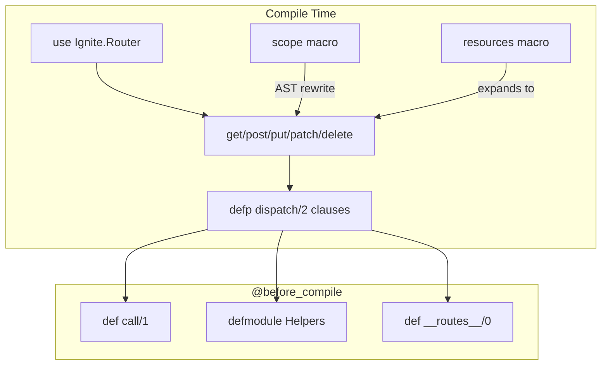

# Router DSL

<!-- metadata: complexity=Complex | files=2 | last-generated=2026-03-24 -->

[< Previous: Core HTTP](./01-core-http.md) | [Index](../00-index.json) | [Next: Cowboy Adapter >](./03-cowboy-adapter.md)

---

## Purpose

Transforms `get "/users/:id"` into compiled pattern-matching function clauses at compile time. Also generates the plug pipeline, path helpers, and route introspection using Elixir macros.

## Key Files

| File | Purpose |
|------|---------|
| `lib/ignite/router.ex` | Router DSL macros: `get`, `post`, `scope`, `resources`, `plug`, `__before_compile__` |
| `lib/ignite/router/helpers.ex` | Generates path helper functions from route metadata |

## Architecture



## How It Works

### Understanding Route Compilation

**The Big Picture:** A switchboard wired at the factory. Each `get "/path"` solders a wire. The BEAM's pattern matching instantly finds the right wire — no searching.

<details>
<summary>Intermediate: How it works</summary>

Each route macro calls `build_route/4` at `lib/ignite/router.ex:268`: splits path into segments, builds a match pattern with variable capture for `:param` segments, generates a `defp dispatch/2` clause.

The `scope` macro at line 217 is an AST rewriter — prepends prefix to path strings before macro expansion.

</details>

<details>
<summary>Advanced: Under the hood</summary>

`@before_compile` at line 328 generates `call/1` (plugs + dispatch), `Helpers` submodule (path functions via `lib/ignite/router/helpers.ex:78`), and `__routes__/0` (introspection). The `resources` macro at line 153 emits individual route macro calls, so scope/route_info work automatically.

</details>

```code-walkthrough
{
  "title": "How scope Rewrites the AST",
  "language": "elixir",
  "code": "defmacro scope(prefix, do: block) do\n  prepend_prefix(block, prefix)\nend\n\ndefp prepend_prefix({method, meta, [path | rest]}, prefix)\n     when method in [:get, :post, :put, :patch, :delete] do\n  {method, meta, [prefix <> path | rest]}\nend",
  "steps": [
    {"lines": [1, 2, 3], "annotation": "scope receives a prefix and a do-block. It passes the raw AST to prepend_prefix — no runtime overhead."},
    {"lines": [5, 6, 7], "annotation": "For route macros, prepend the prefix to the path string at the AST level. get \"/status\" inside scope \"/api\" becomes get \"/api/status\"."}
  ]
}
```

## Key Flows

```flow-trace
{
  "title": "Route Compilation: get \"/users/:id\"",
  "steps": [
    {"component": "Macro", "action": "get macro calls build_route/4", "file": "lib/ignite/router.ex:77", "detail": "get(\"/users/:id\", to: UserController, action: :show)"},
    {"component": "Macro", "action": "Split path, build match pattern", "file": "lib/ignite/router.ex:269", "detail": "[\"users\", \":id\"] → {[\"users\", id], [:id]} where id captures anything"},
    {"component": "Macro", "action": "Generate dispatch/2 clause via quote", "file": "lib/ignite/router.ex:276", "detail": "defp dispatch(%Conn{method: \"GET\"} = conn, [\"users\", id]) do ... end"},
    {"component": "@before_compile", "action": "Generate call/1 + Helpers + __routes__", "file": "lib/ignite/router.ex:328", "detail": "Reads @plugs/@route_info, generates pipeline + path helpers + introspection"}
  ]
}
```

## Gotchas

- **Order matters**: `get "/:slug"` before `get "/users"` catches everything.
- **`finalize_routes/0` must be last** (line 227): Otherwise unmatched routes crash.

## Practice

```drag-match
{
  "title": "Match Router Concepts",
  "pairs": [
    {"concept": "get \"/users/:id\"", "description": "Compiles to a pattern-matching dispatch/2 clause"},
    {"concept": "scope \"/api\"", "description": "Rewrites AST to prepend prefix to all nested paths"},
    {"concept": "resources \"/posts\"", "description": "Expands into 6 route macro calls for CRUD"},
    {"concept": "@before_compile", "description": "Generates call/1, Helpers submodule, and __routes__/0"},
    {"concept": "plug :rate_limit", "description": "Accumulates function name into @plugs attribute"}
  ]
}
```

```spot-the-bug
{
  "title": "Find the Route Ordering Bug",
  "language": "elixir",
  "code": "use Ignite.Router\n\nget \"/:slug\", to: PageController, action: :show\nget \"/users\", to: UserController, action: :index\nget \"/about\", to: PageController, action: :about\n\nfinalize_routes()",
  "bug_lines": [3],
  "hints": [
    "Pattern matching tries clauses top-to-bottom. What does /:slug match?",
    ":slug captures ANY single segment — including 'users' and 'about'"
  ],
  "explanation": "Line 3 catches all single-segment paths. GET /users matches /:slug before reaching line 4. Fix: move /:slug AFTER specific routes."
}
```

> **Quiz: Scope Mechanics**
>
> What does `scope "/api" do scope "/v1" do get "/users" end end` produce?
>
> - A) GET /users
> - B) GET /v1/users
> - C) GET /api/v1/users
>
> <details>
> <summary>Show Answer</summary>
>
> **C)** Nested scopes compose: outer prepends `/api` to inner's `/v1`, producing `scope "/api/v1"`. Then `/api/v1` is prepended to `/users`.
>
> </details>

---

[< Previous: Core HTTP](./01-core-http.md) | [Index](../00-index.json) | [Next: Cowboy Adapter >](./03-cowboy-adapter.md)
