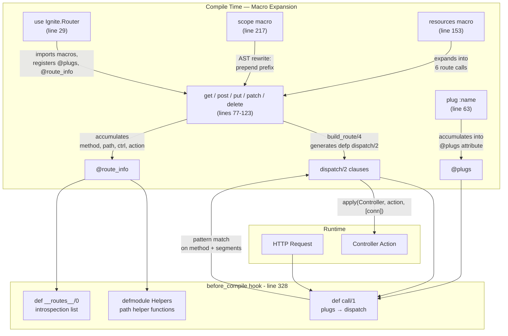

# Router DSL

<!-- metadata: complexity=Complex | files=2 | last-generated=2026-03-24 -->

[< Previous: Core HTTP](./01-core-http.md) | [Index](../01-overview.md) | [Next: Cowboy Adapter >](./03-cowboy-adapter.md)

---

## Purpose

The Router DSL transforms declarative route definitions like `get "/users/:id"` into compiled pattern-matching function clauses at compile time. Instead of looping through a route table at runtime (O(n)), the BEAM's pattern matching dispatches in O(1). Macros are the key enabler: they let you write a friendly DSL that generates efficient Erlang bytecode before the application even starts.

The router also generates a middleware pipeline (plugs), path helper functions, and a route introspection API — all at compile time via Elixir's `@before_compile` hook.

## Key Files

| File | Purpose |
|------|---------|
| `lib/ignite/router.ex` | Router DSL macros: `get`, `post`, `put`, `patch`, `delete`, `scope`, `resources`, `plug`, `finalize_routes`, and `__before_compile__` |
| `lib/ignite/router/helpers.ex` | Derives helper function names from paths and generates path helper functions from route metadata |
| `lib/my_app/router.ex` | Sample usage: plugs, routes, scoped routes, resource routes |

## Architecture



## How It Works

### Understanding the Macro DSL

**The Big Picture:** Think of the router as a recipe book that writes itself. Each `get "/path"` line is an instruction to the compiler: "generate a function clause that handles this exact pattern." By the time your app starts, all the routing decisions are baked into the bytecode — no interpretation, no lookup tables, just direct pattern matching.

<details>
<summary>Intermediate: How __using__, plug, and route macros work</summary>

When a module writes `use Ignite.Router`, the `__using__/1` macro (line 29) injects three things:

1. **`import Ignite.Router`** — makes `get`, `post`, `scope`, `plug`, etc. available without qualification
2. **`Module.register_attribute`** — creates two accumulating attributes:
   - `@plugs` — collects middleware function names (line 35)
   - `@route_info` — collects `{method, path, controller, action}` tuples (line 39)
3. **`@before_compile Ignite.Router`** — schedules code generation after all module attributes are collected (line 44)

The `plug` macro (line 63) simply appends an atom to `@plugs`:

```elixir
defmacro plug(function_name) do
  quote do
    @plugs unquote(function_name)
  end
end
```

Each route macro (`get`, `post`, etc.) delegates to `build_route/4` (line 268), which:
1. Splits the path into segments
2. Builds a pattern that captures `:param` segments as variables
3. Emits a `defp dispatch/2` function clause via `quote`
4. Accumulates route metadata into `@route_info`

</details>

<details>
<summary>Advanced: AST manipulation, @before_compile, and code generation</summary>

**Pattern Building (lines 298-311):** `build_match_pattern/1` converts path segments into a quoted list pattern. Literal segments stay as strings; `:param` segments become `Macro.var/2` calls that generate unbound variables in the function head. For `"/users/:id/posts"`, this produces the pattern `["users", id, "posts"]` where `id` is a variable that captures any value.

**Params Map (lines 316-323):** `build_params_map/1` builds a quoted `%{id: id}` expression that references the same variables from the match pattern, creating the params map at runtime.

**The `build_route/4` output (lines 268-290):** Each call generates a `defp dispatch/2` clause:

```elixir
defp dispatch(%Ignite.Conn{method: "GET"} = conn, ["users", id]) do
  params = %{id: id}
  conn = %Ignite.Conn{conn | params: Map.merge(conn.params, params)}
  apply(UserController, :show, [conn])
end
```

**@before_compile (lines 328-378):** When the module finishes compiling, Elixir calls `__before_compile__/1`, which:
1. Reads `@plugs` and reverses it (accumulation is prepend-order) — line 329
2. Reads `@route_info` and reverses it — line 330
3. Generates `def call/1` that runs plugs via `Enum.reduce`, checking `halted` between each, then dispatches — lines 345-357
4. Generates a `Helpers` submodule using `Ignite.Router.Helpers.build_helper_functions/1` — lines 359-367
5. Generates `def __routes__/0` for runtime introspection — line 376

**Scope AST Rewriting (lines 238-261):** The `scope` macro does not execute anything at runtime. It walks the AST tree of its `do` block and rewrites path strings. `prepend_prefix/2` pattern-matches on AST nodes:
- Route macro calls (`get`, `post`, etc.) — prepends prefix to the path argument (line 243-246)
- `resources` calls — prepends prefix to the resource path (line 249-252)
- Nested `scope` calls — concatenates prefixes (line 255-258)
- Everything else — passes through unchanged (line 261)

</details>

### Understanding Route Dispatch

**The Big Picture:** At runtime, `call/1` splits the request path into segments and calls `dispatch/2`. The BEAM's pattern matching instantly selects the right clause — like flipping to the right page in a phone book by tab, not scanning page by page.

<details>
<summary>Intermediate: Pattern matching mechanics</summary>

Each `dispatch/2` clause matches on two things simultaneously:
1. The HTTP method in `%Ignite.Conn{method: "GET"}` — only matches requests with the right verb
2. The path segments list `["users", id]` — matches the URL structure and captures dynamic segments

The BEAM compiles these multi-clause functions into an efficient decision tree. For N routes, dispatch is O(1) — the compiler generates jump tables, not sequential if/else chains.

Dynamic segments (`:id`, `:user_id`) become variables in the function head. At runtime, they capture whatever string appears in that position and get merged into `conn.params` as a map (line 286).

</details>

<details>
<summary>Advanced: Resources expansion and finalize_routes</summary>

The `resources` macro (line 153) takes a path and controller, optionally filtered by `:only` or `:except`, and emits individual route macro calls. This is important: it emits `get`, `post`, etc. calls, not `dispatch` clauses directly. This means:
- Scoping works automatically (scope rewrites the `get`/`post` AST nodes)
- `@route_info` accumulation works automatically (each route macro accumulates)
- Path helpers are generated for each expanded route

`finalize_routes/0` (line 227) generates a catch-all `dispatch/2` clause that returns 404. Because Elixir compiles function clauses in definition order, this must be the last route definition — otherwise it shadows everything below it.

</details>

### Understanding Path Helpers

**The Big Picture:** Instead of hardcoding `"/users/42"` throughout your app, you call `Helpers.user_path(:show, 42)` and get the same string. If the path ever changes, you only update the route definition.

<details>
<summary>Intermediate: Name derivation and function generation</summary>

Path helpers are generated at compile time by `Ignite.Router.Helpers` (line 78 of `helpers.ex`). The process:

1. For each route in `@route_info`, derive a helper name via `derive_name/1` (line 49):
   - Split path, keep only static segments (drop `:param` ones)
   - Singularize the last segment (naive: strip trailing "s")
   - Join with `_`, append `_path`
   - Examples: `/users/:id` becomes `user_path`, `/api/status` becomes `api_status_path`

2. Deduplicate by `{name, action}` — PUT and PATCH both map to `:update` with the same path (line 86)

3. Generate function clauses:
   - No dynamic segments: `def user_path(:index), do: "/users"` (line 147-152)
   - With dynamic segments: `def user_path(:show, id), do: "" <> "/users" <> "/" <> to_string(id)` (line 154-167)

</details>

<details>
<summary>Advanced: Singularization and path expression building</summary>

`naive_singularize/1` (line 104 of `helpers.ex`) handles common English plurals:
- `"statuses"` → `"status"` (matches `/(ss|sh|ch|x|z)es$/`)
- `"categories"` → `"category"` (matches `"ies"` suffix)
- `"users"` → `"user"` (regular plural, strip trailing `"s"`)
- `"status"`, `"class"` — left unchanged (matches `/(ss|us|is|os)$/`)

`build_path_expr/2` (line 171) constructs a quoted binary concatenation expression. For `/users/:id`, it generates:

```elixir
"" <> "/users" <> "/" <> to_string(id)
```

This is a compile-time AST construction — the actual string concatenation happens at runtime when the helper is called.

</details>

## Key Flows

```flow-trace
{
  "title": "Route Compilation: from DSL to dispatch function",
  "steps": [
    {"component": "MyApp.Router", "action": "use Ignite.Router triggers __using__/1", "file": "lib/ignite/router.ex:29", "detail": "Imports macros, registers @plugs and @route_info attributes, sets @before_compile hook"},
    {"component": "MyApp.Router", "action": "plug :rate_limit accumulates middleware", "file": "lib/ignite/router.ex:63", "detail": "@plugs receives :rate_limit atom — repeated for each plug call"},
    {"component": "Macro", "action": "get \"/users/:id\" calls build_route/4", "file": "lib/ignite/router.ex:77", "detail": "build_route(\"GET\", \"/users/:id\", UserController, :show)"},
    {"component": "Macro", "action": "Split path into segments", "file": "lib/ignite/router.ex:269", "detail": "String.split(\"/users/:id\", \"/\", trim: true) → [\"users\", \":id\"]"},
    {"component": "Macro", "action": "Build match pattern with captures", "file": "lib/ignite/router.ex:298", "detail": "build_match_pattern([\"users\", \":id\"]) → {[\"users\", id], [:id]}"},
    {"component": "Macro", "action": "Generate dispatch/2 clause via quote", "file": "lib/ignite/router.ex:276", "detail": "defp dispatch(%Conn{method: \"GET\"} = conn, [\"users\", id]) do ... end"},
    {"component": "Macro", "action": "Accumulate route info for helpers", "file": "lib/ignite/router.ex:278", "detail": "@route_info {\"GET\", \"/users/:id\", UserController, :show}"},
    {"component": "@before_compile", "action": "Generate call/1, Helpers, __routes__", "file": "lib/ignite/router.ex:328", "detail": "Reads @plugs (reversed), builds plug pipeline in call/1. Reads @route_info, generates Helpers submodule and __routes__/0"}
  ]
}
```

```code-walkthrough
{
  "title": "How scope Rewrites the AST",
  "language": "elixir",
  "code": "defmacro scope(prefix, do: block) do\n  prepend_prefix(block, prefix)\nend\n\ndefp prepend_prefix({:__block__, meta, exprs}, prefix) do\n  {:__block__, meta, Enum.map(exprs, &prepend_prefix(&1, prefix))}\nend\n\ndefp prepend_prefix({method, meta, [path | rest]}, prefix)\n     when method in [:get, :post, :put, :patch, :delete] and is_binary(path) do\n  {method, meta, [prefix <> path | rest]}\nend\n\ndefp prepend_prefix({:scope, meta, [inner_prefix | rest]}, prefix)\n     when is_binary(inner_prefix) do\n  {:scope, meta, [prefix <> inner_prefix | rest]}\nend\n\ndefp prepend_prefix(expr, _prefix), do: expr",
  "steps": [
    {"lines": [1, 2, 3], "annotation": "scope receives a prefix string and a do-block AST. It delegates to prepend_prefix — no runtime code is generated, only AST transformation."},
    {"lines": [5, 6, 7], "annotation": "A block with multiple expressions: recursively transform each one. This handles scope do ... end with several routes inside."},
    {"lines": [9, 10, 11, 12], "annotation": "Route macro nodes: concatenate prefix to the path string at the AST level. get \"/status\" inside scope \"/api\" becomes get \"/api/status\" before get's own macro expansion runs."},
    {"lines": [14, 15, 16, 17], "annotation": "Nested scope: concatenate outer prefix to inner prefix. scope \"/api\" containing scope \"/v1\" becomes scope \"/api/v1\". The inner scope then applies its own prepend_prefix pass."},
    {"lines": [19], "annotation": "Catch-all: anything not a route, resources, or scope passes through unchanged — comments, function definitions, etc."}
  ]
}
```

```code-walkthrough
{
  "title": "Path Helper Generation",
  "language": "elixir",
  "code": "def build_helper_functions(route_info) do\n  route_info\n  |> Enum.map(fn {_method, path, _controller, action} ->\n    helper_name = derive_name(path)\n    dynamic_segments = extract_dynamic_segments(path)\n    {helper_name, action, path, dynamic_segments}\n  end)\n  |> Enum.uniq_by(fn {name, action, _path, _dynamics} -> {name, action} end)\n  |> Enum.map(&build_function_clause/1)\nend\n\ndefp build_function_clause({helper_name, action, path, []}) do\n  quote do\n    def unquote(helper_name)(unquote(action)), do: unquote(path)\n  end\nend\n\ndefp build_function_clause({helper_name, action, path, dynamic_segments}) do\n  vars = Enum.map(dynamic_segments, &Macro.var(&1, nil))\n  path_expr = build_path_expr(path, dynamic_segments)\n  quote do\n    def unquote(helper_name)(unquote(action), unquote_splicing(vars)) do\n      unquote(path_expr)\n    end\n  end\nend",
  "steps": [
    {"lines": [1, 2, 3, 4, 5, 6, 7], "annotation": "For each route, derive a helper name (e.g., :user_path) and extract dynamic segment names (e.g., [:id]). This maps route metadata to function signatures."},
    {"lines": [8], "annotation": "Deduplicate by {name, action} — PUT /users/:id and PATCH /users/:id both map to user_path(:update, id). Without this, you'd get duplicate function clauses."},
    {"lines": [9], "annotation": "Generate a quoted function clause for each unique {name, action} pair."},
    {"lines": [12, 13, 14, 15, 16], "annotation": "No dynamic segments: generate a simple function that returns the path string directly. E.g., def user_path(:index), do: \"/users\""},
    {"lines": [18, 19, 20, 21, 22, 23, 24, 25], "annotation": "With dynamic segments: generate a function that takes the action atom plus one argument per segment. unquote_splicing(vars) expands [:id] into a single parameter. The path_expr interpolates variables at runtime."}
  ]
}
```

## Hot Paths

**Dispatch is O(1):** The BEAM compiles multi-clause function definitions into optimized decision trees. With 50 routes, `dispatch/2` does not iterate — it jumps directly to the matching clause via pattern matching on method string + segment list.

**Plug pipeline is O(k):** Where k is the number of plugs (typically 3-6). `Enum.reduce/3` applies each plug function in sequence, short-circuiting if `conn.halted` is true (line 348). This is the only linear-time part of request handling, and k is small.

**Path helpers are O(1):** Each helper is a direct function clause — `user_path(:show, 42)` does one pattern match and one string concatenation.

## Gotchas

- **Route order matters.** `get "/:slug"` before `get "/users"` catches everything — the `:slug` variable matches any single segment. Place specific routes before catch-all patterns.
- **`finalize_routes()` must be last** (line 227 of `router.ex`). It generates the catch-all 404 clause. Any routes defined after it are unreachable.
- **Scope nesting concatenates prefixes.** `scope "/api" do scope "/v1" do ... end end` produces `/api/v1/...`. The outer scope rewrites the inner scope's prefix string in the AST (line 255-258).
- **`resources` respects scope.** Because `resources` expands into individual `get`/`post`/etc. macro calls, scope prefixing works automatically. But if you define resources outside a scope and expect it to be scoped, it will not be.
- **Plug order is definition order.** Plugs accumulate top-to-bottom and execute in that order. A CSRF plug before a session plug would fail because `conn.session` is not yet populated.
- **`@route_info` accumulates in reverse.** The `@before_compile` callback reverses it (line 330). If you read `@route_info` before `@before_compile`, routes appear in reverse definition order.

## Practice

```chat
{
  "title": "Router Internals Q&A",
  "messages": [
    {"role": "user", "content": "Why does Ignite use macros for routing instead of a runtime lookup table?"},
    {"role": "assistant", "content": "Macros generate pattern-matching function clauses at compile time. The BEAM compiles these into an efficient decision tree — dispatch is O(1) regardless of route count. A runtime lookup table would require iterating or hashing on every request. The macro approach also catches errors at compile time: a malformed route definition fails compilation, not at 2 AM in production."},
    {"role": "user", "content": "What happens if I forget finalize_routes()?"},
    {"role": "assistant", "content": "Any request that does not match a defined route will crash with a FunctionClauseError — there is no catch-all dispatch/2 clause to return 404. The finalize_routes() macro (line 227) generates `defp dispatch(conn, _segments)` which matches anything. Without it, unmatched paths cause unhandled errors."},
    {"role": "user", "content": "How does the resources macro interact with scope?"},
    {"role": "assistant", "content": "resources expands into individual get/post/put/patch/delete macro calls (line 168-189). Since scope works by rewriting AST nodes of those exact macros (lines 243-246), scoping is automatic. scope \"/api\" do resources \"/users\", UserController end produces routes like GET /api/users, POST /api/users, GET /api/users/:id, etc."}
  ]
}
```

```drag-match
{
  "title": "Match Router Concepts to Their Purpose",
  "pairs": [
    {"concept": "get \"/users/:id\"", "description": "Compiles into a pattern-matching defp dispatch/2 clause with variable capture"},
    {"concept": "scope \"/api\"", "description": "Rewrites AST to prepend prefix to all nested route paths at compile time"},
    {"concept": "resources \"/posts\"", "description": "Expands into 6 individual route macro calls covering all CRUD actions"},
    {"concept": "@before_compile", "description": "Generates call/1 (plug pipeline + dispatch), Helpers submodule, and __routes__/0"},
    {"concept": "plug :rate_limit", "description": "Accumulates the function name atom into the @plugs module attribute"},
    {"concept": "finalize_routes()", "description": "Generates the catch-all dispatch/2 clause that returns 404 Not Found"},
    {"concept": "derive_name(\"/users/:id\")", "description": "Strips dynamic segments, singularizes last word, appends _path to produce :user_path"}
  ]
}
```

```spot-the-bug
{
  "title": "Find the Route Ordering Bug",
  "language": "elixir",
  "code": "use Ignite.Router\n\nplug :authenticate\n\nget \"/:slug\", to: PageController, action: :show\nget \"/users\", to: UserController, action: :index\nget \"/about\", to: PageController, action: :about\n\nfinalize_routes()",
  "bug_lines": [5],
  "hints": [
    "Pattern matching tries clauses in definition order. What does /:slug match?",
    "The variable in /:slug captures ANY single path segment — including 'users' and 'about'"
  ],
  "explanation": "Line 5 generates dispatch(conn, [slug]) which matches every single-segment path. GET /users and GET /about both match /:slug before reaching their specific clauses on lines 6-7. Fix: move the catch-all /:slug route AFTER all specific single-segment routes."
}
```

```spot-the-bug
{
  "title": "Find the Missing Catch-All",
  "language": "elixir",
  "code": "use Ignite.Router\n\nplug :log_request\n\nget \"/\", to: HomeController, action: :index\nget \"/about\", to: HomeController, action: :about\npost \"/contact\", to: HomeController, action: :contact",
  "bug_lines": [7],
  "hints": [
    "What happens when someone visits GET /nonexistent?",
    "There is no catch-all clause for unmatched paths"
  ],
  "explanation": "Without finalize_routes() after line 7, any request to an undefined path causes a FunctionClauseError crash. Add finalize_routes() as the last line to generate the 404 catch-all dispatch clause."
}
```

> **Quiz: Scope Mechanics**
>
> What does `scope "/api" do scope "/v1" do get "/users", to: ApiController, action: :users end end` produce?
>
> - A) GET /users
> - B) GET /v1/users
> - C) GET /api/v1/users
> - D) Compile error — scopes cannot nest
>
> <details>
> <summary>Show Answer</summary>
>
> **C)** Nested scopes compose via AST rewriting. The outer scope's `prepend_prefix` finds the inner `{:scope, meta, ["/v1" | rest]}` node and rewrites it to `{:scope, meta, ["/api/v1" | rest]}` (line 255-258). The inner scope then prepends `"/api/v1"` to `"/users"`, producing `get "/api/v1/users"`.
>
> </details>

> **Quiz: Path Helper Output**
>
> Given `resources "/posts", PostController`, what does `Helpers.post_path(:show, 7)` return?
>
> - A) `"/posts/7"`
> - B) `"/post/7"`
> - C) `"/posts/:id"`
> - D) `"/posts/show/7"`
>
> <details>
> <summary>Show Answer</summary>
>
> **A)** `resources "/posts"` expands to (among others) `get "/posts/:id", to: PostController, action: :show`. The helper `post_path(:show, 7)` substitutes `7` for `:id` via `to_string/1`, producing `"/posts/7"`. The helper name is `post_path` (singularized from "posts"), not `posts_path`.
>
> </details>

> **Quiz: Plug Pipeline**
>
> If the second plug in a 5-plug pipeline sets `conn.halted = true`, how many plugs run total?
>
> - A) 1
> - B) 2
> - C) 5
> - D) 0
>
> <details>
> <summary>Show Answer</summary>
>
> **B)** The `call/1` function (generated at line 345-357) uses `Enum.reduce/3` with a halted check: `if acc.halted, do: acc, else: apply(...)`. The first plug runs normally, the second runs and sets halted, then plugs 3-5 see `halted == true` and skip. Dispatch is also skipped (line 351-353).
>
> </details>

---

[< Previous: Core HTTP](./01-core-http.md) | [Index](../01-overview.md) | [Next: Cowboy Adapter >](./03-cowboy-adapter.md)
