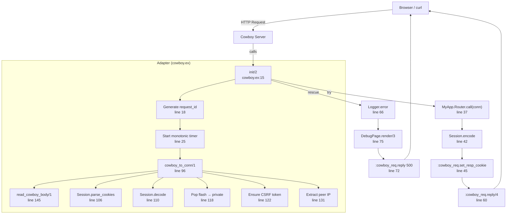

# Cowboy Adapter

<!-- metadata: complexity=Moderate | files=1 | last-generated=2026-03-24 -->

[< Previous: Router DSL](./02-router-dsl.md) | [Index](../01-overview.md) | [Next: LiveView >](./04-liveview.md)

---

## Purpose

Bridges Cowboy's Erlang-native request format with Ignite's `%Conn{}` struct pipeline. Every HTTP request enters through this single adapter module: it converts the Cowboy request into a `%Conn{}`, runs it through the router, encodes the session cookie, attaches a request ID for tracing, measures timing, and sends the response back through Cowboy. If anything crashes, a `try/rescue` renders a debug error page instead of dropping the connection.

## Key Files

| File | Purpose |
|------|---------|
| `lib/ignite/adapters/cowboy.ex` | Implements `:cowboy_handler` behaviour — full HTTP request lifecycle, body parsing, multipart uploads, session handling, error recovery |

## Architecture



## How It Works

### Understanding the Adapter Pattern

**The Big Picture:** Think of the adapter as a translator at a border crossing. Cowboy speaks Erlang tuples and maps; Ignite speaks `%Conn{}` structs. The adapter translates the incoming request into Ignite's language, lets the framework process it, then translates the response back into Cowboy's language. Neither side needs to know about the other.

<details>
<summary>Intermediate: init/2 callback and conn building</summary>

Cowboy calls `init/2` (line 15) for every HTTP request. The function:

1. **Generates a request ID** (line 18) — 16 random bytes base64url-encoded for log correlation
2. **Sets Logger metadata** (line 22) — every downstream `Logger` call in this process automatically includes the request ID
3. **Starts a monotonic timer** (line 25) — immune to wall-clock adjustments
4. **Builds `%Conn{}`** via `cowboy_to_conn/1` (line 29) — reads body, parses headers, decodes session, pops flash, ensures CSRF token, extracts peer IP
5. **Routes** through `MyApp.Router.call(conn)` (line 37) inside a `try` block
6. **Encodes session** and sets the cookie (lines 42-50)
7. **Sends response** via `:cowboy_req.reply/4` (line 60)

</details>

<details>
<summary>Advanced: Error handling, body parsing, and multipart uploads</summary>

**Error handling:** The `try/rescue` block (lines 35-78) catches any exception from the router or controllers. On crash, it logs the full stacktrace with timing (line 66), then renders `Ignite.DebugPage.render/3` (line 75) — rich HTML in dev, generic 500 in prod. The `conn` variable is built *before* the try block (line 29) so it remains available in the rescue clause for the debug page.

**Body parsing dispatch** (`read_cowboy_body/1`, line 145):
- No body → empty map (line 158)
- `multipart/form-data` → `read_multipart/2` (line 151) — recursive loop through parts, streaming files to disk as `%Ignite.Upload{}` structs
- `application/x-www-form-urlencoded` → `URI.decode_query/1` (line 246)
- `application/json` → `Jason.decode/1` (line 250), wraps non-map results in `%{"_json" => parsed}`
- Unknown content type with body → `%{"_body" => body}` (line 258)

**Multipart streaming** (`read_multipart/2`, line 167): Calls `:cowboy_req.read_part/1` in a recursive loop. File parts are streamed chunk-by-chunk to temp files via `read_part_body_to_file/2` (line 206), handling Cowboy's `{:more, data, req}` continuation. Cleanup is scheduled via `Ignite.Upload.schedule_cleanup/1` (line 175).

**Cookie encoding order matters:** Session is encoded (line 42) *after* routing, so any `put_flash` calls in the controller are captured. But flash from the *previous* request was already popped into `conn.private` (line 118) and won't be re-encoded unless explicitly set again.

</details>

## Key Flows

```flow-trace
{
  "title": "HTTP Request through Adapter",
  "steps": [
    {"component": "Cowboy", "action": "Receives HTTP request, calls init/2", "file": "lib/ignite/adapters/cowboy.ex:15", "detail": "Cowboy invokes the :cowboy_handler behaviour callback"},
    {"component": "Adapter", "action": "Generate request ID + start timer", "file": "lib/ignite/adapters/cowboy.ex:18", "detail": "16 random bytes → base64url, attached to Logger.metadata for correlation"},
    {"component": "Adapter", "action": "Build %Conn{} from Cowboy request", "file": "lib/ignite/adapters/cowboy.ex:29", "detail": "cowboy_to_conn/1 reads body, parses headers/cookies, decodes session, pops flash, ensures CSRF token"},
    {"component": "Router", "action": "Route through MyApp.Router.call/1", "file": "lib/ignite/adapters/cowboy.ex:37", "detail": "Conn flows through plug pipeline, then dispatch matches route → controller"},
    {"component": "Adapter", "action": "Encode session cookie", "file": "lib/ignite/adapters/cowboy.ex:42", "detail": "Session map → signed cookie via Session.encode, set via :cowboy_req.set_resp_cookie"},
    {"component": "Adapter", "action": "Send response via Cowboy", "file": "lib/ignite/adapters/cowboy.ex:60", "detail": ":cowboy_req.reply(status, headers, body, req) — includes x-request-id header"}
  ]
}
```

```flow-trace
{
  "title": "Multipart File Upload Parsing",
  "steps": [
    {"component": "Adapter", "action": "Detect multipart content-type", "file": "lib/ignite/adapters/cowboy.ex:150", "detail": "read_cowboy_body checks Content-Type header, dispatches to read_multipart/2"},
    {"component": "Adapter", "action": "Loop through parts recursively", "file": "lib/ignite/adapters/cowboy.ex:167", "detail": "Calls :cowboy_req.read_part/1 until {:done, req}; parses content-disposition for name/filename"},
    {"component": "Adapter", "action": "Stream file part to temp disk", "file": "lib/ignite/adapters/cowboy.ex:174", "detail": "Creates random temp file, streams chunks via read_part_body_to_file/2, builds %Upload{} struct"},
    {"component": "Adapter", "action": "Read regular field as string", "file": "lib/ignite/adapters/cowboy.ex:195", "detail": "Non-file parts read via :cowboy_req.read_part_body, stored as plain strings in params map"}
  ]
}
```

```code-walkthrough
{
  "title": "init/2 — The Request Lifecycle",
  "language": "elixir",
  "code": "def init(req, state) do\n  request_id = :crypto.strong_rand_bytes(16) |> Base.url_encode64(padding: false)\n  Logger.metadata(request_id: request_id)\n  start_time = System.monotonic_time()\n  conn = cowboy_to_conn(req)\n  conn = put_in(conn.private[:request_id], request_id)\n  Logger.info(\"#{conn.method} #{conn.path}\")\n\n  req =\n    try do\n      conn = MyApp.Router.call(conn)\n      cookie_value = Ignite.Session.encode(conn.session)\n      req = :cowboy_req.set_resp_cookie(...)\n      resp_headers = Map.put(conn.resp_headers, \"x-request-id\", request_id)\n      duration = log_duration(start_time)\n      :cowboy_req.reply(conn.status, resp_headers, conn.resp_body, req)\n    rescue\n      exception ->\n        :cowboy_req.reply(500, ..., DebugPage.render(exception, __STACKTRACE__, conn), req)\n    end\n\n  {:ok, req, state}\nend",
  "steps": [
    {"lines": [1, 2, 3, 4], "annotation": "Setup phase: generate a unique request ID from 16 cryptographic random bytes, attach it to Logger metadata so every log line in this process includes it, and start a monotonic timer for measuring response time."},
    {"lines": [5, 6, 7], "annotation": "Translation phase: cowboy_to_conn/1 converts the Cowboy request into an %Ignite.Conn{} struct with parsed headers, body params, session, flash, and peer IP. The request ID is stashed in conn.private."},
    {"lines": [9, 10, 11, 12, 13, 14, 15, 16], "annotation": "Happy path: route through the framework, encode the updated session into a signed cookie, attach x-request-id to response headers, log timing, and send the reply via Cowboy."},
    {"lines": [17, 18, 19], "annotation": "Error path: if any exception is raised during routing or rendering, catch it, log the full stacktrace, and render a debug error page (rich in dev, generic in prod). The conn is available because it was built before the try block."},
    {"lines": [22], "annotation": "Always returns {:ok, req, state} — Cowboy's expected return value. The request is complete regardless of success or failure."}
  ]
}
```

```chat
{
  "title": "A Day in the Life of a Request",
  "messages": [
    {"role": "Cowboy", "text": "Hey Adapter, I got an HTTP POST with headers and a body. Here's my `req` map."},
    {"role": "Adapter", "text": "Thanks. Let me generate a request ID (22 chars, URL-safe), start my stopwatch, and translate your req into an %Ignite.Conn{}. I'll read the body, parse cookies, decode the session, pop flash for one-time semantics, and make sure there's a CSRF token."},
    {"role": "Adapter", "text": "Router, here's the Conn. Do your thing."},
    {"role": "Router", "text": "Ran through the plug pipeline (CSRF check, rate limit, logging), matched POST /todos to TodoController.create. Here's the updated Conn with status 302 and a flash message."},
    {"role": "Adapter", "text": "Perfect. I'll encode the session (with the new flash) into a signed cookie, add x-request-id to the response headers, log '302 in 1.2ms', and hand everything back to Cowboy."},
    {"role": "Cowboy", "text": "Got it. Sending the HTTP response to the client now."},
    {"role": "Adapter", "text": "Oh, and if the Router had crashed? I would have caught the exception, logged the stacktrace, and sent a 500 with a debug error page instead. The client always gets a response."}
  ]
}
```

## Hot Paths

Every single HTTP request passes through `init/2` at line 15. This is the framework's outermost boundary for HTTP traffic. Performance-sensitive operations within:

- **`cowboy_to_conn/1`** (line 96) — runs on every request: header downcasing, cookie parsing, session decoding + HMAC verification, CSRF token check
- **`log_duration/1`** (line 85) — monotonic time diff and unit conversion on every request
- **Session encode/decode** — cryptographic operations (HMAC sign/verify) on every request

The multipart path (`read_multipart/2`, line 167) only activates for file uploads, but when it does, it performs disk I/O per uploaded file.

## Gotchas

1. **Hardcoded `MyApp.Router`** at line 37 — the adapter is coupled to a specific router module. A more flexible design would accept the router as configuration or part of `state`.

2. **Flash pop semantics** (line 118) — flash is popped from the decoded session into `conn.private[:flash]` *before* routing. This means `get_flash` reads from `conn.private`, not `conn.session`. If you look at `conn.session` during a controller action, flash is already gone. New flash set via `put_flash` goes back into `conn.session` for the *next* request.

3. **`conn` built outside `try`** (line 29) — intentional design. If `conn` were inside the `try`, the `rescue` clause couldn't access it for the debug error page. But this means a crash in `cowboy_to_conn/1` itself (e.g., malformed request) would *not* be caught and would produce a Cowboy-level error, not a pretty debug page.

4. **Session cookie options** (line 49) — `http_only: true` and `same_site: :lax` are hardcoded. No `secure: true` flag, so the cookie will be sent over plain HTTP in development.

5. **JSON parse fallback** (lines 250-254) — non-map JSON (arrays, strings) is wrapped in `%{"_json" => parsed}`, and unparseable bodies become `%{"_body" => body}`. Controllers need to know to check these keys.

## Practice

```drag-match
{
  "title": "Match Adapter Responsibilities",
  "pairs": [
    {"concept": "request_id generation", "description": "16 random bytes base64url-encoded, attached to Logger.metadata for log correlation"},
    {"concept": "cowboy_to_conn/1", "description": "Translates Cowboy req map into %Ignite.Conn{} with parsed headers, body, session, and peer IP"},
    {"concept": "Flash pop (line 118)", "description": "Removes flash from session into conn.private for one-time read semantics"},
    {"concept": "try/rescue block", "description": "Catches controller exceptions and renders a debug error page with 500 status"},
    {"concept": "log_duration/1", "description": "Calculates elapsed time using monotonic clock, formats as us/ms/s"},
    {"concept": "read_multipart/2", "description": "Recursively reads multipart parts, streaming file uploads to temp disk paths"}
  ]
}
```

```spot-the-bug
{
  "title": "Find the Error Handling Gap",
  "language": "elixir",
  "code": "def init(req, state) do\n  request_id = :crypto.strong_rand_bytes(16) |> Base.url_encode64(padding: false)\n  Logger.metadata(request_id: request_id)\n  start_time = System.monotonic_time()\n  conn = cowboy_to_conn(req)\n\n  req =\n    try do\n      conn = MyApp.Router.call(conn)\n      :cowboy_req.reply(conn.status, conn.resp_headers, conn.resp_body, req)\n    rescue\n      exception ->\n        :cowboy_req.reply(500, %{}, DebugPage.render(exception, __STACKTRACE__, conn), req)\n    end\n\n  {:ok, req, state}\nend",
  "bug_lines": [5],
  "hints": [
    "What happens if cowboy_to_conn/1 itself raises an exception?",
    "The try block starts at line 8, but conn is built at line 5 — outside the try"
  ],
  "explanation": "If cowboy_to_conn/1 crashes (e.g., malformed request triggers a parse error), the exception is NOT caught by the try/rescue — it propagates up to Cowboy as an unhandled error. The actual code has this same limitation. To fix it, you could wrap the entire body in try/rescue, but then conn would be nil in the rescue clause for the debug page."
}
```

```spot-the-bug
{
  "title": "Find the Content-Type Bug",
  "language": "elixir",
  "code": "defp parse_body(body, content_type) do\n  cond do\n    content_type == \"application/json\" ->\n      Jason.decode!(body)\n    content_type == \"application/x-www-form-urlencoded\" ->\n      URI.decode_query(body)\n    true ->\n      %{}\n  end\nend",
  "bug_lines": [3, 5],
  "hints": [
    "Content-Type headers often include extra parameters like charset",
    "What does 'application/json; charset=utf-8' equal?"
  ],
  "explanation": "Exact equality fails for Content-Type headers with parameters (e.g., 'application/json; charset=utf-8'). The actual code at lines 245-249 uses pattern matching with '<> _' to match just the prefix: parse_body(body, \"application/json\" <> _), which correctly handles any trailing parameters."
}
```

> **Quiz: Request ID Lifecycle**
>
> The request ID generated at line 18 appears in three places. Which of the following is NOT one of them?
>
> - A) `Logger.metadata` for log correlation
> - B) `conn.private[:request_id]` for access during routing
> - C) `x-request-id` response header for client-side correlation
> - D) The session cookie for cross-request tracking
>
> <details>
> <summary>Show Answer</summary>
>
> **D)** The request ID is per-request and never stored in the session. It appears in Logger metadata (line 22), `conn.private` (line 30), and the `x-request-id` response header (line 53). Each request gets a fresh ID.
>
> </details>

> **Quiz: Why Monotonic Time?**
>
> Why does the adapter use `System.monotonic_time()` (line 25) instead of `System.system_time()` for request timing?
>
> - A) It's faster to call
> - B) It returns smaller numbers
> - C) It's immune to wall-clock adjustments (NTP, daylight saving)
> - D) It works across distributed nodes
>
> <details>
> <summary>Show Answer</summary>
>
> **C)** Monotonic time only moves forward and is unaffected by NTP corrections or clock adjustments. If the system clock jumps backward during a request, `system_time` could produce a negative duration, but `monotonic_time` never will.
>
> </details>

---

[< Previous: Router DSL](./02-router-dsl.md) | [Index](../01-overview.md) | [Next: LiveView >](./04-liveview.md)
