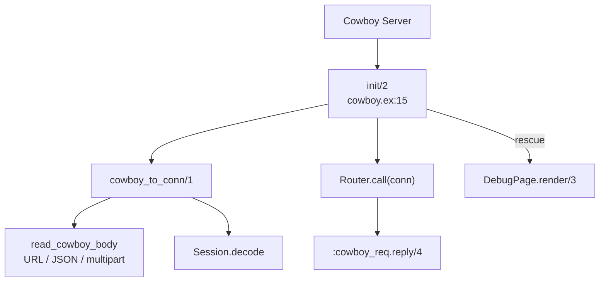

# Cowboy Adapter

<!-- metadata: complexity=Complex | files=1 | last-generated=2026-03-24 -->

[< Previous: Router DSL](./02-router-dsl.md) | [Index](../00-index.json) | [Next: LiveView >](./04-liveview.md)

---

## Purpose

Bridges Cowboy HTTP server with Ignite's `%Conn{}`. Converts Cowboy requests to Conn, decodes sessions, generates request IDs, handles multipart uploads, parses JSON bodies, and renders debug error pages on crash.

## Key Files

| File | Purpose |
|------|---------|
| `lib/ignite/adapters/cowboy.ex` | Implements `:cowboy_handler` — HTTP request lifecycle |

## Architecture



## How It Works

**The Big Picture:** A translator at a border crossing — Cowboy speaks Erlang tuples, Ignite speaks `%Conn{}` structs. The adapter translates both ways.

<details>
<summary>Intermediate: How it works</summary>

`init/2` at `lib/ignite/adapters/cowboy.ex:15`: generates request ID (line 18), starts timer (line 25), builds conn (line 29), routes via `MyApp.Router.call(conn)` (line 37), encodes session + sends response (lines 42-60). `try/rescue` at line 35 catches exceptions.

</details>

## Key Flows

```flow-trace
{
  "title": "Multipart File Upload",
  "steps": [
    {"component": "Adapter", "action": "Detect multipart content-type", "file": "lib/ignite/adapters/cowboy.ex:150", "detail": "read_cowboy_body checks Content-Type, dispatches to read_multipart"},
    {"component": "Adapter", "action": "Loop through parts", "file": "lib/ignite/adapters/cowboy.ex:167", "detail": "Recursive :cowboy_req.read_part/1 until {:done, req}"},
    {"component": "Adapter", "action": "Stream file to temp path", "file": "lib/ignite/adapters/cowboy.ex:174", "detail": "Creates temp file, streams chunks to disk, builds %Upload{} struct"}
  ]
}
```

## Gotchas

- **Hardcodes `MyApp.Router`** at line 37
- **Flash popped from session into `conn.private`** (line 118) for one-time semantics

## Practice

```drag-match
{
  "title": "Match Adapter Steps",
  "pairs": [
    {"concept": "Request ID", "description": "16 random bytes for log correlation via Logger.metadata"},
    {"concept": "Session decode", "description": "Verify HMAC signature, deserialize binary to map"},
    {"concept": "Flash pop", "description": "Move from session to conn.private for one-time read"},
    {"concept": "try/rescue", "description": "Catch controller exceptions, render debug error page"}
  ]
}
```

```spot-the-bug
{
  "title": "Find the Session Security Issue",
  "language": "elixir",
  "code": "def decode(cookie_value) do\n  case Plug.Crypto.MessageVerifier.verify(cookie_value, secret()) do\n    {:ok, binary} ->\n      {:ok, :erlang.binary_to_term(binary)}\n    :error -> :error\n  end\nend",
  "bug_lines": [4],
  "hints": [
    "What atoms could an attacker create by controlling the binary data?",
    "The BEAM has a fixed atom table — creating too many crashes the VM"
  ],
  "explanation": "Line 4 uses binary_to_term WITHOUT [:safe]. An attacker could craft data with new atoms, exhausting the atom table. Fix: :erlang.binary_to_term(binary, [:safe]). The actual code at lib/ignite/session.ex:70 correctly uses [:safe]."
}
```

> **Quiz: Flash Lifecycle**
>
> Why is flash popped from session into `conn.private` at `lib/ignite/adapters/cowboy.ex:118`?
>
> - A) Performance
> - B) Security
> - C) One-time semantics — prevents re-sending on next response
>
> <details>
> <summary>Show Answer</summary>
>
> **C)** Popping prevents the flash from being re-encoded into the cookie on response.
>
> </details>

---

[< Previous: Router DSL](./02-router-dsl.md) | [Index](../00-index.json) | [Next: LiveView >](./04-liveview.md)
