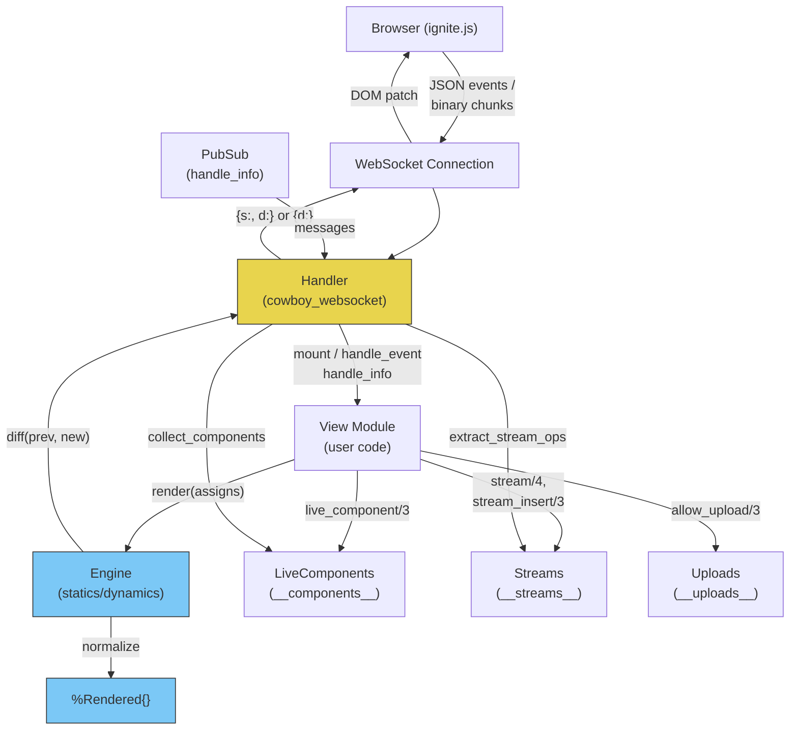

# LiveView

<!-- metadata: complexity=Critical | files=8 | last-generated=2026-03-24 -->

## Purpose

Traditional web apps force a hard choice: server-rendered HTML (simple but static) or client-side JavaScript frameworks (interactive but complex). LiveView sidesteps this by keeping **all state on the server** and pushing surgical HTML diffs over a persistent WebSocket. The browser never runs application logic — it just patches the DOM. This gives you rich interactivity with zero client-side state management, no API layer to maintain, and no JavaScript build pipeline. The tradeoff is that every interaction requires a round-trip to the server, but on modern networks this is imperceptible for most UIs.

## Key Files

| File | Purpose |
|------|---------|
| `lib/ignite/live_view.ex` | Behaviour definition, `~L`/`~F` sigils, `live_component/3`, `push_redirect/3`, `raw/1` |
| `lib/ignite/live_view/handler.ex` | Cowboy WebSocket handler — mount, event dispatch, render-diff-send loop |
| `lib/ignite/live_view/engine.ex` | Splits rendered output into statics/dynamics, computes sparse diffs |
| `lib/ignite/live_view/eex_engine.ex` | Custom EEx engine for `~L` — compile-time static/dynamic separation |
| `lib/ignite/live_view/feex_engine.ex` | Enhanced `~F` engine — `@` shorthand, block support, auto HTML escaping |
| `lib/ignite/live_view/rendered.ex` | `%Rendered{}` struct holding statics and dynamics lists |
| `lib/ignite/live_view/stream.ex` | Efficiently-diffed collections — insert, delete, upsert, limit, reset |
| `lib/ignite/live_view/upload.ex` | File upload structs (`%Upload{}`, `%UploadEntry{}`) and `UploadHelpers` |
| `lib/ignite/live_component.ex` | `LiveComponent` behaviour — reusable stateful components inside a LiveView |

## Architecture



## How It Works

### Understanding the LiveView Lifecycle

**The Big Picture:** Think of a LiveView as a spreadsheet cell. You define a formula (the `render/1` function) and the current values (assigns). When any value changes, the formula re-evaluates automatically and the display updates — but only the cells that actually changed get repainted.

<details><summary>Intermediate</summary>

The lifecycle is a three-phase loop:

1. **Mount** — `mount/2` is called once when the WebSocket connects. It returns initial assigns (state). The handler calls `Engine.render/2`, which produces both statics and dynamics. The full payload `{s: statics, d: dynamics}` is sent to the browser, which reconstructs the HTML by interleaving them.

2. **Render** — `render/1` is a pure function that takes assigns and returns either a plain string or a `%Rendered{}` struct (from `~L`/`~F` sigils). The engine normalizes both formats into `{statics, dynamics}`.

3. **Handle Event** — When the user clicks a button with `ignite-click="increment"`, the JS client sends `{"event": "increment", "params": {}}` over the WebSocket. The handler calls `handle_event/3`, which returns updated assigns. The handler re-renders, diffs against the previous dynamics, and sends only the changed values as a sparse map `{d: {"0": "43"}}`.

This loop repeats for every user interaction — the server always holds the authoritative state.

</details>

<details><summary>Advanced</summary>

Each LiveView connection is backed by a **dedicated Erlang process** (the Cowboy WebSocket handler process). This means:

- **Memory:** Each connected user consumes one process worth of memory. The assigns map is the primary memory cost. Streams mitigate this by not retaining item data after rendering — only DOM IDs are kept in `stream.items`.

- **Isolation:** A crash in one user's LiveView does not affect others. The BEAM's per-process garbage collection means no stop-the-world pauses.

- **Server push:** Because the handler process has a mailbox, any other process can send it messages via `send/2`. The `websocket_info/2` callback (handler.ex line 150) catches these, allowing PubSub broadcasts or timer ticks to trigger re-renders. This is how real-time features work without polling.

- **Component state:** LiveComponents store their state in the parent's assigns under `__components__` (a map of `%{id => {module, comp_assigns}}`). During render, `live_component/3` uses the process dictionary (`Process.put/2` at live_view.ex line 100) as a side channel to pass component state back to the handler, since `render/1` is a pure function that returns a string.

- **Statics are sent once:** On mount, the handler sends both statics and dynamics. On every subsequent update, only the dynamics (or a sparse subset) are sent. The JS client holds the statics in memory and reconstructs the full HTML locally.

</details>

### Understanding the Diffing Engine

**The Big Picture:** Instead of sending the entire HTML page on every update, the engine splits the template into "parts that never change" (statics) and "parts that might change" (dynamics), then only sends dynamics that actually differ.

<details><summary>Intermediate</summary>

The `Engine` module (engine.ex) handles two render return types:

1. **`%Rendered{}` from `~L`/`~F`:** The statics and dynamics are already separated at compile time. For a template like `<h1>Count: <%= @count %></h1>`, statics = `["<h1>Count: ", "</h1>"]` and dynamics = `["42"]`.

2. **Plain string (legacy):** Wrapped as `{["", ""], [html]}` — the entire HTML is one big dynamic. This works but defeats the purpose of fine-grained diffing.

The `diff/2` function (engine.ex line 60) compares old and new dynamics element-by-element:
- If only index 0 changed: `%{"0" => "43"}` (sparse map)
- If all changed: `["43", "new"]` (full list, more compact than a map)
- If none changed: `%{}` (empty map, nothing sent)

</details>

<details><summary>Advanced</summary>

The sparse diff strategy is a bandwidth optimization. Consider a template with 20 dynamic expressions — if only one changes (e.g., a counter), the wire payload shrinks from 20 values to 1. The JS client merges the sparse map into its cached dynamics array and reconstructs the HTML by interleaving with the cached statics.

The `diff/2` function also handles structural changes (engine.ex line 62): if the number of dynamics changes between renders (possible when using conditional rendering in plain strings), the full list is sent since the statics no longer match.

A key design decision: statics are literal strings baked into the compiled BEAM module. They exist once in memory regardless of how many users are connected. Dynamics are per-process (per-connection) and are the main per-user memory cost.

</details>

### Understanding Streams

**The Big Picture:** Streams solve the "1,000-item list" problem. Instead of holding all items in server memory and re-sending the entire list HTML on every change, streams send only insert/delete operations and free item data from memory after rendering.

<details><summary>Intermediate</summary>

A stream has three phases:

1. **Initialize** with `stream/4` — provide a name, initial items, and a `:render` function. Each item gets a DOM ID like `"events-42"`. The items are queued as insert operations.

2. **Mutate** with `stream_insert/3` (append/prepend/upsert) or `stream_delete/3`. These queue operations but do not re-render items immediately.

3. **Extract** — After each render cycle, the handler calls `extract_stream_ops/1` (stream.ex line 231), which drains the ops queue, renders each inserted item via the `:render` function, and builds a wire payload like:
   ```json
   {"streams": {"events": {"inserts": [{"id": "events-1", "html": "<div>...</div>", "at": 0}]}}}
   ```
   The JS client patches the DOM directly — no full re-render needed.

</details>

<details><summary>Advanced</summary>

Streams track insertion order in the `order` list and existing DOM IDs in the `items` map. This enables two advanced features:

- **Upsert detection** (stream.ex line 174): When `stream_insert` is called for an item whose DOM ID already exists, the `at` position is ignored and the item is updated in-place. The JS client replaces the existing element rather than appending a new one.

- **Client-side limits** (stream.ex line 263): When `limit: N` is set, excess items are automatically pruned from the opposite end of insertion. Prepending with a limit prunes from the bottom; appending with a limit prunes from the top. This is implemented via `apply_limit/5`, which generates delete operations for the pruned items.

After ops are extracted, the ops queue is cleared but the `items` map and `order` list persist — the server remembers which DOM IDs exist even though it no longer holds the item data.

</details>

### Understanding LiveComponents

**The Big Picture:** LiveComponents are self-contained widgets inside a LiveView. Each has its own state and event handlers, but shares the parent's WebSocket connection and process.

<details><summary>Intermediate</summary>

Components are rendered inline via `live_component(assigns, Module, id: "my-id", ...)`. The flow:

1. **First render:** `mount/1` is called with props, returning initial assigns. The component is wrapped in `<div ignite-component="my-id">...</div>`.

2. **Subsequent renders:** Props from the parent are merged into existing component state (live_view.ex line 80). No re-mount.

3. **Events:** Component events use the wire format `"component_id:event_name"`. The handler splits on `:` (handler.ex line 218), looks up the component in `__components__`, and dispatches to the component's `handle_event/3`.

</details>

<details><summary>Advanced</summary>

The trickiest part of the component system is the process dictionary bridge. Since `render/1` is a pure function that returns a string, it cannot modify the parent's assigns. But during rendering, `live_component/3` needs to register newly created or updated component state. The solution:

1. During render, each `live_component/3` call stores `{module, comp_assigns}` in `Process.put(:__ignite_components__, ...)` (live_view.ex line 100).
2. After render returns, `collect_components/1` (live_view.ex line 114) reads and clears the process dictionary, merging component state back into the parent's assigns under `__components__`.

This is a pragmatic escape hatch — the process dictionary is process-local mutable state, used here because the alternative (threading component state through the render return value) would require a fundamentally different render API.

</details>

### Understanding the EEx/FEEx Engines

**The Big Picture:** The `~L` and `~F` sigils compile templates at build time, separating static HTML from dynamic expressions. At runtime, only the dynamic values are evaluated — the statics are baked into the compiled module as literal strings.

<details><summary>Intermediate</summary>

Both engines implement the `EEx.Engine` behaviour, which receives callbacks as the EEx parser walks the template:

1. `handle_text/3` — static text, appended to a pending buffer
2. `handle_expr/3` with `"="` marker — a `<%= expr %>` output expression. Flushes the pending buffer as a new static, adds the expression as a new dynamic.
3. `handle_body/1` — called at the end, builds the final AST that constructs a `%Rendered{}` struct.

The `~F` (FEEx) engine adds three capabilities over `~L`:
- **`@` shorthand:** `@count` is pre-processed to `assigns.count` via regex before EEx parsing (live_view.ex line 201).
- **Block support:** `handle_begin/1` creates a sub-buffer for block bodies. `handle_end/1` compiles the sub-buffer into an AST. The whole block becomes a single dynamic.
- **Auto-escaping:** Output expressions are wrapped in `FEExEngine.escape/1` (feex_engine.ex line 73), which escapes `& < > " '`. Use `raw/1` to bypass.

</details>

<details><summary>Advanced</summary>

The EEx engine protocol is subtle. For the `~L` engine (EExEngine), `handle_begin/1` and `handle_end/1` are no-ops — block expressions like `<% if ... do %>` are silently ignored (eex_engine.ex line 64). This is a deliberate limitation; `~L` only supports inline expressions.

The `~F` engine solves this with a sub-buffer mechanism:
1. `handle_begin/1` returns a fresh `{[], [], ""}` state (feex_engine.ex line 40), independent of the outer buffer.
2. Text and expressions inside the block accumulate in this sub-buffer.
3. `handle_end/1` compiles the sub-buffer into a string-producing AST via `build_body_ast/2` (feex_engine.ex line 159).
4. EEx substitutes this AST as the body of the block expression.
5. `handle_expr/3` with the `""` marker (feex_engine.ex line 78) receives the complete block and treats it as a single dynamic.

The `block_expr?/1` check (feex_engine.ex line 146) prevents double-escaping: block bodies already contain escaped inner expressions, so the outer block wrapper uses `block_to_string/1` instead of `escape/1`.

</details>

### Understanding File Uploads

**The Big Picture:** File uploads use a binary WebSocket protocol to stream file data in chunks directly to the LiveView process. No separate HTTP upload endpoint is needed.

<details><summary>Intermediate</summary>

The upload lifecycle has five stages:

1. **Configure** — `allow_upload/3` in `mount/2` creates an `%Upload{}` config stored in `assigns.__uploads__`.
2. **Validate** — When the user selects files, the JS client sends an `__upload_validate__` event with file metadata. `validate_entries/3` checks size, type, and count limits.
3. **Transfer** — The JS client sends file data as binary WebSocket frames. Each frame is prefixed with a 2-byte ref length, the ref string, then the chunk data (handler.ex line 133). `receive_chunk/3` appends to a temp file and updates progress.
4. **Complete** — The client signals `__upload_complete__` per file. `mark_complete/3` sets `done?: true`.
5. **Consume** — The view calls `consume_uploaded_entries/3` in its event handler, processing each completed file and cleaning up temp files.

</details>

<details><summary>Advanced</summary>

The binary frame protocol (handler.ex line 133) is minimal:

```
<<ref_len::16, ref::binary-size(ref_len), chunk_data::binary>>
```

This avoids JSON overhead for binary data. The 2-byte length prefix allows refs up to 65,535 bytes — more than enough for upload identifiers.

Upload validation (upload.ex line 205) is intentionally server-side: the client sends metadata, the server validates against the `%Upload{}` config, and responds with a validation result including per-entry errors. The `type_allowed?/3` function (upload.ex line 332) supports three patterns: extension matching (`.jpg`), wildcard MIME types (`image/*`), and exact MIME types (`application/pdf`).

Temp files are created via `Ignite.Upload.random_file/1` on first chunk and scheduled for cleanup. The `consume_uploaded_entries/3` callback (upload.ex line 126) deletes the temp file after successful processing, or keeps it if the callback returns `{:postpone, _}`.

</details>

## Key Flows

### Mount and First Render

```flow-trace
{
  "title": "LiveView Mount and First Render",
  "steps": [
    {"file": "lib/ignite/live_view/handler.ex", "line": 20, "label": "init/2 — parse cookies from WebSocket handshake, decode session"},
    {"file": "lib/ignite/live_view/handler.ex", "line": 38, "label": "websocket_init/1 — call view_module.mount(%{}, session)"},
    {"file": "lib/ignite/live_view/handler.ex", "line": 44, "label": "Engine.render(view_module, assigns) → {statics, dynamics}"},
    {"file": "lib/ignite/live_view/engine.ex", "line": 36, "label": "Engine.render/2 — calls view_module.render(assigns), then normalize/1"},
    {"file": "lib/ignite/live_view/engine.ex", "line": 91, "label": "normalize(%Rendered{}) — returns {statics, dynamics} directly"},
    {"file": "lib/ignite/live_view/handler.ex", "line": 47, "label": "collect_components(assigns) — persist component state from process dict"},
    {"file": "lib/ignite/live_view/handler.ex", "line": 50, "label": "extract_stream_ops(assigns) — drain pending stream operations"},
    {"file": "lib/ignite/live_view/handler.ex", "line": 58, "label": "Build payload {s: statics, d: dynamics, streams?: ...}"},
    {"file": "lib/ignite/live_view/handler.ex", "line": 62, "label": "Send JSON payload to browser, store prev_dynamics in state"}
  ]
}
```

### User Event to Re-render to Patch

```flow-trace
{
  "title": "User Event → Re-render → Sparse Diff → DOM Patch",
  "steps": [
    {"file": "lib/ignite/live_view/handler.ex", "line": 68, "label": "websocket_handle({:text, json}) — decode incoming JSON event"},
    {"file": "lib/ignite/live_view/handler.ex", "line": 96, "label": "Match generic event pattern {event, params}"},
    {"file": "lib/ignite/live_view/handler.ex", "line": 98, "label": "handle_possible_component_event — check for 'id:event' format"},
    {"file": "lib/ignite/live_view/handler.ex", "line": 105, "label": "Call view_module.handle_event(event, params, assigns)"},
    {"file": "lib/ignite/live_view/handler.ex", "line": 111, "label": "Check for __redirect__ in new assigns"},
    {"file": "lib/ignite/live_view/handler.ex", "line": 167, "label": "send_render_update — Engine.render(view, assigns)"},
    {"file": "lib/ignite/live_view/engine.ex", "line": 60, "label": "Engine.diff(prev_dynamics, new_dynamics) — sparse comparison"},
    {"file": "lib/ignite/live_view/engine.ex", "line": 70, "label": "Zip old/new, keep only changed indices as map entries"},
    {"file": "lib/ignite/live_view/handler.ex", "line": 180, "label": "extract_stream_ops — include stream changes if any"},
    {"file": "lib/ignite/live_view/handler.ex", "line": 188, "label": "Send {d: sparse_diff} to browser, update prev_dynamics"}
  ]
}
```

### Browser-Handler-Engine Conversation

```chat
{
  "title": "WebSocket Lifecycle: Counter Increment",
  "participants": ["Browser", "Handler", "Engine"],
  "messages": [
    {"from": "Browser", "to": "Handler", "label": "WebSocket connect (with session cookie)"},
    {"from": "Handler", "to": "Engine", "label": "Engine.render(CounterLive, %{count: 0})"},
    {"from": "Engine", "to": "Handler", "label": "{[\"<h1>Count: \", \"</h1>...\"], [\"0\"]}"},
    {"from": "Handler", "to": "Browser", "label": "{s: [\"<h1>Count: \", \"</h1>...\"], d: [\"0\"]}"},
    {"from": "Browser", "to": "Handler", "label": "{event: \"increment\", params: {}}"},
    {"from": "Handler", "to": "Engine", "label": "Engine.render(CounterLive, %{count: 1})"},
    {"from": "Engine", "to": "Handler", "label": "{[\"<h1>Count: \", \"</h1>...\"], [\"1\"]}"},
    {"from": "Handler", "to": "Handler", "label": "diff([\"0\"], [\"1\"]) → %{\"0\" => \"1\"}"},
    {"from": "Handler", "to": "Browser", "label": "{d: {\"0\": \"1\"}}"},
    {"from": "Browser", "to": "Browser", "label": "Merge sparse diff into cached dynamics, rebuild HTML, morphdom patch"}
  ]
}
```

### Code Walkthrough: send_render_update

```code-walkthrough
{
  "title": "The Render-Diff-Send Pipeline",
  "file": "lib/ignite/live_view/handler.ex",
  "steps": [
    {"lines": "167-168", "label": "Re-render the view with updated assigns. Engine.render returns {statics, dynamics} — we discard statics since the browser already has them from mount."},
    {"lines": "169-170", "label": "Collect any component state that was written to the process dictionary during render. This is the side-channel bridge between the pure render function and the stateful handler."},
    {"lines": "173-177", "label": "Compute sparse diff. If prev_dynamics exists, compare element-by-element. Only indices whose values changed appear in the output map. If no previous dynamics, send the full list."},
    {"lines": "179-180", "label": "Drain stream operations. Streams queue inserts/deletes during handle_event and render them here into wire-ready JSON."},
    {"lines": "182", "label": "Update handler state: new assigns (with cleared stream ops) and new prev_dynamics for the next diff cycle."},
    {"lines": "185-189", "label": "Build the JSON payload. Always includes dynamics diff. Conditionally includes stream operations. Send as a text WebSocket frame."}
  ]
}
```

## Hot Paths

**`Engine.render/2`** is called on every event, every `handle_info`, and every upload chunk. It invokes the view module's `render/1` function and normalizes the result. For views using `~L`/`~F` sigils, the statics are compiled into the module and cost nothing at runtime — only the dynamic expressions are evaluated.

**`Engine.diff/2`** runs after every render. Its time complexity is O(N) where N is the number of dynamic expressions. For templates with many dynamics, this is the primary CPU cost per event. The sparse map output keeps wire costs proportional to the number of *changed* values, not total values.

**`extract_stream_ops/1`** iterates all streams and renders each pending insert via the user-provided `:render` function. For a bulk insert of 100 items, this means 100 function calls. The items are freed from server memory after rendering.

## Gotchas

1. **Component state lives in `assigns.__components__`** — If you replace the entire assigns map in `handle_event` (e.g., `{:noreply, %{count: 0}}`), you lose all component state. Always update assigns with `%{assigns | count: 0}` or `Map.put/3` to preserve `__components__`, `__streams__`, and `__uploads__`.

2. **Stream DOM IDs must be globally unique** — The DOM prefix defaults to the stream name (e.g., `"events"`), and each item gets `"events-{id}"`. If two streams produce the same DOM ID, the client will corrupt the DOM. Use the `:dom_prefix` option to disambiguate.

3. **`~L` does not support blocks** — Writing `<% if condition do %>...<% end %>` in a `~L` template silently drops the content (eex_engine.ex line 64). Use `~F` for block expressions or inline ternaries in `~L`.

4. **Process dictionary side-effect in render** — `live_component/3` writes to `Process.get/put` during render (live_view.ex line 99-100). If you call `render/1` manually for testing, you must call `collect_components/1` afterwards or the process dictionary will leak state.

5. **Upload binary protocol is position-sensitive** — The binary frame format `<<ref_len::16, ref::binary, chunk::binary>>` (handler.ex line 133) has no error correction. A malformed frame logs a warning but the chunk is lost. The client must retry.

6. **Streams free item data after render** — After `extract_stream_ops` runs, only DOM IDs remain in `stream.items`. You cannot retrieve item data from a stream — keep a separate source of truth (e.g., Ecto) if you need to re-access items.

## Practice

### Drag-Match: LiveView Concepts

```drag-match
{
  "title": "Match each concept to its role in the LiveView system",
  "pairs": [
    {"left": "statics", "right": "HTML fragments that never change, sent once on mount"},
    {"left": "dynamics", "right": "Expression values re-evaluated on every render"},
    {"left": "sparse diff", "right": "Map of only changed dynamic indices"},
    {"left": "__components__", "right": "Assigns key storing LiveComponent state"},
    {"left": "stream ops", "right": "Queued insert/delete operations drained after render"},
    {"left": "process dictionary", "right": "Side channel for component state during render"},
    {"left": "%Rendered{}", "right": "Struct holding pre-split statics and dynamics lists"},
    {"left": "handle_info/2", "right": "Callback for server-push messages (PubSub, timers)"}
  ]
}
```

### Spot the Bug: LiveView Event Handler

```spot-the-bug
{
  "title": "Why does this LiveView lose its stream data after an event?",
  "language": "elixir",
  "code": "def handle_event(\"reset\", _params, assigns) do\n  {:noreply, %{count: 0, items: []}}\nend",
  "bug": "Replacing the entire assigns map discards __streams__, __components__, and __uploads__. Use %{assigns | count: 0, items: []} to preserve framework-managed keys.",
  "fix": "def handle_event(\"reset\", _params, assigns) do\n  {:noreply, %{assigns | count: 0, items: []}}\nend"
}
```

### Spot the Bug: Template Engine Choice

```spot-the-bug
{
  "title": "Why does nothing appear inside the list?",
  "language": "elixir",
  "code": "def render(assigns) do\n  ~L\"\"\"\n  <ul>\n    <% for item <- assigns.items do %>\n      <li><%= item.name %></li>\n    <% end %>\n  </ul>\n  \"\"\"\nend",
  "bug": "The ~L sigil (EExEngine) does not support block expressions like <% for ... do %>. Non-output expressions are silently ignored (eex_engine.ex line 64). Switch to ~F which handles blocks, or use an inline comprehension.",
  "fix": "def render(assigns) do\n  ~F\"\"\"\n  <ul>\n    <%= for item <- @items do %>\n      <li><%= item.name %></li>\n    <% end %>\n  </ul>\n  \"\"\"\nend"
}
```

### Quiz: Wire Protocol

```quiz
{
  "title": "LiveView Wire Protocol",
  "questions": [
    {
      "question": "On mount, the handler sends {s: statics, d: dynamics}. What does it send on subsequent updates?",
      "options": [
        "{s: statics, d: dynamics} — both every time",
        "{d: dynamics} — full dynamics list",
        "{d: sparse_map} — only changed dynamic indices",
        "The full rendered HTML string"
      ],
      "answer": 2,
      "explanation": "After mount, only dynamics are sent. Engine.diff compares previous and new dynamics, producing a sparse map of changed indices (e.g., {\"0\": \"43\"}). If all dynamics changed, a full list is sent instead (more compact than a complete map)."
    },
    {
      "question": "How does the handler route a component event like 'toggle-btn:click'?",
      "options": [
        "It calls the parent view's handle_event with the full string",
        "It splits on ':', looks up 'toggle-btn' in __components__, and calls the component's handle_event with 'click'",
        "It broadcasts via PubSub to find the component",
        "It creates a new process for the component"
      ],
      "answer": 1,
      "explanation": "handler.ex line 218: String.split(event, \":\", parts: 2) separates component_id from event_name. The component module and assigns are retrieved from assigns.__components__[component_id], and the component's handle_event/3 is called directly."
    },
    {
      "question": "What is the binary WebSocket frame format for file upload chunks?",
      "options": [
        "JSON with base64-encoded data",
        "<<ref_len::16, ref::binary-size(ref_len), chunk_data::binary>>",
        "<<chunk_size::32, chunk_data::binary>>",
        "Raw binary with no header"
      ],
      "answer": 1,
      "explanation": "handler.ex line 133: The binary frame starts with a 2-byte ref length, followed by the ref string, followed by the raw chunk data. This avoids JSON overhead for binary transfers."
    }
  ]
}
```

---
[< Previous: Cowboy Adapter](./03-cowboy-adapter.md) | [Index](../01-overview.md) | [Next: PubSub & Presence >](./05-pubsub-presence.md)
