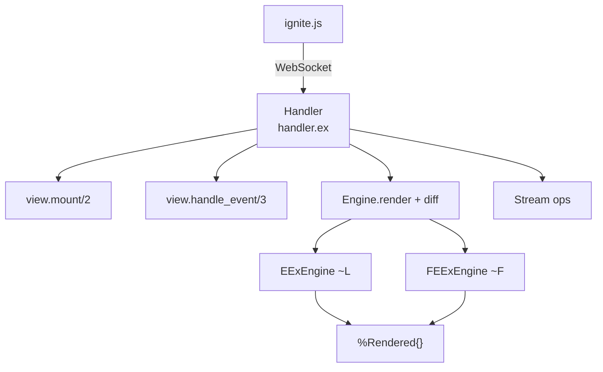

# LiveView

<!-- metadata: complexity=Critical | files=8 | last-generated=2026-03-24 -->

[< Previous: Cowboy Adapter](./03-cowboy-adapter.md) | [Index](../00-index.json) | [Next: PubSub & Presence >](./05-pubsub-presence.md)

---

## Purpose

Real-time server-rendered UI. Maintains a stateful process per WebSocket, renders templates that separate static/dynamic parts at compile time, pushes only changed values as sparse JSON diffs.

## Key Files

| File | Purpose |
|------|---------|
| `lib/ignite/live_view.ex` | Behaviour, `~L`/`~F` sigils, `live_component/3`, `push_redirect/2` |
| `lib/ignite/live_view/handler.ex` | WebSocket handler: mount, events, diff sending |
| `lib/ignite/live_view/engine.ex` | Diffing: `render/2`, `diff/2` |
| `lib/ignite/live_view/eex_engine.ex` | `~L` sigil: compile-time statics/dynamics separation |
| `lib/ignite/live_view/feex_engine.ex` | `~F` sigil: `@` shorthand, blocks, auto-escaping |
| `lib/ignite/live_view/rendered.ex` | `%Rendered{statics, dynamics}` struct |
| `lib/ignite/live_view/stream.ex` | Efficient list operations |
| `lib/ignite/live_component.ex` | Component behaviour |

## Architecture



## How It Works

### Understanding Diffing

**The Big Picture:** A fill-in-the-blanks worksheet. Blanks (dynamics) change but printed text (statics) stays the same. Only changed blanks are sent — not the whole page.

<details>
<summary>Intermediate: How it works</summary>

`~L` at `lib/ignite/live_view.ex:166` compiles via `EExEngine`. For `<h1>Count: <%= assigns.count %></h1>`:
- statics: `["<h1>Count: ", "</h1>"]` (baked into module)
- dynamics: `[to_string(assigns.count)]` (evaluated each render)

Mount sends both: `{"s": [...], "d": ["42"]}`. Events: `Engine.diff/2` at `lib/ignite/live_view/engine.ex:60` sends only changed indices: `{"d": {"0": "43"}}`.

</details>

<details>
<summary>Advanced: Under the hood</summary>

**EExEngine** (`lib/ignite/live_view/eex_engine.ex:35`): State = `{statics_rev, dynamics_rev, pending}`. `handle_text` appends to pending. `handle_expr("=")` flushes pending as static, adds expr as dynamic. `handle_body` reverses and produces `%Rendered{}` AST.

**FEExEngine** adds: `@var` → `assigns.var` via regex (line 201); block support via `handle_begin/handle_end` sub-buffers; auto-escaping via `escape/1` (line 127).

**Sparse diffing** (engine.ex:60): When one index changed → sparse map. When ALL changed → full array. Different lengths → full array.

</details>

```chat
{
  "title": "LiveView Diffing Conversation",
  "participants": {
    "Template": {"color": "#4A90D9", "icon": "code"},
    "Engine": {"color": "#50C878", "icon": "cpu"},
    "Handler": {"color": "#FF6B6B", "icon": "server"},
    "Client": {"color": "#FFB347", "icon": "laptop"}
  },
  "messages": [
    {"from": "Template", "text": "I'm compiled! Static parts frozen, dynamic parts are code.", "technical": "~L → %Rendered{statics: [\"<h1>Count: \", \"</h1>\"], dynamics: [to_string(assigns.count)]}"},
    {"from": "Engine", "text": "Evaluating dynamics. Count is 42, so dynamics = [\"42\"].", "technical": "Engine.render(view, assigns) → {statics, [\"42\"]}"},
    {"from": "Handler", "text": "First render — sending everything.", "technical": "JSON: {\"s\": [...], \"d\": [\"42\"]}"},
    {"from": "Client", "text": "Saved statics. DOM rendered!", "technical": "statics saved; buildHtml(); morphdom()"},
    {"from": "Handler", "text": "Click! Count now 43. Diffing...", "technical": "diff([\"42\"], [\"43\"]) → %{\"0\" => \"43\"}"},
    {"from": "Client", "text": "15 bytes! Patching just the text node.", "technical": "dynamics[0] = \"43\"; morphdom patches text node only"}
  ]
}
```

## Key Flows

```flow-trace
{
  "title": "LiveView Mount",
  "steps": [
    {"component": "Handler", "action": "Parse session from WS handshake", "file": "lib/ignite/live_view/handler.ex:20", "detail": "Read Cookie header, decode signed session"},
    {"component": "Handler", "action": "Call view.mount/2", "file": "lib/ignite/live_view/handler.ex:42", "detail": "CounterLive.mount(%{}, session) → {:ok, %{count: 0}}"},
    {"component": "Engine", "action": "Render → statics + dynamics", "file": "lib/ignite/live_view/handler.ex:44", "detail": "Engine.render(view, assigns) → {statics, dynamics}"},
    {"component": "Handler", "action": "Send mount payload", "file": "lib/ignite/live_view/handler.ex:61", "detail": "JSON: {s: statics, d: dynamics, streams: ...}"}
  ]
}
```

```flow-trace
{
  "title": "LiveView Event Handling",
  "steps": [
    {"component": "Handler", "action": "Receive JSON event", "file": "lib/ignite/live_view/handler.ex:68", "detail": "websocket_handle → Jason.decode → extract event + params"},
    {"component": "View", "action": "handle_event/3", "file": "lib/ignite/live_view/handler.ex:105", "detail": "apply(view, :handle_event, [...]) → {:noreply, new_assigns}"},
    {"component": "Engine", "action": "Re-render + sparse diff", "file": "lib/ignite/live_view/handler.ex:167", "detail": "render → new_dynamics; diff(prev, new) → sparse map"},
    {"component": "Handler", "action": "Send sparse update", "file": "lib/ignite/live_view/handler.ex:188", "detail": "JSON: {d: {\"0\": \"43\"}}"}
  ]
}
```

## Gotchas

- **`~L` doesn't support blocks** (eex_engine.ex:64): `<% if %>` silently ignored. Use `~F`.
- **Component state uses process dictionary** (live_view.ex:99): `Process.put` during render.
- **Streams bypass the diffing engine**: Sent alongside diffs, processed independently.

## Practice

```drag-match
{
  "title": "Match LiveView Concepts",
  "pairs": [
    {"concept": "statics", "description": "HTML fragments sent once on mount — never change"},
    {"concept": "dynamics", "description": "Expression values re-evaluated each render — only changed ones sent"},
    {"concept": "sparse diff", "description": "JSON map with only changed indices: {\"0\": \"43\"}"},
    {"concept": "stream", "description": "Efficient list ops that bypass statics+dynamics diffing"},
    {"concept": "~F sigil", "description": "Enhanced engine with @shorthand, blocks, auto-escaping"}
  ]
}
```

```spot-the-bug
{
  "title": "Find the Template Bug",
  "language": "elixir",
  "code": "def render(assigns) do\n  ~L\"\"\"\n  <ul>\n    <% for item <- assigns.items do %>\n      <li><%= item.name %></li>\n    <% end %>\n  </ul>\n  \"\"\"\nend",
  "bug_lines": [4],
  "hints": [
    "What engine does ~L use? Does it support blocks?",
    "Check eex_engine.ex:64 — non-= expressions are silently ignored"
  ],
  "explanation": "~L uses EExEngine which ignores <% %> (non-output) expressions at line 64. The for block never runs. Fix: switch to ~F sigil which supports blocks."
}
```

> **Quiz: Sparse Diffing**
>
> If prev = `["Alice", "42", "online"]` and new = `["Alice", "43", "online"]`, what does `diff/2` return?
>
> - A) `["Alice", "43", "online"]`
> - B) `%{"1" => "43"}`
> - C) `%{}`
>
> <details>
> <summary>Show Answer</summary>
>
> **B)** Only index 1 changed. The diff produces `%{"1" => "43"}` — a sparse map.
>
> </details>

---

[< Previous: Cowboy Adapter](./03-cowboy-adapter.md) | [Index](../00-index.json) | [Next: PubSub & Presence >](./05-pubsub-presence.md)
