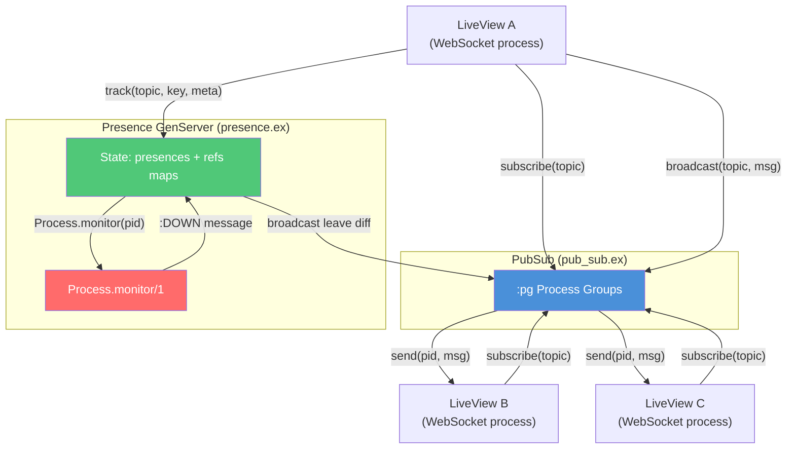

# PubSub & Presence

<!-- metadata: complexity=Moderate | files=2 | last-generated=2026-03-24 -->

[< Previous: LiveView](./04-liveview.md) | [Index](../00-index.json) | [Next: Security >](./06-security.md)

---

## Purpose

PubSub enables cross-process messaging so LiveView processes can broadcast state changes in real time. Presence layers user tracking on top, detecting joins and disconnects automatically via `Process.monitor`.

**Why `:pg` over Redis or an external broker?** Erlang's `:pg` (process groups) is built into OTP -- zero dependencies, zero network hops, zero serialization cost. Processes join groups and receive plain Erlang messages via `send/2`. When a process dies, `:pg` automatically removes it from all groups. For a single-node framework like Ignite, this is the simplest possible foundation. Scaling to multiple nodes would still work because `:pg` is cluster-aware by default.

## Key Files

| File | Purpose |
|------|---------|
| `lib/ignite/pub_sub.ex` | `subscribe/1`, `broadcast/2` wrapping Erlang `:pg` process groups |
| `lib/ignite/presence.ex` | `track/3`, `untrack/2`, `list/1` -- GenServer with `Process.monitor` for auto-cleanup |

## Architecture



## How It Works

### Understanding PubSub

**The Big Picture:** PubSub is a group chat room. Any process can join a topic and hear what others say. When someone leaves (process dies), they are silently removed -- no goodbye needed.

<details>
<summary>Intermediate: How it works</summary>

PubSub is a thin wrapper around Erlang's `:pg` module (52 lines total).

- **`start_link/1`** (line 24): Starts a `:pg` scope named `Ignite.PubSub`. This scope isolates our groups from any other `:pg` usage in the BEAM.
- **`subscribe/1`** (line 29): Calls `:pg.join(Ignite.PubSub, topic, self())` to add the calling process to the topic's group. The key insight: `self()` means the subscribing process joins directly -- no intermediary.
- **`broadcast/2`** (line 37): Iterates over `:pg.get_members/2`, calling `send(pid, message)` for each member except `self()`. The sender exclusion at line 38 (`pid != self()`) prevents double-processing since the sender already applied the update in its `handle_event`.

No GenServer, no ETS, no message queues. Just direct process-to-process `send/2`.

</details>

<details>
<summary>Advanced: Under the hood</summary>

**`:pg` internals:** Process groups are maintained in-memory by a `:pg` server process. Group membership is automatically replicated across connected BEAM nodes, making this cluster-ready with zero config changes.

**`child_spec/1`** (line 46): Defines how the supervisor starts the `:pg` scope. The `id: __MODULE__` ensures only one PubSub scope exists per application.

**Why `for` comprehension over `Enum.each`?** The `for` at line 38 is idiomatic Elixir for side-effect iteration. The return value is a list of `send` results, but only `:ok` is returned (line 42).

**Race condition awareness:** Between `get_members/2` and `send/2`, a process could die. This is harmless -- `send` to a dead PID is a no-op in Erlang. No try/rescue needed.

</details>

### Understanding Presence

**The Big Picture:** Presence is a sign-in sheet that erases your name automatically when you leave the room. Track a user, get notified of joins and leaves, query who is online.

<details>
<summary>Intermediate: How it works</summary>

Presence is a GenServer (197 lines) that maintains two maps in its state (line 77):

- `presences`: `%{topic => %{key => %{pid, meta, ref}}}` -- who is where with what metadata
- `refs`: `%{reference => {topic, key}}` -- reverse lookup from monitor ref to topic/key

**Track** (line 81): Three cases via pattern matching:
1. Same process, same key (line 87): Update metadata, reuse existing monitor ref
2. Different process claiming same key (line 93): Demonitor old, monitor new
3. New entry (line 99): Create fresh monitor via `do_track/5` (line 168)

**Auto-cleanup** (line 143): When a monitored process dies, `:DOWN` arrives. The `refs` map provides O(1) lookup to find the topic/key, then `remove_presence/4` (line 180) cleans both maps.

**Leave broadcast** (line 155): Uses direct `send` instead of `PubSub.broadcast` because the dead process cannot be `self()` in the Presence GenServer context.

</details>

<details>
<summary>Advanced: Under the hood</summary>

**Why a GenServer instead of ETS?** Presence needs atomic "monitor + store" operations. A GenServer serializes these naturally. Two concurrent `track` calls for the same key are handled sequentially, preventing orphaned monitors.

**The `remove_presence/4` helper** (line 180): Cleans up empty topic maps (`if updated == %{}` at line 185) to prevent unbounded state growth from abandoned topics.

**`remove_ref/2`** (line 194) vs **`remove_presence/4`** (line 180): `remove_ref` only cleans the `refs` map (used when replacing an old process at line 96). `remove_presence` cleans both maps (used on untrack/death).

**Pin operator in pattern matching** (line 87, 115): `%{pid: ^pid}` ensures we match only when the stored PID equals the argument PID. Without the pin, it would rebind -- a subtle but critical distinction.

</details>

```code-walkthrough
{
  "title": "PubSub broadcast/2 — Message Fan-Out",
  "file": "lib/ignite/pub_sub.ex",
  "highlights": [
    {"lines": [37, 38], "label": "Get all group members and filter out self()"},
    {"lines": [39], "label": "Direct send/2 to each subscriber — no intermediary process"},
    {"lines": [42], "label": "Always returns :ok regardless of how many subscribers received"}
  ]
}
```

```code-walkthrough
{
  "title": "Presence handle_call :track — Three-Way Pattern Match",
  "file": "lib/ignite/presence.ex",
  "highlights": [
    {"lines": [86, 87, 88, 89, 90, 91], "label": "Case 1: Same pid, same key — update meta only, reuse monitor ref"},
    {"lines": [93, 94, 95, 96, 97], "label": "Case 2: Different pid for same key — demonitor old, track new"},
    {"lines": [99, 100, 101], "label": "Case 3: Brand new entry — fresh monitor via do_track/5"},
    {"lines": [105], "label": "Broadcast join diff to all topic subscribers via PubSub"}
  ]
}
```

```chat
{
  "title": "Two Users Join a Chat Room",
  "participants": {
    "Alice (LiveView)": {"color": "#4A90D9", "icon": "laptop"},
    "Bob (LiveView)": {"color": "#50C878", "icon": "laptop"},
    "PubSub": {"color": "#FF6B6B", "icon": "broadcast"},
    "Presence": {"color": "#FFB347", "icon": "clipboard"}
  },
  "messages": [
    {"from": "Alice (LiveView)", "text": "Subscribing to 'room:lobby' and tracking myself.", "technical": "PubSub.subscribe(\"room:lobby\")\nPresence.track(\"room:lobby\", \"alice\", %{name: \"Alice\"})"},
    {"from": "Presence", "text": "Monitoring Alice's process. Broadcasting join.", "technical": "Process.monitor(alice_pid) → ref stored in refs map\nPubSub.broadcast → {:presence_diff, %{joins: %{\"alice\" => ...}}}"},
    {"from": "Bob (LiveView)", "text": "I'm joining too!", "technical": "PubSub.subscribe(\"room:lobby\")\nPresence.track(\"room:lobby\", \"bob\", %{name: \"Bob\"})"},
    {"from": "PubSub", "text": "Alice, Bob just joined.", "technical": "send(alice_pid, {:presence_diff, %{joins: %{\"bob\" => %{name: \"Bob\"}}}})"},
    {"from": "Alice (LiveView)", "text": "Got it! Updating my online users list.", "technical": "handle_info({:presence_diff, diff}, assigns) → update assigns.users"},
    {"from": "Alice (LiveView)", "text": "Closing browser tab. WebSocket dies.", "technical": "Process exits → :DOWN sent to Presence GenServer"},
    {"from": "Presence", "text": "Alice's process died. Auto-untracking.", "technical": "handle_info({:DOWN, ref, ...}) → remove_presence → broadcast leave"},
    {"from": "PubSub", "text": "Bob, Alice left.", "technical": "send(bob_pid, {:presence_diff, %{joins: %{}, leaves: %{\"alice\" => %{name: \"Alice\"}}}})"}
  ]
}
```

## Key Flows

```flow-trace
{
  "title": "Broadcast to Subscribers",
  "steps": [
    {"component": "LiveView A", "action": "User clicks increment", "file": "lib/ignite/live_view/handler.ex:105", "detail": "handle_event(\"increment\", ...) → {:noreply, %{count: 43}}"},
    {"component": "LiveView A", "action": "Broadcast new count", "file": "lib/ignite/pub_sub.ex:37", "detail": "PubSub.broadcast(\"counter\", {:count_updated, 43})"},
    {"component": "PubSub", "action": "Get group members", "file": "lib/ignite/pub_sub.ex:38", "detail": ":pg.get_members(Ignite.PubSub, \"counter\") → [pid_a, pid_b, pid_c]"},
    {"component": "PubSub", "action": "Filter out sender", "file": "lib/ignite/pub_sub.ex:38", "detail": "pid != self() removes pid_a from recipient list"},
    {"component": "PubSub", "action": "Send to each subscriber", "file": "lib/ignite/pub_sub.ex:39", "detail": "send(pid_b, {:count_updated, 43}); send(pid_c, {:count_updated, 43})"},
    {"component": "LiveView B", "action": "Receive and update", "file": "lib/ignite/live_view/handler.ex:167", "detail": "handle_info → {:noreply, %{count: 43}} → re-render → diff → push"}
  ]
}
```

```flow-trace
{
  "title": "User Join/Leave Detection via Presence",
  "steps": [
    {"component": "LiveView", "action": "Track presence", "file": "lib/ignite/presence.ex:46", "detail": "Presence.track(\"room:lobby\", \"user_42\", %{name: \"Jose\"})"},
    {"component": "Presence", "action": "GenServer.call → handle_call :track", "file": "lib/ignite/presence.ex:81", "detail": "Pattern match: nil case → new tracking"},
    {"component": "Presence", "action": "Monitor the process", "file": "lib/ignite/presence.ex:169", "detail": "ref = Process.monitor(pid); store {pid, meta, ref} in presences map"},
    {"component": "Presence", "action": "Store reverse lookup", "file": "lib/ignite/presence.ex:176", "detail": "refs map: ref → {\"room:lobby\", \"user_42\"} for O(1) :DOWN handling"},
    {"component": "Presence", "action": "Broadcast join diff", "file": "lib/ignite/presence.ex:105", "detail": "PubSub.broadcast(topic, {:presence_diff, %{joins: %{\"user_42\" => meta}, leaves: %{}}})"},
    {"component": "BEAM", "action": "Process dies (WebSocket closes)", "file": "lib/ignite/presence.ex:143", "detail": "handle_info({:DOWN, ref, :process, _pid, _reason}, state)"},
    {"component": "Presence", "action": "Lookup ref → topic/key", "file": "lib/ignite/presence.ex:144", "detail": "Map.get(state.refs, ref) → {\"room:lobby\", \"user_42\"}"},
    {"component": "Presence", "action": "Clean state and broadcast leave", "file": "lib/ignite/presence.ex:149-156", "detail": "remove_presence/4 → send leave diff to all :pg members"}
  ]
}
```

## Hot Paths

| Path | What happens | Performance note |
|------|-------------|-----------------|
| `broadcast/2` | Iterates all group members, sends to each | O(n) where n = subscriber count. Fine for hundreds; for thousands, consider batching |
| `Presence.list/1` | `GenServer.call` serializes through single process | Bottleneck if called frequently; cache result in LiveView assigns |
| `:DOWN` handler | Runs in Presence GenServer | Single-threaded cleanup; burst of disconnects queue up |

## Gotchas

- **`broadcast/2` excludes `self()` by design** (line 38): The sender already updated its own state in `handle_event`. If you need the sender to also receive the message, call `send(self(), message)` separately.
- **Presence leave uses direct `send`, not `PubSub.broadcast`** (line 155): Inside the Presence GenServer's `handle_info`, `self()` is the Presence process, not the dead LiveView. Using `PubSub.broadcast` would incorrectly exclude the Presence PID from recipients. Direct iteration over `:pg.get_members` avoids this.
- **Same key, different process** (line 93): If a user reconnects with the same key, the old monitor is demonitored and the new process takes over. This prevents ghost entries but means presence keys must be unique per topic.
- **Empty topic cleanup** (line 185): When the last user leaves a topic, the topic key is deleted from state to prevent memory leaks from abandoned topics.

## Practice

```drag-match
{
  "title": "Match PubSub & Presence Concepts",
  "pairs": [
    {"concept": ":pg.join/3", "description": "Adds calling process to a named group — auto-removed on process death"},
    {"concept": "broadcast excludes self()", "description": "Prevents sender from double-processing its own update"},
    {"concept": "Process.monitor/1", "description": "Returns a reference; triggers :DOWN message when monitored process dies"},
    {"concept": "presence_diff", "description": "Map with :joins and :leaves keys broadcast on user connect/disconnect"},
    {"concept": "refs map", "description": "Reverse lookup from monitor reference to {topic, key} for O(1) cleanup"},
    {"concept": "child_spec/1", "description": "Tells the supervisor how to start and identify the :pg scope process"}
  ]
}
```

```spot-the-bug
{
  "title": "Find the PubSub Bug",
  "language": "elixir",
  "code": "def handle_event(\"send_message\", %{\"text\" => text}, assigns) do\n  msg = %{user: assigns.username, text: text}\n  Ignite.PubSub.broadcast(\"chat\", {:new_message, msg})\n  {:noreply, assigns}\nend\n\ndef handle_info({:new_message, msg}, assigns) do\n  {:noreply, %{assigns | messages: assigns.messages ++ [msg]}}\nend",
  "bug_lines": [3, 4],
  "hints": [
    "broadcast/2 sends to everyone EXCEPT self(). What happens to the sender's message list?",
    "The sender never adds the message to its own assigns"
  ],
  "explanation": "broadcast/2 excludes self() (pub_sub.ex line 38), so the sender never receives {:new_message, msg}. The sender's message list is never updated. Fix: update assigns BEFORE broadcasting:\n{:noreply, %{assigns | messages: assigns.messages ++ [msg]}}"
}
```

```spot-the-bug
{
  "title": "Find the Presence Bug",
  "language": "elixir",
  "code": "def mount(_params, _session, assigns) do\n  Ignite.Presence.track(\"room:lobby\", assigns.user_id, %{name: assigns.name})\n  users = Ignite.Presence.list(\"room:lobby\")\n  {:ok, Map.put(assigns, :users, users)}\nend\n\ndef handle_info({:presence_diff, diff}, assigns) do\n  users = Ignite.Presence.list(\"room:lobby\")\n  {:noreply, %{assigns | users: users}}\nend",
  "bug_lines": [1, 2],
  "hints": [
    "What must happen before you can receive {:presence_diff, ...} messages?",
    "Check how broadcast works — it sends via PubSub, not Presence directly"
  ],
  "explanation": "Missing PubSub.subscribe/1! Presence broadcasts diffs via PubSub (presence.ex line 105), but this mount never subscribes. The process will never receive {:presence_diff, ...}. Fix: add Ignite.PubSub.subscribe(\"room:lobby\") before or after track."
}
```

> **Quiz: Why does Presence use direct `send` instead of `PubSub.broadcast` in the `:DOWN` handler?**
>
> - A) Performance optimization to skip the PubSub layer
> - B) `PubSub.broadcast` excludes `self()`, and `self()` in the handler is the Presence GenServer, not the dead process
> - C) The dead process is still in the `:pg` group and would receive the message
>
> <details>
> <summary>Show Answer</summary>
>
> **B)** Inside `handle_info` at line 143, `self()` is the Presence GenServer's PID. `PubSub.broadcast` would exclude Presence from recipients -- but Presence is not a subscriber anyway. The real issue is that `broadcast/2` filters by `self()` which would be the Presence PID, not the dead LiveView PID. Using direct iteration over `:pg.get_members` at line 155 ensures all actual subscribers receive the leave diff.
>
> </details>

> **Quiz: What happens if a process calls `subscribe` twice for the same topic?**
>
> - A) Error: already subscribed
> - B) The process receives each broadcast message twice
> - C) No effect -- `:pg` deduplicates
>
> <details>
> <summary>Show Answer</summary>
>
> **B)** `:pg.join/3` adds the PID to the group each time it is called. Calling it twice means the PID appears twice in `get_members/2`, so `broadcast/2` will `send` the message to that PID twice. Always guard with a flag or subscribe only once in `mount`.
>
> </details>

---

[< Previous: LiveView](./04-liveview.md) | [Index](../00-index.json) | [Next: Security >](./06-security.md)
