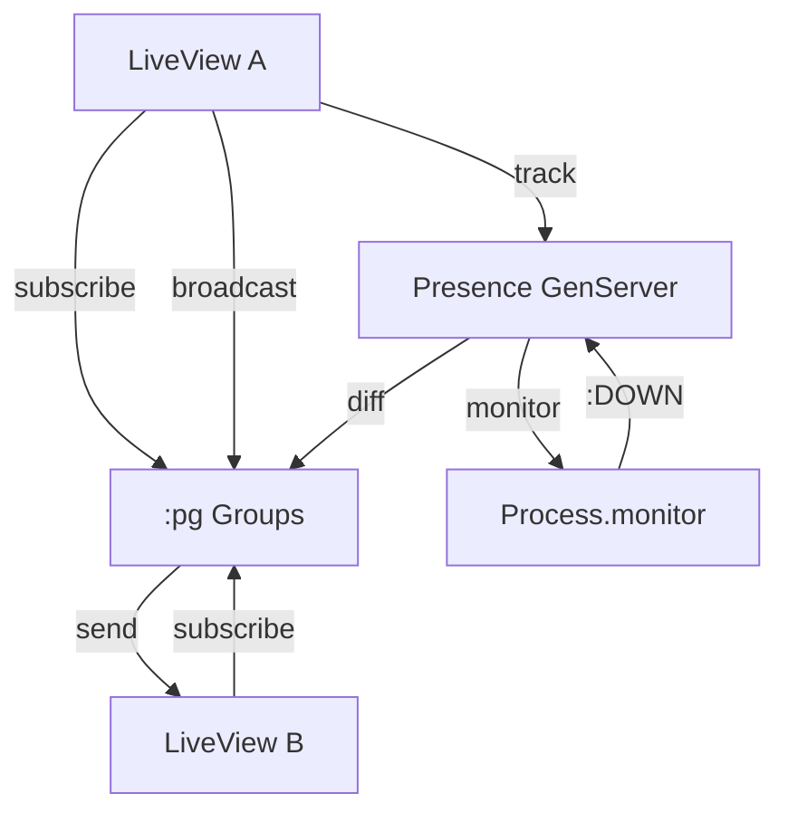

# PubSub & Presence

<!-- metadata: complexity=Moderate | files=2 | last-generated=2026-03-24 -->

[< Previous: LiveView](./04-liveview.md) | [Index](../00-index.json) | [Next: Security >](./06-security.md)

---

## Purpose

PubSub enables LiveView processes to broadcast messages in real time. Presence tracks connected users with automatic disconnect detection via `Process.monitor`. Both built on Erlang primitives with zero external dependencies.

## Key Files

| File | Purpose |
|------|---------|
| `lib/ignite/pub_sub.ex` | `subscribe/1`, `broadcast/2` wrapping Erlang `:pg` |
| `lib/ignite/presence.ex` | `track/3`, `untrack/2`, `list/1` — GenServer with `Process.monitor` |

## Architecture



## How It Works

**The Big Picture:** PubSub is a group chat. Presence is a sign-in sheet that erases your name when you leave.

<details>
<summary>Intermediate: How it works</summary>

PubSub (`lib/ignite/pub_sub.ex`): `subscribe/1` (line 29) joins `:pg` group. `broadcast/2` (line 37) sends to all members except `self()`.

Presence (`lib/ignite/presence.ex`): `track/3` (line 81) stores `{pid, meta, ref}`, monitors pid (line 169). `:DOWN` at line 142 triggers auto-untrack + leave broadcast.

</details>

```chat
{
  "title": "Shared Counter via PubSub",
  "participants": {
    "Tab A": {"color": "#4A90D9", "icon": "laptop"},
    "Tab B": {"color": "#50C878", "icon": "laptop"},
    "PubSub": {"color": "#FF6B6B", "icon": "broadcast"}
  },
  "messages": [
    {"from": "Tab A", "text": "Subscribing to 'counter'.", "technical": ":pg.join(Ignite.PubSub, \"counter\", self())"},
    {"from": "Tab B", "text": "Me too!", "technical": "Same call — both in the group"},
    {"from": "Tab A", "text": "Click! Count is 43. Broadcasting.", "technical": "broadcast(\"counter\", {:count, 43}) — sends to all except self()"},
    {"from": "PubSub", "text": "Tab B, message from Tab A.", "technical": "send(tab_b_pid, {:count, 43})"},
    {"from": "Tab B", "text": "Got it! Updating to 43.", "technical": "handle_info → {:noreply, %{count: 43}} → diff → push"}
  ]
}
```

## Key Flows

```flow-trace
{
  "title": "Presence Join & Auto-Leave",
  "steps": [
    {"component": "LiveView", "action": "Track presence", "file": "lib/ignite/presence.ex:46", "detail": "Presence.track(\"room\", \"alice\", %{name: \"Alice\"})"},
    {"component": "Presence", "action": "Monitor process", "file": "lib/ignite/presence.ex:169", "detail": "Process.monitor(pid) — ref stored for :DOWN lookup"},
    {"component": "Presence", "action": "Broadcast join", "file": "lib/ignite/presence.ex:105", "detail": "{:presence_diff, %{joins: ..., leaves: %{}}}"},
    {"component": "Presence", "action": "Process dies → auto-untrack", "file": "lib/ignite/presence.ex:142", "detail": ":DOWN → remove + broadcast leave diff"}
  ]
}
```

## Practice

```drag-match
{
  "title": "Match PubSub & Presence",
  "pairs": [
    {"concept": ":pg.join/3", "description": "Adds process to group — auto-removal on death"},
    {"concept": "broadcast excludes self()", "description": "Prevents sender from double-processing its own update"},
    {"concept": "Process.monitor/1", "description": "Returns ref that triggers :DOWN when process dies"},
    {"concept": "presence_diff", "description": "Map with :joins and :leaves keys broadcast on connect/disconnect"}
  ]
}
```

> **Quiz:** Why does `broadcast/2` exclude `self()`?
>
> - A) Prevent infinite loops
> - B) Prevent double-update (sender already updated in handle_event)
>
> <details><summary>Show Answer</summary>
>
> **B)** The sender updated assigns in handle_event. The broadcast would cause a redundant second update.
>
> </details>

---

[< Previous: LiveView](./04-liveview.md) | [Index](../00-index.json) | [Next: Security >](./06-security.md)
