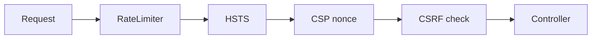

# Security

<!-- metadata: complexity=Moderate | files=5 | last-generated=2026-03-24 -->

[< Previous: PubSub & Presence](./05-pubsub-presence.md) | [Index](../00-index.json) | [Next: OTP Supervision >](./07-otp-supervision.md)

---

## Purpose

Defense-in-depth: CSRF with XOR masking, CSP nonces, HSTS, signed sessions, SSL/TLS, ETS rate limiting.

## Key Files

| File | Purpose |
|------|---------|
| `lib/ignite/csrf.ex` | Token generation, XOR masking, timing-safe validation |
| `lib/ignite/csp.ex` | Per-request nonce, CSP header |
| `lib/ignite/hsts.ex` | Strict-Transport-Security (prod only) |
| `lib/ignite/session.ex` | Signed cookies via `Plug.Crypto.MessageVerifier` |
| `lib/ignite/ssl.ex` | SSL/TLS config, HTTP→HTTPS redirect |
| `lib/ignite/rate_limiter.ex` | ETS sliding window, per-IP |

## Architecture



## How It Works

### CSRF Protection

**The Big Picture:** A secret handshake. Server whispers a code before showing a form. You must repeat it on submit. Attackers can't know the code.

<details>
<summary>Intermediate: How it works</summary>

1. Token generation (`lib/ignite/csrf.ex:39`): 32 random bytes
2. Masking (line 58): `mask <> xor(mask, token)` — random mask means different-looking token each time (BREACH mitigation)
3. Validation (line 71): split, XOR to unmask, `secure_compare`

</details>

```code-walkthrough
{
  "title": "CSRF Token Masking",
  "language": "elixir",
  "code": "def mask_token(token) do\n  decoded = Base.url_decode64!(token, padding: false)\n  mask = :crypto.strong_rand_bytes(byte_size(decoded))\n  masked = xor_bytes(mask, decoded)\n  Base.url_encode64(mask <> masked, padding: false)\nend",
  "steps": [
    {"lines": [2], "annotation": "Decode the base64 session token to raw bytes."},
    {"lines": [3], "annotation": "Random mask same length as token — makes each masked token look different."},
    {"lines": [4], "annotation": "XOR mask with token. Reversible: xor(mask, xor(mask, token)) = token."},
    {"lines": [5], "annotation": "Concatenate mask + masked and encode. Validator splits in half, XORs to recover original."}
  ]
}
```

## Key Flows

```flow-trace
{
  "title": "CSRF Validation on Form Submit",
  "steps": [
    {"component": "Session", "action": "Decode session with _csrf_token", "file": "lib/ignite/adapters/cowboy.ex:122", "detail": "Token present in session data"},
    {"component": "Router", "action": "verify_csrf_token — GET passes through", "file": "lib/my_app/router.ex:94", "detail": "Safe methods exempt"},
    {"component": "CSRF", "action": "For POST: unmask + secure_compare", "file": "lib/ignite/csrf.ex:71", "detail": "Split submitted in half, XOR, compare to session token"},
    {"component": "Router", "action": "Mismatch → 403", "file": "lib/my_app/router.ex:113", "detail": "Halts pipeline with Forbidden page"}
  ]
}
```

## Practice

```drag-match
{
  "title": "Match Security Mechanisms",
  "pairs": [
    {"concept": "XOR masking", "description": "Makes each CSRF token look different to defeat BREACH"},
    {"concept": "secure_compare", "description": "Constant-time comparison preventing timing attacks"},
    {"concept": "CSP nonce", "description": "Per-request random value allowing only matching scripts"},
    {"concept": "ETS :bag", "description": "Stores {ip, timestamp} entries for sliding window rate limiting"},
    {"concept": "MessageVerifier", "description": "HMAC-signs session data to detect tampering"}
  ]
}
```

```spot-the-bug
{
  "title": "Find the Rate Limiter Bug",
  "language": "elixir",
  "code": "def call(conn) do\n  ip = client_ip(conn)\n  now = System.system_time(:millisecond)\n  :ets.insert(@table, {ip, now})\n  count = count_requests(ip, now - @window_ms)\n  if count > @max, do: json(conn, %{error: \"rate limited\"}, 429), else: conn\nend",
  "bug_lines": [3],
  "hints": [
    "What kind of time is system_time? What if the clock jumps backward?",
    "The actual code uses monotonic_time which only moves forward"
  ],
  "explanation": "system_time is wall-clock — NTP sync can make it jump backward, breaking the window calculation. Fix: use System.monotonic_time(:millisecond) as the actual code does at lib/ignite/rate_limiter.ex:67."
}
```

> **Quiz:** Why does `mask_token/1` use a random mask each time?
>
> - A) Make token harder to guess
> - B) Defeat BREACH compression attacks
>
> <details><summary>Show Answer</summary>
>
> **B)** BREACH uses compression oracles to leak secrets. Random masking means the token looks different each page load.
>
> </details>

---

[< Previous: PubSub & Presence](./05-pubsub-presence.md) | [Index](../00-index.json) | [Next: OTP Supervision >](./07-otp-supervision.md)
