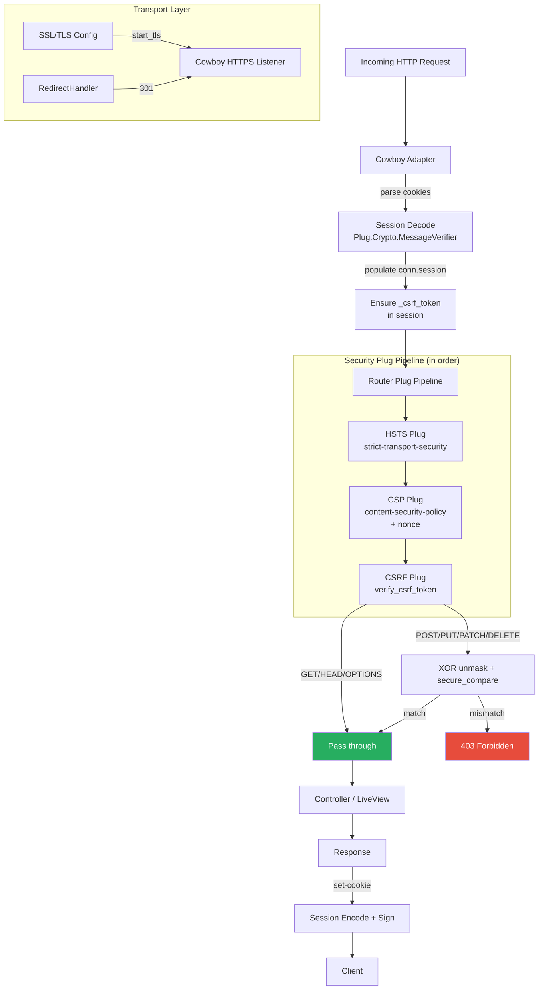
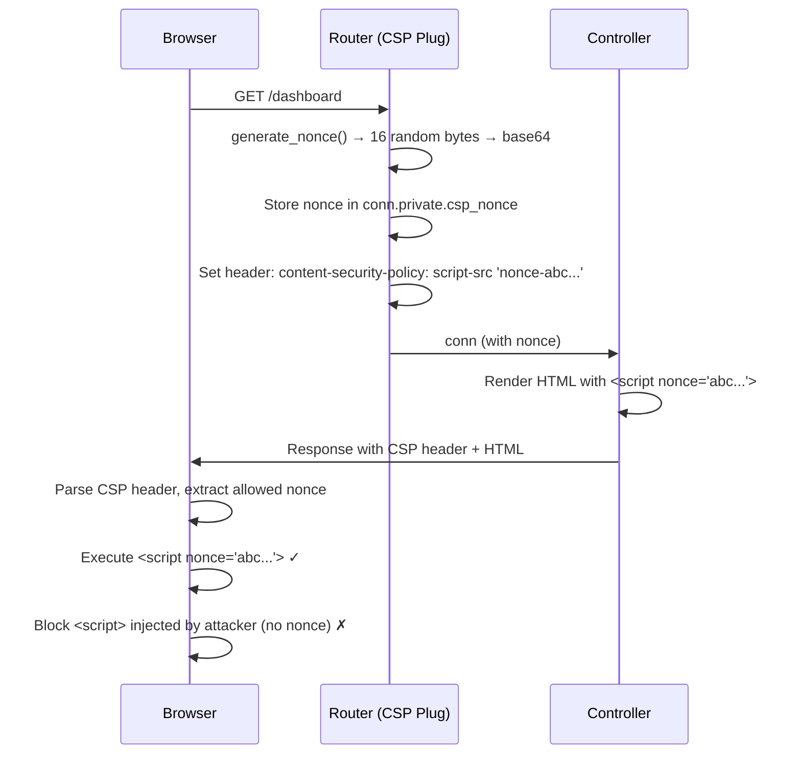

# Security

<!-- metadata: complexity=Complex | files=6 | last-generated=2026-03-24 -->

## Purpose

Defense-in-depth security for the Ignite framework. This module covers five complementary layers: **CSRF protection** (prevents forged form submissions), **CSP headers** (blocks injected scripts), **HSTS** (forces HTTPS), **signed sessions** (tamper-proof cookies), and **SSL/TLS** (encrypted transport with HTTP-to-HTTPS redirect). Each layer addresses a different attack vector; together they provide comprehensive protection for a production web application.

## Key Files

| File | Lines | Responsibility |
|------|-------|---------------|
| `lib/ignite/csrf.ex` | 1-115 | CSRF token generation, XOR masking, validation |
| `lib/ignite/csp.ex` | 1-109 | CSP header generation with per-request nonces |
| `lib/ignite/hsts.ex` | 1-41 | Strict Transport Security header |
| `lib/ignite/session.ex` | 1-106 | Signed cookie-based sessions using HMAC |
| `lib/ignite/ssl.ex` | 1-125 | SSL/TLS Cowboy child spec configuration |
| `lib/ignite/ssl/redirect_handler.ex` | 1-43 | HTTP-to-HTTPS 301 redirect Cowboy handler |

## Architecture



## How It Works

### Understanding CSRF Protection

```chat
Student: What is CSRF and why do we need protection against it?
Teacher: Imagine you're logged into your bank. A malicious site tricks your browser into submitting a form to the bank's transfer endpoint. Because your browser automatically sends your session cookie, the bank thinks it's a legitimate request. CSRF tokens prevent this — every form includes a secret token that an attacker's site cannot know.
Student: But if the token is the same every time, couldn't an attacker just read it from the page source?
Teacher: Good thinking! That's where XOR masking comes in. The actual token stays constant in the session, but every time we render a form, we produce a *different-looking* masked version. This also defends against the BREACH compression attack, where an attacker could guess the token byte-by-byte if it appeared unchanged in compressed responses.
Student: How does the server verify the masked token if it looks different every time?
Teacher: The masked token is actually `mask ++ XOR(mask, token)`. To verify, we split the submitted value in half, XOR the two halves together, and compare the result against the session token using constant-time comparison. Even though each masked token looks random, they all unmask to the same secret.
```

#### Level 1: The Big Picture

CSRF protection works in three phases: (1) a random token is generated once per session and stored in the session cookie, (2) every HTML form includes a masked version of that token as a hidden input, (3) on form submission, the server unmasks the submitted token and compares it to the session token. Mismatches result in a 403 response.

#### Level 2: Masking with XOR

The masking scheme in `mask_token/1` (line 58 of `csrf.ex`) generates a random mask the same size as the decoded token, XORs the mask with the token, and concatenates `mask <> XOR(mask, token)`. This is base64url-encoded for safe transport. The `xor_bytes/2` helper (line 106) performs byte-wise XOR using Erlang's `:binary.bin_to_list/1`.

#### Level 3: Constant-Time Comparison

In `valid_token?/2` (line 71), after unmasking, the comparison uses `Plug.Crypto.secure_compare/2` rather than `==`. This prevents timing attacks where an attacker measures response times to guess the token byte-by-byte. `secure_compare` always takes the same amount of time regardless of where the bytes differ.

---

### Understanding CSP Headers

```chat
Student: What does Content Security Policy actually do?
Teacher: CSP is an HTTP header that tells the browser: "Only execute scripts, load images, connect to servers, etc. from these approved sources." Even if an attacker manages to inject a script tag via XSS, the browser will refuse to run it because it doesn't match the policy.
Student: How do we allow our own inline scripts then?
Teacher: We use nonces. Each request generates a random nonce (16 bytes). We put that nonce in both the CSP header and our script tags. Only scripts with the matching nonce run. An attacker would need to guess 16 random bytes — practically impossible.
```

#### Level 1: The Big Picture

`put_csp_headers/1` (line 49 of `csp.ex`) generates a random nonce, stores it in `conn.private.csp_nonce`, and sets the `content-security-policy` response header. Controllers use `csp_nonce(conn)` to embed the nonce in their script tags.

#### Level 2: Policy Directives

The `build_header/1` function (line 95) constructs nine directives: `default-src 'self'` restricts everything to same-origin by default, `script-src` requires the nonce, `object-src 'none'` blocks plugins, `connect-src` allows WebSocket for LiveView, and `form-action 'self'` prevents form hijacking.

#### Level 3: Nonce Generation

Nonces are 16 bytes of cryptographically secure randomness via `:crypto.strong_rand_bytes/1` (line 38-40), base64url-encoded. Each request gets a fresh nonce, so even if an attacker observes one, it is useless for the next request.

---

### Understanding Sessions

```chat
Student: How does the session cookie prevent tampering?
Teacher: We use `Plug.Crypto.MessageVerifier` which computes an HMAC (Hash-based Message Authentication Code) over the serialized session data using a secret key. The cookie value contains both the data and the HMAC signature. If anyone changes even one byte, the HMAC won't match and `decode/1` returns `:error`.
Student: Why use `:erlang.term_to_binary` instead of JSON?
Teacher: Erlang's native serialization handles any Elixir term — maps, lists, tuples, atoms — without needing a JSON library. We pass the `[:safe]` option on deserialization (line 70 of session.ex) to prevent atom-table exhaustion attacks.
```

#### Level 1: The Big Picture

Session data lives entirely in a signed cookie (`_ignite_session`). On each request, the Cowboy adapter decodes the cookie. During the request, controllers read/write `conn.session`. On response, the adapter re-encodes and signs the updated session.

#### Level 2: Encode/Decode Cycle

`encode/1` (line 45) serializes the session map with `:erlang.term_to_binary/1`, then signs with `Plug.Crypto.MessageVerifier.sign/2`. `decode/1` (line 66) verifies the signature, then deserializes with the `[:safe]` flag. The cookie header (line 104) includes `HttpOnly` (no JavaScript access) and `SameSite=Lax` (prevents cross-origin sends on unsafe methods).

#### Level 3: Cookie Parsing

`parse_cookies/1` (line 88) splits the raw `Cookie` header on `;`, trims whitespace, and splits each pair on `=` with `parts: 2` to handle values that contain `=` (like base64).

---

### Understanding SSL/TLS

```chat
Student: Why do we need both an HTTPS listener and a redirect listener?
Teacher: Users might type `http://yoursite.com` or follow old HTTP links. The redirect listener catches those requests on port 80 and sends a 301 to the HTTPS URL. Combined with HSTS, after the first visit the browser will never even try HTTP again.
Student: What does `String.to_charlist` do for the cert paths?
Teacher: Erlang's `:ssl` module predates Elixir strings. It expects file paths as Erlang charlists (single-quoted strings). `String.to_charlist/1` converts Elixir's UTF-8 binaries to the format Erlang expects.
```

#### Level 1: The Big Picture

`Ignite.SSL.child_spec/2` (line 29 of `ssl.ex`) checks application config. If `:ssl` is nil, it starts Cowboy in plaintext mode (`:start_clear`). If SSL options are present, it validates certificate files exist and starts Cowboy in TLS mode (`:start_tls`).

#### Level 2: HTTP-to-HTTPS Redirect

`redirect_child_spec/2` (line 79) starts a second Cowboy listener on an HTTP port. All requests hit `Ignite.SSL.RedirectHandler` which builds the HTTPS URL preserving path and query string (lines 39-42 of `redirect_handler.ex`), using pattern matching to omit the port number when it is 443.

#### Level 3: HSTS Header

`Ignite.HSTS.put_hsts_header/1` (line 30 of `hsts.ex`) is config-driven: when `config :ignite, hsts: true`, it adds `strict-transport-security: max-age=31536000; includeSubDomains`. This tells browsers to use HTTPS exclusively for one year, including all subdomains.

## Key Flows

### CSRF Token Lifecycle

```flow-trace
[
  {"label": "First Request (GET /register)", "nodes": [
    {"file": "lib/ignite/adapters/cowboy.ex", "line": 110, "text": "Adapter decodes session cookie — no _csrf_token yet"},
    {"file": "lib/ignite/adapters/cowboy.ex", "line": 126, "text": "No _csrf_token in session, so generate one via Ignite.CSRF.generate_token()"},
    {"file": "lib/ignite/csrf.ex", "line": 39, "text": "generate_token/0: 32 bytes from :crypto.strong_rand_bytes, base64url-encoded"},
    {"file": "lib/my_app/router.ex", "line": 94, "text": "verify_csrf_token/1: method is GET, pass through without checking"},
    {"file": "lib/ignite/csrf.ex", "line": 99, "text": "csrf_token_tag/1: mask the session token and embed in <input type=hidden>"},
    {"file": "lib/ignite/csrf.ex", "line": 58, "text": "mask_token/1: random mask XOR'd with token, concatenated as mask<>masked"},
    {"file": "lib/ignite/session.ex", "line": 45, "text": "encode/1: serialize session with _csrf_token, sign with HMAC, set cookie"}
  ]},
  {"label": "Form Submission (POST /register)", "nodes": [
    {"file": "lib/ignite/adapters/cowboy.ex", "line": 110, "text": "Adapter decodes session cookie — _csrf_token present in session"},
    {"file": "lib/my_app/router.ex", "line": 99, "text": "verify_csrf_token/1: method is POST, must validate"},
    {"file": "lib/my_app/router.ex", "line": 106, "text": "Extract session_token from conn.session, submitted_token from conn.params"},
    {"file": "lib/ignite/csrf.ex", "line": 71, "text": "valid_token?/2: base64-decode both tokens"},
    {"file": "lib/ignite/csrf.ex", "line": 78, "text": "Split submitted token in half: <<mask::size, masked::size>>"},
    {"file": "lib/ignite/csrf.ex", "line": 79, "text": "XOR mask with masked to recover the original token"},
    {"file": "lib/ignite/csrf.ex", "line": 80, "text": "Plug.Crypto.secure_compare/2: constant-time comparison — returns true"}
  ]}
]
```

### CSRF Token Masking — Code Walkthrough

```code-walkthrough
[
  {"file": "lib/ignite/csrf.ex", "lines": [58, 63], "heading": "mask_token/1 — Creating the masked token", "body": "The function takes a base64url-encoded session token, decodes it to raw bytes, generates a random mask of equal length using `:crypto.strong_rand_bytes/1`, XORs the mask with the decoded token, then concatenates `mask <> masked` and re-encodes to base64url. Each call produces a different output because the mask is random."},
  {"file": "lib/ignite/csrf.ex", "lines": [71, 87], "heading": "valid_token?/2 — Unmasking and comparing", "body": "Both the session token and submitted token are base64-decoded. The submitted token must be exactly twice the size of the session token (mask + masked). Using binary pattern matching, the two halves are extracted. XORing the halves recovers the original token. Finally, `Plug.Crypto.secure_compare/2` performs constant-time comparison to prevent timing attacks."},
  {"file": "lib/ignite/csrf.ex", "lines": [106, 114], "heading": "xor_bytes/2 — Byte-wise XOR helper", "body": "Converts both binaries to lists of integers, zips them together, applies `Bitwise.bxor/2` to each pair, and converts back to a binary. This is a straightforward implementation used by both masking and unmasking."},
  {"file": "lib/ignite/csrf.ex", "lines": [99, 103], "heading": "csrf_token_tag/1 — Embedding in HTML forms", "body": "Retrieves the session token from the conn, masks it, and returns an HTML hidden input string. Each page render gets a fresh masked value, defeating BREACH compression attacks."}
]
```

### Browser-Server CSRF Negotiation

```chat
Browser: GET /register — I have no session cookie yet.
Server: Here's the page with a form. I generated a CSRF token (base64url, 32 random bytes), stored it in your session, and embedded a *masked* version in a hidden input. I'm also setting a signed session cookie containing the token.
Browser: The user filled the form. POST /register with _csrf_token=<masked value> from the hidden input, plus the session cookie.
Server: I decoded the session cookie, found the stored CSRF token. I base64-decoded the submitted token, split it in half (mask | masked), XOR'd the halves to recover the original, and compared it to the session token using secure_compare. They match — request accepted!
Browser: What if a malicious site tries to POST to /register?
Server: The attacker's page can trigger the POST and your browser will send the session cookie (that's the danger!), but the attacker cannot read or guess the masked token value from our page. Their request will arrive without a valid _csrf_token, and I'll respond with 403 Forbidden.
```

### CSP Nonce Flow



### Session Encode/Decode Flow

```mermaid
sequenceDiagram
    participant B as Browser
    participant A as Cowboy Adapter
    participant S as Ignite.Session
    participant P as Plug.Crypto

    Note over B,P: Request Phase
    B->>A: Request with Cookie: _ignite_session=SFMy...
    A->>S: decode(cookie_value)
    S->>P: MessageVerifier.verify(cookie_value, secret)
    P-->>S: ok, verified binary
    S->>S: :erlang.binary_to_term(binary, [:safe])
    S-->>A: ok with session map (user_id, csrf_token)
    A->>A: Populate conn.session

    Note over B,P: Response Phase
    A->>S: encode(conn.session)
    S->>S: :erlang.term_to_binary(session)
    S->>P: MessageVerifier.sign(binary, secret)
    P-->>S: signed_cookie_value
    S-->>A: "SFMy..."
    A->>B: Set-Cookie: _ignite_session=SFMy...; HttpOnly; SameSite=Lax
```

## Hot Paths

| Path | Why it matters | Where |
|------|---------------|-------|
| CSRF validation on every POST | Runs on every state-changing request; uses constant-time compare | `lib/ignite/csrf.ex:71-87` |
| Session decode on every request | HMAC verification + deserialization on every request | `lib/ignite/session.ex:66-75` |
| CSP nonce generation per request | 16-byte RNG call per request; minimal overhead | `lib/ignite/csp.ex:37-41` |
| Cookie parsing | String splitting on every request | `lib/ignite/session.ex:88-97` |

## Gotchas

```spot-the-bug
{
  "title": "Missing CSRF token in session",
  "file": "lib/ignite/csrf.ex",
  "lines": [48, 50],
  "bug_line": 49,
  "description": "If the session doesn't have a `_csrf_token` key, `get_token/1` falls back to `generate_token()` — but this generates a *new* token every time without storing it. The Cowboy adapter handles initial token creation (storing it in the session), but if you call `get_token` before the adapter has populated the session, you'll get an ephemeral token that can never be validated.",
  "hint": "Notice that `get_token/1` uses `||` to fall back, but the fallback value is never persisted back to the session."
}
```

```spot-the-bug
{
  "title": "HSTS with no SSL configured",
  "file": "lib/ignite/hsts.ex",
  "lines": [30, 40],
  "bug_line": 31,
  "description": "HSTS and SSL are configured independently. If someone sets `config :ignite, hsts: true` but does NOT configure `:ssl`, the server sends HSTS headers over plain HTTP. Browsers will then try to upgrade to HTTPS, which will fail because no TLS listener exists. Always pair HSTS with SSL configuration.",
  "hint": "The HSTS plug checks `Application.get_env(:ignite, :hsts)` but never verifies that SSL is actually configured."
}
```

## Practice

### Drag-Match: Security Layers

```drag-match
{
  "description": "Match each security mechanism to the attack it prevents.",
  "pairs": [
    ["CSRF token", "Forged form submissions from malicious sites"],
    ["CSP nonce", "Injected script execution (XSS)"],
    ["HSTS header", "SSL stripping / downgrade attacks"],
    ["Signed session cookie", "Session data tampering"],
    ["SameSite=Lax", "Cross-origin cookie sending on unsafe methods"],
    ["HttpOnly cookie flag", "JavaScript access to session cookie"],
    ["XOR masking", "BREACH compression side-channel attack"],
    ["secure_compare", "Timing-based token guessing"]
  ]
}
```

### Drag-Match: Function to Module

```drag-match
{
  "description": "Match each function to the module that defines it.",
  "pairs": [
    ["generate_token/0", "Ignite.CSRF"],
    ["mask_token/1", "Ignite.CSRF"],
    ["valid_token?/2", "Ignite.CSRF"],
    ["put_csp_headers/1", "Ignite.CSP"],
    ["generate_nonce/0", "Ignite.CSP"],
    ["put_hsts_header/1", "Ignite.HSTS"],
    ["encode/1", "Ignite.Session"],
    ["decode/1", "Ignite.Session"],
    ["child_spec/2", "Ignite.SSL"]
  ]
}
```

### Comprehension Questions

1. **Why does `mask_token/1` produce a different output each time it is called with the same token?** Trace through the function at `csrf.ex:58-63` and identify which step introduces randomness.

2. **What would happen if `valid_token?/2` used `==` instead of `Plug.Crypto.secure_compare/2`?** Consider how an attacker could exploit the difference in timing.

3. **Why does the CSP policy include `connect-src 'self' ws: wss:`?** Think about what Ignite feature requires WebSocket connections.

4. **The session cookie uses `SameSite=Lax` rather than `SameSite=Strict`. What is the trade-off?** Consider what happens when a user clicks a link to your site from an external page.

5. **Why does the `RedirectHandler` use pattern matching on port 443 (lines 39-42 of `redirect_handler.ex`) rather than always including the port?** Consider what URLs look like in standard browser behavior.

---

[< Previous: PubSub & Presence](./05-pubsub-presence.md) | [Index](../01-overview.md) | [Next: OTP & Supervision >](./07-otp-supervision.md)
