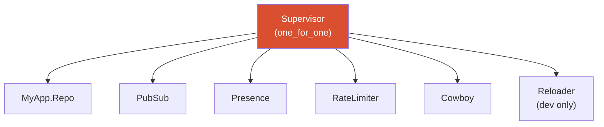

# OTP Supervision

<!-- metadata: complexity=Moderate | files=3 | last-generated=2026-03-24 -->

[< Previous: Security](./06-security.md) | [Index](../00-index.json) | [Next: Persistence >](./08-persistence.md)

---

## Purpose

Wires the application under a supervision tree. Defines process startup order and crash recovery.

## Key Files

| File | Purpose |
|------|---------|
| `lib/ignite/application.ex` | OTP Application — supervision tree |
| `lib/ignite/server.ex` | GenServer TCP loop (educational) |
| `lib/ignite/reloader.ex` | Hot code reloader (dev only) |

## Architecture



## How It Works

**The Big Picture:** A hospital org chart. Director (Supervisor) restarts departments (children) that fail without shutting down the hospital.

<details>
<summary>Intermediate: How it works</summary>

`start/2` at `lib/ignite/application.ex:13` builds children: Repo → PubSub → Presence → RateLimiter → Cowboy. `one_for_one` (line 60) restarts only the crashed child. Reloader (line 80) only in `:dev`.

</details>

```flow-trace
{
  "title": "Application Startup",
  "steps": [
    {"component": "Application", "action": "Build static manifest", "file": "lib/ignite/application.ex:18", "detail": "Static.init() creates ETS table, hashes assets"},
    {"component": "Application", "action": "Compile Cowboy dispatch", "file": "lib/ignite/application.ex:21", "detail": "Maps /live/* to Handler, /assets/* to static, /[...] to Adapter"},
    {"component": "Supervisor", "action": "Start children sequentially", "file": "lib/ignite/application.ex:41", "detail": "Repo → PubSub → Presence → RateLimiter → Cowboy"}
  ]
}
```

## Practice

```drag-match
{
  "title": "Match OTP Concepts",
  "pairs": [
    {"concept": "one_for_one", "description": "Only the crashed child restarts"},
    {"concept": "{:continue, :listen}", "description": "Defers socket setup so init returns immediately"},
    {"concept": "Code.compile_file/1", "description": "Hot-swaps a module at runtime"}
  ]
}
```

> **Quiz:** Why does Repo start before PubSub?
>
> - A) Alphabetical
> - B) DB pool must be ready before queries
>
> <details><summary>Show Answer</summary>**B)**</details>

---

[< Previous: Security](./06-security.md) | [Index](../00-index.json) | [Next: Persistence >](./08-persistence.md)
