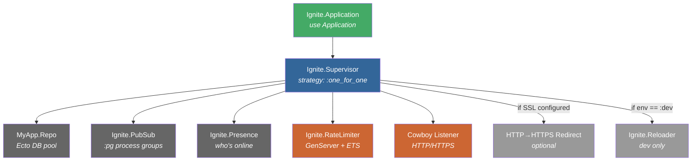

# OTP & Supervision

<!-- metadata: complexity=Moderate | files=3 | last-generated=2026-03-24 -->

## Purpose

OTP (Open Telecom Platform) supervision is the backbone of fault tolerance in Elixir applications. The "let it crash" philosophy means individual processes can fail without bringing down the whole system — a supervisor automatically restarts them. Ignite uses a flat supervision tree with ordered startup to ensure dependencies (database, PubSub) are available before the HTTP server begins accepting requests.

## Key Files

| File | Lines | Role |
|------|-------|------|
| `lib/ignite/application.ex` | 1–87 | OTP Application entry point; defines the supervision tree and child ordering |
| `lib/ignite/rate_limiter.ex` | 1–205 | GenServer + ETS sliding-window rate limiter with periodic cleanup |
| `lib/ignite/reloader.ex` | 1–103 | GenServer that polls file mtimes and hot-swaps changed modules in dev |

## Architecture



**Startup order matters.** Children start left-to-right. Repo must be up before anything queries the database. PubSub must be up before Presence (which broadcasts via PubSub). RateLimiter must be up before Cowboy accepts the first HTTP request.

## How It Works

### Understanding the Supervision Tree

#### Level 1 — The Big Picture

Ignite.Application is the entry point that the BEAM VM calls when your app starts. It builds a list of child processes and hands them to a Supervisor. If any child crashes, the supervisor restarts just that child (`:one_for_one` strategy) without affecting the others.

#### Level 2 — Ordered Child List & Conditional Children

```code-walkthrough
[
  {
    "file": "lib/ignite/application.ex",
    "lines": "41-55",
    "label": "Building the children list",
    "description": "The children list is built in dependency order. Repo starts first (database connections), then PubSub (messaging layer), then Presence (depends on PubSub), then RateLimiter (must be ready for requests), and finally Cowboy (the HTTP server). Two helper functions conditionally append redirect and dev-only children."
  },
  {
    "file": "lib/ignite/application.ex",
    "lines": "60-61",
    "label": "Starting the supervisor",
    "description": "Supervisor.start_link/2 starts all children in order. The :one_for_one strategy means if RateLimiter crashes, only RateLimiter restarts — Cowboy, PubSub, and everything else keep running."
  },
  {
    "file": "lib/ignite/application.ex",
    "lines": "80-86",
    "label": "Conditional dev children",
    "description": "The Reloader is only started when the :env config is :dev. This uses Application config (not Mix.env()) because Mix is not available in production releases."
  }
]
```

#### Level 3 — Why `:one_for_one`?

The `:one_for_one` strategy is correct here because the children are mostly independent at runtime. If the RateLimiter crashes, its ETS table is lost, but Cowboy can still serve requests (they just won't be rate-limited until the RateLimiter restarts and creates a fresh table). The alternative strategies are:

- `:one_for_all` — restart everything if one child dies (too aggressive here)
- `:rest_for_one` — restart the crashed child and all children started after it (useful if later children depend on earlier ones at runtime, but overkill for Ignite)

---

### Understanding the Rate Limiter

#### Level 1 — The Big Picture

The RateLimiter is a GenServer whose only job is to own an ETS table and periodically clean up expired entries. The actual rate-checking happens in the `call/1` function, which runs in the *caller's process* (the Cowboy request handler), not in the GenServer process. This avoids making the GenServer a bottleneck.

#### Level 2 — ETS Sliding Window

```code-walkthrough
[
  {
    "file": "lib/ignite/rate_limiter.ex",
    "lines": "124-137",
    "label": "GenServer init creates the ETS table",
    "description": "The ETS table is a :bag (multiple values per key) and :public (any process can read/write). The write_concurrency and read_concurrency options let multiple Cowboy handler processes insert and query simultaneously without locking. The GenServer schedules the first cleanup timer."
  },
  {
    "file": "lib/ignite/rate_limiter.ex",
    "lines": "61-101",
    "label": "Rate limit check (runs in caller's process)",
    "description": "Each request inserts {ip, timestamp} into ETS (line 70), then counts entries within the window using a match spec (line 74). If count exceeds max_requests, the conn is halted with a 429 JSON response. Otherwise the conn passes through with rate-limit headers added."
  },
  {
    "file": "lib/ignite/rate_limiter.ex",
    "lines": "139-156",
    "label": "Periodic cleanup via handle_info",
    "description": "Every window_ms (capped at 60s), the GenServer uses :ets.select_delete/2 with a match spec to remove entries older than the sliding window cutoff. This prevents unbounded memory growth from expired timestamps."
  }
]
```

#### Level 3 — Match Specs Deep Dive

The match specs at lines 147 and 162 are Erlang's way of running queries inside ETS without copying data to the calling process:

- **Cleanup (line 147):** `[{{:_, :"$1"}, [{:<, :"$1", cutoff}], [true]}]` — For any `{ip, timestamp}` where `timestamp < cutoff`, delete it.
- **Counting (line 162):** `[{{ip, :"$1"}, [{:>=, :"$1", cutoff}], [true]}]` — For a specific IP, count entries where `timestamp >= cutoff`.

The `:"$1"` is a capture variable that binds to the timestamp field. The guard `[{:<, :"$1", cutoff}]` is an Erlang guard expression. The `[true]` return value tells `select_delete` to delete (or `select_count` to count) each match.

---

### Understanding the Hot Code Reloader

#### Level 1 — The Big Picture

In development, the Reloader polls the filesystem every second. When a `.ex` file changes, it recompiles just that file and hot-swaps the new module code into the running BEAM VM — no server restart needed.

#### Level 2 — File Watching Loop

```code-walkthrough
[
  {
    "file": "lib/ignite/reloader.ex",
    "lines": "22-33",
    "label": "Init: snapshot all file mtimes",
    "description": "On startup, the Reloader scans lib/**/*.ex and assets/** to build a map of {filepath => mtime}. This becomes the baseline for detecting changes. A :check timer is scheduled for 1 second later."
  },
  {
    "file": "lib/ignite/reloader.ex",
    "lines": "36-53",
    "label": "Polling loop via handle_info(:check)",
    "description": "Every second, the Reloader re-scans all file mtimes. If the mtime map differs from the stored state, reload_changed/2 is called to recompile changed files. Asset changes trigger a static manifest rebuild. The new mtimes are stored in state."
  },
  {
    "file": "lib/ignite/reloader.ex",
    "lines": "68-85",
    "label": "Hot-swapping changed modules",
    "description": "For each file whose mtime changed, Code.compile_file/1 recompiles it. The :ignore_module_conflict compiler option (line 76) suppresses warnings about redefining existing modules. Compile errors are caught with try/rescue so one broken file doesn't crash the Reloader."
  }
]
```

#### Level 3 — Why Polling Instead of inotify?

Polling is simpler and cross-platform. OS-level file watchers (inotify on Linux, FSEvents on macOS) require native dependencies or NIFs. Since the Reloader is dev-only and checks every 1 second, the overhead is negligible. Phoenix uses a similar approach via its `file_system` dependency, but Ignite keeps it dependency-free.

## Key Flows

### Application Boot Sequence

```flow-trace
[
  {"label": "BEAM VM starts", "description": "The runtime calls Ignite.Application.start/2"},
  {"label": "Static assets init", "description": "Ignite.Static.init() builds the cache-busting manifest before any requests arrive (line 18)"},
  {"label": "Cowboy dispatch compiled", "description": "Routes are compiled into Cowboy's routing table: WebSocket paths, static files, and catch-all HTTP (lines 21-39)"},
  {"label": "Children list built", "description": "Ordered list: Repo → PubSub → Presence → RateLimiter → Cowboy → optional redirect → optional Reloader (lines 41-55)"},
  {"label": "Supervisor.start_link/2", "description": "Starts each child sequentially. If any child fails to start, the whole application fails (line 61)"},
  {"label": "Server ready", "description": "Logger.info announces the URL. Cowboy is now accepting connections (line 58)"}
]
```

### Rate Limit Check

```flow-trace
[
  {"label": "HTTP request arrives", "description": "Cowboy handler calls the router plug pipeline"},
  {"label": "rate_limit plug fires", "description": "Calls Ignite.RateLimiter.call(conn)"},
  {"label": "Extract client IP", "description": "Checks x-forwarded-for header first, falls back to peer IP from Cowboy adapter (lines 166-181)"},
  {"label": "Insert into ETS", "description": ":ets.insert(:ignite_rate_limiter, {ip, monotonic_timestamp}) — records this request (line 70)"},
  {"label": "Count within window", "description": ":ets.select_count with match spec counts entries where timestamp >= cutoff (lines 73-74)"},
  {"label": "Under limit?", "description": "If count <= max_requests: add x-ratelimit-* headers and pass conn through (lines 80, 98-100)"},
  {"label": "Over limit?", "description": "If count > max_requests: return 429 with retry-after header and JSON error body (lines 82-97)"}
]
```

### Supervisor Restart Conversation

```chat
[
  {"role": "Supervisor", "message": "Alright, I've started all 5 children in order. Repo is up, PubSub is up, Presence is up, RateLimiter is up, Cowboy is listening on port 4000. My strategy is :one_for_one — each child is independent."},
  {"role": "RateLimiter", "message": "I created my ETS table and scheduled my first cleanup timer. Ready to track request rates!"},
  {"role": "Supervisor", "message": "Great. Now I wait. If any of you crash, I'll restart just you — nobody else gets disturbed."},
  {"role": "RateLimiter", "message": "Uh oh — I just hit an unexpected error processing a cleanup. I'm going down!"},
  {"role": "Supervisor", "message": "I detected RateLimiter exited abnormally. Restarting it now... RateLimiter.init/1 is called again, a fresh ETS table is created. Previous rate counts are lost, but that's fine — better to let a few extra requests through than to crash the whole app."},
  {"role": "Cowboy", "message": "I never noticed anything. I kept serving requests the whole time. The rate limit plug just got a brief moment where the ETS table didn't exist, but the next request after restart works fine."},
  {"role": "Supervisor", "message": "That's the beauty of :one_for_one. Isolation means resilience."}
]
```

## Hot Paths

| Path | Why It Matters |
|------|---------------|
| `RateLimiter.call/1` | Runs on every HTTP request. Uses ETS directly (no GenServer call) to avoid serialization bottleneck |
| `:ets.insert/2` at line 70 | Lock-free concurrent writes thanks to `write_concurrency: true` |
| `:ets.select_count/2` at line 163 | Runs in the caller process, no message passing |
| `Reloader.handle_info(:check)` at line 36 | Runs every 1 second in dev; `Path.wildcard/1` scans the filesystem |

## Gotchas

```spot-the-bug
{
  "buggy": "def call(conn) do\n  ip = client_ip(conn)\n  count = GenServer.call(__MODULE__, {:check_rate, ip})\n  if count > max_requests, do: halt_429(conn), else: conn\nend",
  "fixed": "def call(conn) do\n  ip = client_ip(conn)\n  :ets.insert(@table, {ip, System.monotonic_time(:millisecond)})\n  count = count_requests(ip, cutoff)\n  if count > max_requests, do: halt_429(conn), else: conn\nend",
  "hint": "The GenServer.call version serializes ALL requests through a single process. Under load, the GenServer mailbox becomes a bottleneck. The fix: use ETS directly from the caller's process.",
  "language": "elixir"
}
```

```spot-the-bug
{
  "buggy": "defp dev_children do\n  if Mix.env() == :dev do\n    [{Ignite.Reloader, [path: \"lib\"]}]\n  else\n    []\n  end\nend",
  "fixed": "defp dev_children do\n  if Application.get_env(:ignite, :env) == :dev do\n    [{Ignite.Reloader, [path: \"lib\"]}]\n  else\n    []\n  end\nend",
  "hint": "Mix is not available at runtime in a production release. The code compiles fine but crashes when deployed. Use Application config instead.",
  "language": "elixir"
}
```

## Practice

### Match the OTP Concepts

```drag-match
{
  "pairs": [
    {"left": ":one_for_one", "right": "Restart only the crashed child process"},
    {"left": ":one_for_all", "right": "Restart every child when one crashes"},
    {"left": ":rest_for_one", "right": "Restart the crashed child and all children started after it"},
    {"left": "GenServer", "right": "A process that holds state and handles messages"},
    {"left": "ETS :bag", "right": "Table allowing multiple values per key"},
    {"left": "Code.compile_file/1", "right": "Hot-swap a module in the running VM"}
  ]
}
```

### Match the Rate Limiter Components

```drag-match
{
  "pairs": [
    {"left": ":ets.insert/2", "right": "Record a request timestamp for an IP"},
    {"left": ":ets.select_count/2", "right": "Count requests within the sliding window"},
    {"left": ":ets.select_delete/2", "right": "Periodic cleanup of expired entries"},
    {"left": "write_concurrency: true", "right": "Allow concurrent writes without locking"},
    {"left": "Process.send_after/3", "right": "Schedule the next cleanup cycle"},
    {"left": ":public", "right": "Let any process read/write the ETS table"}
  ]
}
```

### Think About It

1. **What happens if the RateLimiter crashes mid-request?** The ETS table is destroyed (it's owned by the GenServer process). The supervisor restarts the RateLimiter, which creates a fresh table. Requests during the brief gap may fail if they try to read from the missing table. How would you make this more resilient? (Hint: look into ETS heir processes.)

2. **Why does the Reloader use `try/rescue` around `Code.compile_file`?** If a developer saves a file with a syntax error, without the rescue, the Reloader process would crash. The supervisor would restart it, but the new instance would immediately try to compile the same broken file and crash again — potentially hitting the max restart intensity and taking down the whole supervision tree.

3. **The children list uses `++` to append optional children (lines 55). What would happen if you put Cowboy _after_ the Reloader in the list?** Cowboy would still work, but during startup there'd be a brief window where the Reloader is running but Cowboy isn't listening yet. More importantly, if you used `:rest_for_one` strategy, a Reloader crash would restart Cowboy too — unnecessary downtime.

---

[< Previous: Security](./06-security.md) | [Index](../01-overview.md) | [Next: Persistence >](./08-persistence.md)
