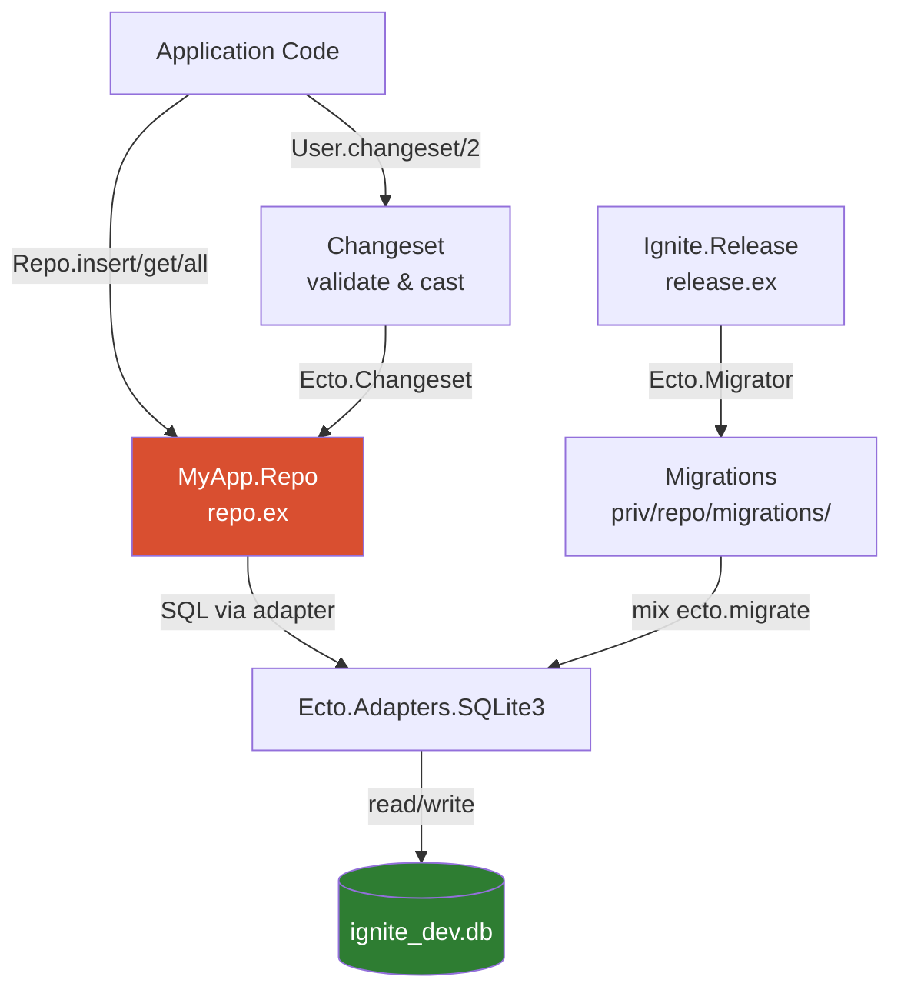

# Persistence

<!-- metadata: complexity=Moderate | files=3 | last-generated=2026-03-24 -->

[< Previous: OTP & Supervision](./07-otp-supervision.md) | [Index](../01-overview.md) | [Next: Frontend JS >](./09-frontend-js.md)

---

## Purpose

Adds database persistence via Ecto and SQLite. Ecto provides a unified API (Repo, Schema, Changeset, Migrations) that decouples application code from the underlying database. SQLite was chosen for zero-infrastructure local development, but the adapter pattern means switching to PostgreSQL requires changing only the adapter module and config -- no application code changes.

## Key Files

| File | Purpose |
|------|---------|
| `lib/my_app/repo.ex` | Repository module -- connection pool and query API |
| `lib/my_app/schemas/user.ex` | Schema + changeset validations for the `users` table |
| `lib/ignite/release.ex` | Migration/rollback tasks for production releases (no Mix) |
| `config/config.exs` | Database path, pool size, `ecto_repos` registration |
| `priv/repo/migrations/20260304000001_create_users.exs` | Migration that creates `users` table + unique index |

## Architecture



## How It Works

### Understanding the Repo

**The Big Picture:** A librarian. You never touch the shelves (database) directly -- you hand the librarian a request ("find user 5", "store this record") and they handle the details.

<details>
<summary>Intermediate: How it works</summary>

`lib/my_app/repo.ex:13` calls `use Ecto.Repo, otp_app: :ignite, adapter: Ecto.Adapters.SQLite3`. This single macro injects all CRUD functions: `Repo.insert/1`, `Repo.get/2`, `Repo.all/1`, `Repo.update/1`, `Repo.delete/1`, plus transaction support.

The `otp_app: :ignite` tells Ecto to read its config from `config :ignite, MyApp.Repo` (config/config.exs:17). The `adapter:` option selects the SQL dialect and connection driver.

At startup, `lib/ignite/application.ex:44` lists `MyApp.Repo` as a supervised child -- this starts the connection pool before any queries can run.

</details>

<details>
<summary>Advanced: Under the hood</summary>

`use Ecto.Repo` generates a GenServer-backed connection pool. Configuration at `config/config.exs:17-19` sets `database: "ignite_dev.db"` and `pool_size: 5`. The pool is a `DBConnection` pool -- each checkout gives a raw SQLite connection.

To swap databases, change only two things: the adapter at `repo.ex:15` (e.g., `Ecto.Adapters.Postgres`) and the config (add `hostname`, `username`, `password`). All `Repo.*` calls remain identical -- this is the adapter pattern at work.

The `ecto_repos` list at `config/config.exs:22` tells Mix tasks (and `Ignite.Release`) which repos to target for migrations.

</details>

### Understanding Schemas & Changesets

**The Big Picture:** A schema is a blueprint of a database table in Elixir structs. A changeset is a validation checkpoint -- data must pass through it before reaching the database.

<details>
<summary>Intermediate: How it works</summary>

`lib/my_app/schemas/user.ex:8` calls `use Ecto.Schema` which enables the `schema` macro. At line 11, `schema "users"` maps the module to the `users` table. Fields `username` and `email` (lines 12-13) become struct keys. `timestamps()` at line 15 auto-adds `inserted_at` and `updated_at`.

The `changeset/2` function at line 24 is the validation pipeline:
1. `cast(attrs, [:username, :email])` -- whitelist allowed fields (line 26)
2. `validate_required([:username])` -- username must be present (line 27)
3. `validate_length(:username, min: 2, max: 50)` -- length bounds (line 28)
4. `unique_constraint(:username)` -- maps to the DB unique index (line 29)

If any step fails, the changeset accumulates errors without raising -- `Repo.insert(changeset)` returns `{:error, changeset}` instead of crashing.

</details>

<details>
<summary>Advanced: Under the hood</summary>

`import Ecto.Changeset` at line 9 brings in `cast/3`, `validate_required/2`, etc. These are pure functions that thread an `%Ecto.Changeset{}` struct through a pipeline, collecting `:errors` and marking `:valid?` as false on failure.

`unique_constraint(:username)` at line 29 does NOT check uniqueness in Elixir. It tells Ecto to convert a database unique-violation error (from the index created at `priv/repo/migrations/20260304000001_create_users.exs:12`) into a friendly changeset error. This avoids race conditions that in-memory checks would have.

The `schema "users"` macro at line 11 also generates `__schema__/1` introspection functions used by Ecto internally for query building, type casting, and association loading.

</details>

### Understanding Migrations

**The Big Picture:** Migrations are version-controlled database changes. Each file is a timestamped step that can be applied forward or rolled back -- like git commits for your database schema.

<details>
<summary>Intermediate: How it works</summary>

`priv/repo/migrations/20260304000001_create_users.exs:1` defines a migration module using `use Ecto.Migration`. The `change/0` function at line 4 describes the transformation:

- `create table(:users)` (line 5) generates `CREATE TABLE`
- `add :username, :string, null: false` (line 6) adds a NOT NULL column
- `timestamps()` (line 9) adds `inserted_at` and `updated_at` columns
- `create unique_index(:users, [:username])` (line 12) prevents duplicate usernames

The `change/0` function is reversible -- Ecto can infer the rollback (`DROP TABLE`, `DROP INDEX`) automatically.

</details>

<details>
<summary>Advanced: Under the hood</summary>

The timestamp prefix `20260304000001` determines execution order. Ecto tracks which migrations have run in a `schema_migrations` table. `mix ecto.migrate` runs only pending ones.

The second migration (`20260306000001_create_todo_app_tables.exs`) shows more advanced patterns: foreign keys via `references(:todo_users, on_delete: :delete_all)` at line 23, cascading deletes, and multiple indexes (lines 28-29, 38). The `on_delete: :nilify_all` at line 24 nullifies the FK instead of deleting the row -- useful for optional associations.

</details>

### Understanding Release Tasks

**The Big Picture:** In production, Mix is not available (it is a build tool). `Ignite.Release` provides the same migration commands as Mix tasks, callable from the release binary.

<details>
<summary>Intermediate: How it works</summary>

`lib/ignite/release.ex:26` defines `migrate/0`. It calls `load_app/0` (line 27) to boot the application, then iterates over all configured repos (line 29) and runs `Ecto.Migrator.with_repo/2` which starts the repo temporarily, runs all `:up` migrations, and shuts it down.

Usage: `bin/ignite eval "Ignite.Release.migrate()"` -- no Mix needed.

</details>

<details>
<summary>Advanced: Under the hood</summary>

`load_app/0` at line 57 is crucial: it starts `:ssl` and `:ecto_sql` (dependencies the repo needs), then calls `Application.load(@app)` to load config without starting the full supervision tree. This lets migration run as a standalone command.

`repos/0` at line 53 reads `Application.fetch_env!(:ignite, :ecto_repos)` -- the same list from `config/config.exs:22`. This means adding a second repo (e.g., for a read replica) automatically includes it in migration runs.

`create_db/0` at line 45 calls `repo.__adapter__().storage_up(repo.config())` -- the adapter-specific command to create the database file (SQLite) or `CREATE DATABASE` (PostgreSQL).

</details>

## Key Flows

```flow-trace
{
  "title": "Insert a Record",
  "steps": [
    {"component": "Controller", "action": "Build changeset from params", "file": "lib/my_app/schemas/user.ex:24", "detail": "User.changeset(%User{}, %{\"username\" => \"alice\"})"},
    {"component": "Changeset", "action": "Cast & validate fields", "file": "lib/my_app/schemas/user.ex:26-29", "detail": "cast → validate_required → validate_length → unique_constraint"},
    {"component": "Repo", "action": "Insert if changeset valid", "file": "lib/my_app/repo.ex:13", "detail": "Repo.insert(changeset) → adapter generates INSERT SQL"},
    {"component": "SQLite", "action": "Execute INSERT + return row", "file": "config/config.exs:18", "detail": "Writes to ignite_dev.db, returns {:ok, %User{id: 1}}"},
    {"component": "Controller", "action": "Pattern match on result", "detail": "{:ok, user} → success response; {:error, changeset} → show errors"}
  ]
}
```

```flow-trace
{
  "title": "Run Migrations in Production",
  "steps": [
    {"component": "Operator", "action": "Invoke release eval", "detail": "bin/ignite eval \"Ignite.Release.migrate()\""},
    {"component": "Release", "action": "Load app without starting tree", "file": "lib/ignite/release.ex:57", "detail": "Start :ssl, :ecto_sql; load :ignite config"},
    {"component": "Release", "action": "Iterate repos", "file": "lib/ignite/release.ex:29", "detail": "for repo <- repos() — reads ecto_repos from config"},
    {"component": "Migrator", "action": "Run pending migrations", "file": "lib/ignite/release.ex:30", "detail": "Ecto.Migrator.with_repo starts pool, runs :up, stops pool"}
  ]
}
```

```chat
{
  "title": "Inserting a User",
  "participants": {
    "Controller": {"color": "#4A90D9", "icon": "code"},
    "Changeset": {"color": "#50C878", "icon": "shield"},
    "Repo": {"color": "#D94F30", "icon": "database"},
    "SQLite": {"color": "#FFB347", "icon": "disk"}
  },
  "messages": [
    {"from": "Controller", "text": "User submitted a form. Build a changeset.", "technical": "User.changeset(%User{}, %{\"username\" => \"alice\", \"email\" => \"a@b.com\"})"},
    {"from": "Changeset", "text": "Casting username and email. Checking required fields, length...", "technical": "cast/3 whitelists fields; validate_required checks :username; validate_length checks 2..50"},
    {"from": "Changeset", "text": "All validations pass. valid? = true.", "technical": "%Changeset{valid?: true, changes: %{username: \"alice\", email: \"a@b.com\"}}"},
    {"from": "Repo", "text": "Changeset is valid. Generating SQL and executing.", "technical": "INSERT INTO users (username, email, inserted_at, updated_at) VALUES (?, ?, ?, ?)"},
    {"from": "SQLite", "text": "Row inserted. Returning ID.", "technical": "{:ok, %User{id: 1, username: \"alice\", email: \"a@b.com\"}}"},
    {"from": "Controller", "text": "Got {:ok, user}. Rendering success response.", "technical": "Pattern match on {:ok, user} branch"}
  ]
}
```

## Hot Paths

| Path | Why It Matters |
|------|---------------|
| `Repo.insert(changeset)` | Every write goes through changeset validation then SQL generation |
| `Repo.all(User)` | Connection pool checkout, query, decode rows into structs |
| `Ecto.Migrator.run/3` | Sequential, locks `schema_migrations` to prevent concurrent runs |

## Gotchas

- **`unique_constraint` needs a matching DB index**: `unique_constraint(:username)` at `user.ex:29` does nothing without the index at `create_users.exs:12`. Without the index, duplicates silently succeed.
- **Pool exhaustion**: With `pool_size: 5` (config.exs:19), six concurrent queries means the sixth waits. In LiveView-heavy apps, increase the pool or use `Repo.checkout/1` carefully.
- **Migrations are irreversible once deployed**: Rollbacks exist but are risky in production. Prefer additive migrations (add column, then backfill, then remove old column in a later migration).
- **SQLite limitations**: No concurrent writes (single-writer lock), no `ALTER COLUMN`. For production workloads, switch to PostgreSQL.

## Practice

```drag-match
{
  "title": "Match Ecto Concepts",
  "pairs": [
    {"concept": "Repo", "description": "Connection pool + CRUD API that translates Elixir calls to SQL"},
    {"concept": "Schema", "description": "Maps a database table to an Elixir struct with typed fields"},
    {"concept": "Changeset", "description": "Validation pipeline that accumulates errors without raising"},
    {"concept": "Migration", "description": "Version-controlled, reversible database schema change"},
    {"concept": "unique_constraint", "description": "Converts a DB unique-violation error into a friendly changeset error"}
  ]
}
```

```spot-the-bug
{
  "title": "Find the Persistence Bug",
  "language": "elixir",
  "code": "def create_user(attrs) do\n  changeset = User.changeset(%User{}, attrs)\n  if changeset.valid? do\n    MyApp.Repo.insert(changeset)\n  else\n    {:error, changeset}\n  end\nend",
  "bug_lines": [3],
  "hints": [
    "What does Repo.insert/1 already do when the changeset is invalid?",
    "Is checking valid? before insert ever necessary?"
  ],
  "explanation": "The manual valid? check is redundant. Repo.insert/1 already returns {:error, changeset} when the changeset is invalid. Worse, this check skips database-level validations (like unique_constraint) which only trigger on actual INSERT. Just call Repo.insert(changeset) directly."
}
```

```spot-the-bug
{
  "title": "Find the Migration Bug",
  "language": "elixir",
  "code": "def change do\n  create table(:users) do\n    add :username, :string\n    add :email, :string\n    timestamps()\n  end\nend",
  "bug_lines": [3],
  "hints": [
    "Compare with the actual migration at 20260304000001_create_users.exs:6",
    "What happens if someone inserts a user with no username?"
  ],
  "explanation": "Missing null: false on :username (line 3). The schema's validate_required catches it in Elixir, but direct SQL inserts or data migrations bypass changesets. Always enforce NOT NULL at the database level too. The real migration at 20260304000001_create_users.exs:6 correctly uses null: false."
}
```

> **Quiz: Adapter Pattern**
>
> To switch from SQLite to PostgreSQL, which files need changes?
>
> - A) `repo.ex`, `config.exs`, and every module that calls `Repo.*`
> - B) `repo.ex` (adapter) and `config.exs` (connection details) only
> - C) Only `config.exs`
>
> <details><summary>Show Answer</summary>**B)** Change the adapter at repo.ex:15 and the config at config.exs:17-19. All Repo.* calls remain identical -- that is the entire point of the adapter pattern.</details>

> **Quiz: Changeset Errors**
>
> What does `Repo.insert(User.changeset(%User{}, %{}))` return?
>
> - A) Raises an exception
> - B) `{:error, %Ecto.Changeset{errors: [username: {"can't be blank", ...}]}}`
> - C) `{:ok, %User{username: nil}}`
>
> <details><summary>Show Answer</summary>**B)** The changeset fails validate_required(:username) at user.ex:27, so Repo.insert returns {:error, changeset} with accumulated errors. No exception raised.</details>

---

[< Previous: OTP & Supervision](./07-otp-supervision.md) | [Index](../01-overview.md) | [Next: Frontend JS >](./09-frontend-js.md)
