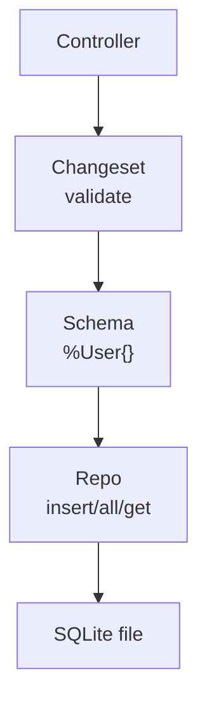

# Persistence

<!-- metadata: complexity=Moderate | files=4 | last-generated=2026-03-24 -->

[< Previous: OTP Supervision](./07-otp-supervision.md) | [Index](../00-index.json) | [Next: Frontend JS >](./09-frontend-js.md)

---

## Purpose

Ecto + SQLite for zero-infrastructure data storage. Repo, schemas, changesets, migrations.

## Key Files

| File | Purpose |
|------|---------|
| `lib/my_app/repo.ex` | Ecto Repo — SQLite connection pool |
| `lib/my_app/schemas/user.ex` | User schema + changeset |
| `priv/repo/migrations/` | Database migrations |

## Architecture



## How It Works

**The Big Picture:** Ecto is a librarian translating between structs and SQL tables. Changesets validate before touching the database.

## Practice

```drag-match
{
  "title": "Match Ecto Concepts",
  "pairs": [
    {"concept": "Repo", "description": "Connection pool with insert/all/get/delete"},
    {"concept": "Schema", "description": "Maps struct fields to table columns"},
    {"concept": "Changeset", "description": "Validates and tracks changes before DB write"},
    {"concept": "Migration", "description": "Versioned script that creates/alters tables"}
  ]
}
```

> **Quiz:** Primary advantage of changesets?
>
> - A) Faster than manual validation
> - B) Composable data structures — inspect errors without touching DB
>
> <details><summary>Show Answer</summary>**B)**</details>

---

[< Previous: OTP Supervision](./07-otp-supervision.md) | [Index](../00-index.json) | [Next: Frontend JS >](./09-frontend-js.md)
