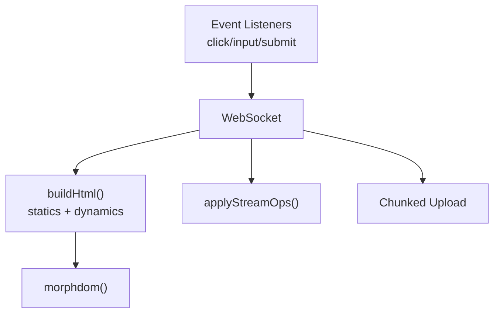

# Frontend JavaScript

<!-- metadata: complexity=Moderate | files=3 | last-generated=2026-03-24 -->

[< Previous: Persistence](./08-persistence.md) | [Index](../00-index.json) | [Next: Static Assets >](./10-static-assets.md)

---

## Purpose

Client-side counterpart to LiveView. WebSocket connection, HTML reconstruction from statics+dynamics, DOM patching via morphdom, event delegation, live navigation, JS hooks, stream operations, file upload chunking.

## Key Files

| File | Purpose |
|------|---------|
| `assets/ignite.js` | Main client: WS, events, DOM patching, streams, uploads |
| `assets/hooks.js` | Example hooks: CopyToClipboard, LocalTime |
| `assets/morphdom.min.js` | DOM diffing library |

## Architecture



## How It Works

**The Big Picture:** A window display receiving update instructions. Full layout on opening day. After that, only changed price tags are sent.

<details>
<summary>Intermediate: How it works</summary>

Mount: `{"s": [...], "d": ["42"]}` — statics saved permanently. Update: `{"d": {"0": "43"}}` patches index 0. `buildHtml()` at `assets/ignite.js:341` interleaves arrays. morphdom at line 354 with `onBeforeElUpdated` preserves focus.

</details>

## Practice

```drag-match
{
  "title": "Match Client Concepts",
  "pairs": [
    {"concept": "statics", "description": "Saved once — reused to reconstruct HTML on every update"},
    {"concept": "sparse update", "description": "Patches only changed indices in dynamics array"},
    {"concept": "morphdom", "description": "Compares DOM trees, applies minimal mutations"},
    {"concept": "ignite-click", "description": "Caught by document-level listener, sends event over WS"},
    {"concept": "ignite-hook", "description": "Attaches JS Hook with mounted/updated/destroyed callbacks"}
  ]
}
```

> **Quiz:** Server sends `{"d": {"2": "new"}}` with dynamics `["a", "b", "old"]`. Result?
>
> - A) `["new"]`
> - B) `["a", "b", "new"]`
>
> <details><summary>Show Answer</summary>**B)** Sparse patch: `dynamics[2] = "new"`</details>

---

[< Previous: Persistence](./08-persistence.md) | [Index](../00-index.json) | [Next: Static Assets >](./10-static-assets.md)
