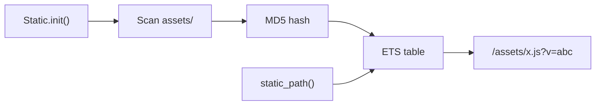

# Static Assets

<!-- metadata: complexity=Simple | files=2 | last-generated=2026-03-24 -->

[< Previous: Frontend JS](./09-frontend-js.md) | [Index](../00-index.json) | [Next: DevTools >](./11-devtools.md)

---

## Purpose

Cache-busting URLs. Scans `assets/`, computes MD5 hashes, stores in ETS. `static_path/1` appends `?v=HASH`.

## Key Files

| File | Purpose |
|------|---------|
| `lib/ignite/static.ex` | ETS manifest: `init/1`, `rebuild/1`, `static_path/1` |

## Architecture



## How It Works

**The Big Picture:** Browsers cache aggressively. Change the fingerprint → browser fetches the new version.

<details>
<summary>Intermediate</summary>

`init/1` at `lib/ignite/static.ex:23` creates ETS with `read_concurrency: true`, hashes files (MD5, first 8 hex chars at line 83). `static_path/1` at line 58 looks up hash. Reloader calls `rebuild/1` on change.

</details>

## Practice

```drag-match
{
  "title": "Match Static Concepts",
  "pairs": [
    {"concept": "read_concurrency: true", "description": "Optimizes ETS for many concurrent reads"},
    {"concept": "?v=hash", "description": "Content hash forces browser cache refresh on change"},
    {"concept": "Static.rebuild/1", "description": "Called by Reloader when assets change in dev"}
  ]
}
```

> **Quiz:** What does `static_path("missing.js")` return?
>
> - A) Error
> - B) nil
> - C) `"/assets/missing.js"` (no version)
>
> <details><summary>Show Answer</summary>**C)** ETS lookup returns `[]`, falls to the no-hash clause.</details>

---

[< Previous: Frontend JS](./09-frontend-js.md) | [Index](../00-index.json) | [Next: DevTools >](./11-devtools.md)
