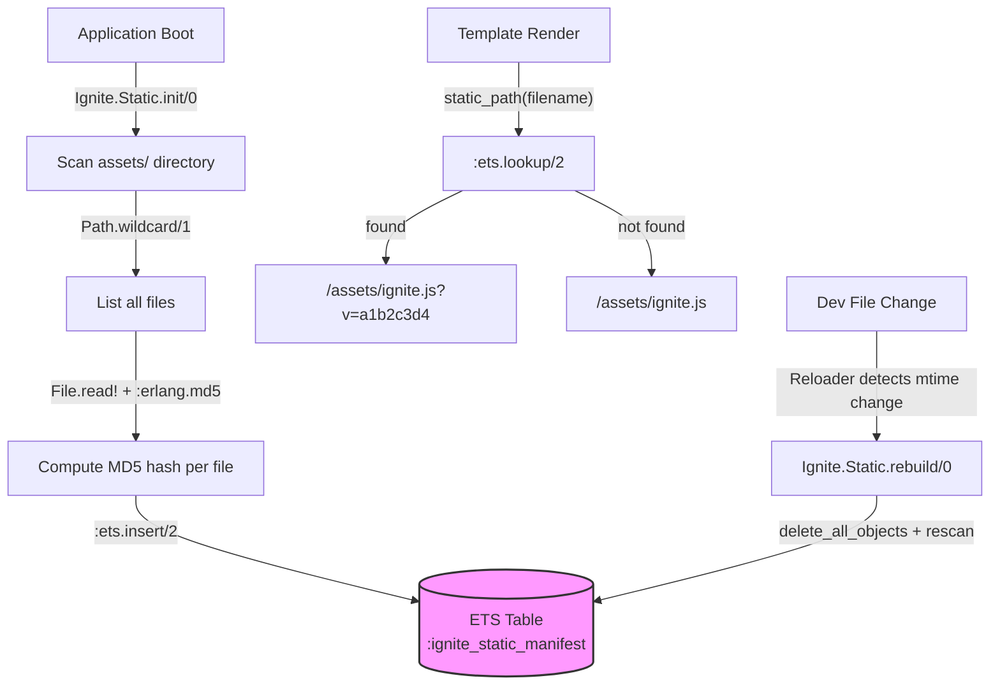

# Static Assets

<!-- metadata: complexity=Simple | files=1 | last-generated=2026-03-24 -->

## Purpose

Web browsers aggressively cache static files like JavaScript, CSS, and images. When you deploy a change, users may still see stale versions for hours or days. The **Static Assets** module solves this with a **cache-busting pipeline**: at boot time it scans every file in the `assets/` directory, computes an MD5 content hash, and stores the mapping in an **ETS table** (Erlang's blazing-fast in-memory key-value store). The `static_path/1` helper then appends a `?v=HASH` query parameter to every asset URL, so when file contents change, the URL changes, and the browser fetches the new version.

This is the same strategy used by Phoenix's own static pipeline (`mix phx.digest`), but implemented in under 90 lines of Elixir.

## Key Files

| File | Lines | Role |
|------|-------|------|
| `lib/ignite/static.ex` | 1–90 | ETS manifest builder, `static_path/1` helper |
| `lib/ignite/application.ex` | 18 | Calls `Ignite.Static.init()` at boot |
| `lib/ignite/controller.ex` | 184–186 | Convenience delegate `static_path/1` for templates |
| `lib/ignite/reloader.ex` | 43–48 | Calls `Ignite.Static.rebuild()` on asset file changes |
| `templates/live.html.eex` | 20–22 | Uses `static_path/1` to load JS assets with cache-busting |

## Architecture



## How It Works

### Understanding the Asset Pipeline

````chat
role: student
Why not just put a timestamp in the URL, like `?v=1711296000`?

role: teacher
Timestamps change on every deploy even if the file didn't change. That forces browsers to re-download identical files. Content hashing means the URL only changes when the actual bytes change — saving bandwidth and improving page load times.

role: student
Why ETS instead of a regular Map in a GenServer?

role: teacher
ETS gives you lock-free concurrent reads (with `read_concurrency: true`). Every incoming HTTP request needs to look up asset hashes, so this avoids making a GenServer a bottleneck. Reads happen directly in the calling process — no message passing, no mailbox queuing.

role: student
Is MD5 safe to use here? I thought it was broken.

role: teacher
MD5 is cryptographically broken — you shouldn't use it for passwords or signatures. But here we only need a content fingerprint: "did the bytes change?" For that, MD5 is fast and perfectly adequate. Phoenix uses the same approach.
````

### Level 1 — The Big Picture

At application startup, `Ignite.Static.init/0` scans every file under `assets/`, hashes its content, and stores a `{filename, hash}` pair in an ETS table. When a template calls `static_path("ignite.js")`, the hash is looked up and appended as a query parameter. In development, the reloader automatically calls `rebuild/0` when asset files change on disk.

### Level 2 — The Mechanics

1. **Boot** (`init/0`, line 23): Creates or clears the ETS table `:ignite_static_manifest` with `:public` access and `read_concurrency: true`, then calls `build_manifest/1`.
2. **Scan** (`build_manifest/1`, line 69): Uses `Path.wildcard("assets/**/*")` to find all files, filters to regular files only, then computes an MD5 hash for each.
3. **Hash** (`hash_file/1`, line 83): Reads the file, computes `:erlang.md5/1`, base-16 encodes it, and truncates to the first 8 hex characters.
4. **Lookup** (`static_path/1`, line 58): Pattern-matches on `ets.lookup/2` — if found, returns `/assets/filename?v=hash`; if not, returns `/assets/filename` without a version.
5. **Hot Reload** (`rebuild/0`, line 38): Clears the ETS table and rescans. Called by `Ignite.Reloader` when asset mtimes change.

### Level 3 — Under the Hood

The ETS table is created with four key options:
- **`:named_table`** — accessible by atom name rather than opaque reference, so any process can call `:ets.lookup(:ignite_static_manifest, key)`.
- **`:set`** — one value per key (latest insert wins).
- **`:public`** — any process can read or write. Since only `init/0` and `rebuild/0` write, this is safe.
- **`read_concurrency: true`** — tells the BEAM to optimize for concurrent readers, which is the dominant access pattern (many requests, rare writes).

The `init/0` function is idempotent: if the table already exists (checked via `:ets.info/1`), it clears entries rather than crashing. This matters during hot code reloading in development.

## Key Flows

### Asset URL Resolution

```flow-trace
{
  "trigger": "Template calls static_path(\"ignite.js\")",
  "steps": [
    {"location": "lib/ignite/controller.ex:184", "action": "static_path/1 delegates to Ignite.Static.static_path/1"},
    {"location": "lib/ignite/static.ex:59", "action": ":ets.lookup(:ignite_static_manifest, \"ignite.js\")"},
    {"location": "lib/ignite/static.ex:60-61", "action": "Match found: return \"/assets/ignite.js?v=a1b2c3d4\""},
    {"location": "templates/live.html.eex:22", "action": "Browser receives <script src=\"/assets/ignite.js?v=a1b2c3d4\">"}
  ]
}
```

### Manifest Initialization

```code-walkthrough
{
  "file": "lib/ignite/static.ex",
  "highlights": [
    {"lines": "14-15", "label": "Module attributes define the ETS table name and default directory"},
    {"lines": "23-31", "label": "init/0 is idempotent — creates or clears the ETS table, then builds the manifest"},
    {"lines": "24-28", "label": "Guard against double-init: if table exists, clear it; otherwise create with read-optimized settings"},
    {"lines": "69-78", "label": "build_manifest/1 walks the directory tree, hashes each file, inserts into ETS"},
    {"lines": "83-89", "label": "hash_file/1 produces 8 hex chars from MD5 — fast and sufficient for cache busting"},
    {"lines": "58-66", "label": "static_path/1 looks up the hash and builds the versioned URL, falling back gracefully"}
  ]
}
```

## Hot Paths

| Path | Frequency | Why it matters |
|------|-----------|---------------|
| `static_path/1` | Every page render | Called for each `<script>` / `<link>` tag. ETS lookup is O(1) and lock-free. |
| `init/0` | Once at boot | Scans the filesystem and populates ETS. Blocks startup until complete. |
| `rebuild/0` | On asset file save (dev only) | Rescans all files. Fast for typical asset directories (<100 files). |

## Gotchas

```spot-the-bug
{
  "language": "elixir",
  "code": "def static_path(filename) do\n  hash = hash_file(\"assets/\" <> filename)\n  \"/assets/#{filename}?v=#{hash}\"\nend",
  "bug": "This reads the file from disk on EVERY request instead of using the cached ETS lookup. Under load, this would hammer the filesystem and destroy performance. The correct implementation uses :ets.lookup/2.",
  "fix": "def static_path(filename) do\n  case :ets.lookup(:ignite_static_manifest, filename) do\n    [{^filename, hash}] -> \"/assets/#{filename}?v=#{hash}\"\n    [] -> \"/assets/#{filename}\"\n  end\nend"
}
```

## Practice

### Match the Concepts

```drag-match
{
  "pairs": [
    {"left": ":ets.new(_, [:named_table, :set, :public, read_concurrency: true])", "right": "Create a shared, read-optimized in-memory table"},
    {"left": ":erlang.md5(content)", "right": "Compute a 128-bit content fingerprint"},
    {"left": "binary_part(hex, 0, 8)", "right": "Truncate hash to 8 hex characters"},
    {"left": "Path.wildcard(\"assets/**/*\")", "right": "Recursively find all files in the assets directory"},
    {"left": ":ets.lookup(@table, filename)", "right": "O(1) key lookup in the manifest table"}
  ]
}
```

### Check Your Understanding

```quiz
{
  "questions": [
    {
      "question": "Why does init/0 check :ets.info(@table) before creating the table?",
      "options": [
        "To measure table size",
        "To avoid crashing if the table already exists (idempotency)",
        "To read existing entries",
        "To set permissions on the table"
      ],
      "answer": 1
    },
    {
      "question": "What happens when static_path/1 is called for a file not in the manifest?",
      "options": [
        "It raises a FileNotFoundError",
        "It returns nil",
        "It returns the path without a version query parameter",
        "It triggers a rebuild of the manifest"
      ],
      "answer": 2
    },
    {
      "question": "Why is read_concurrency: true important for this ETS table?",
      "options": [
        "It makes writes faster",
        "It allows multiple processes to read simultaneously without contention",
        "It encrypts the data at rest",
        "It persists the table to disk"
      ],
      "answer": 1
    }
  ]
}
```

---

[< Previous: Frontend JS](./09-frontend-js.md) | [Index](../01-overview.md) | [Next: DevTools >](./11-devtools.md)
