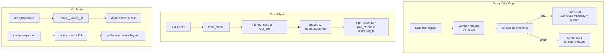

# DevTools

<!-- metadata: complexity=Moderate | files=4 | last-generated=2026-03-24 -->

[< Previous: Static Assets](./10-static-assets.md) | [Index](../01-overview.md) | [Next: Sample App >](./12-sample-app.md)

---

## Purpose

Developer experience tooling for the Ignite framework: a rich debug error page that shows exception details, stacktraces, and request context in development (but hides them in production); test helpers that let you exercise routes and controllers without starting an HTTP server; and Mix tasks for route introspection and SSL certificate generation.

## Key Files

| File | Purpose |
|------|---------|
| `lib/ignite/debug_page.ex` | Rich HTML error page in dev, generic 500 in prod |
| `lib/ignite/conn_test.ex` | Test helpers: `build_conn`, `get`, `post`, response assertions |
| `lib/mix/tasks/ignite.routes.ex` | `mix ignite.routes` — prints all registered routes |
| `lib/mix/tasks/ignite.gen.cert.ex` | `mix ignite.gen.cert` — generates self-signed SSL certs |

## Architecture



## How It Works

### Understanding the Debug Error Page

**The Big Picture:** When your controller crashes, you need to know what happened. In development, Ignite catches the exception and renders a tabbed HTML page showing the error message, a color-coded stacktrace (your code highlighted, dependencies dimmed), request details, and session data. In production, it shows a safe generic page that leaks nothing to attackers.

<details>
<summary>Intermediate: How it works</summary>

`DebugPage.render/3` at `lib/ignite/debug_page.ex:21` checks `Application.get_env(:ignite, :env)`. In dev mode, `render_dev/3` (line 52) extracts the exception type, HTML-escapes the message (line 54), formats the stacktrace into an HTML table (line 55), and builds a request summary (line 56). The output is a self-contained HTML page with inline CSS and JavaScript for tab switching between Stacktrace, Request, and Session panels.

Each stacktrace entry at line 104 is classified as `"app"` or `"dep"` by `app_frame?/1` (line 119), which checks if the file path starts with `lib/my_app` or `lib/ignite`. App frames are bold; dependency frames are greyed out.

</details>

<details>
<summary>Advanced: Under the hood</summary>

The `format_entry/4` function at line 104 handles both forms of the Erlang stacktrace tuple: when `arity` is an integer (compiled code) or a list (the actual arguments, available in development). It normalizes with `if is_list(arity), do: length(arity), else: arity` at line 105.

HTML escaping at line 192 replaces `&`, `<`, `>`, and `"` to prevent XSS. This is critical because exception messages can contain user-controlled input (e.g., a URL path like `/<script>alert(1)</script>` would appear in a "no route" error).

The entire page is self-contained — CSS at line 204 and JS at line 234 are inlined, so the debug page works even if static assets are broken (which they often are when you are debugging).

</details>

### Understanding Test Helpers

**The Big Picture:** Testing web routes normally means starting a server and making HTTP calls. Ignite's `ConnTest` module lets you skip all that. You build a fake request, push it directly through the router, and check the response — all in-process, fast, and deterministic.

<details>
<summary>Intermediate: How it works</summary>

`build_conn/3` at `lib/ignite/conn_test.ex:46` creates a bare `%Ignite.Conn{}` with method, path, and params. The shortcut helpers `get/3`, `post/3`, `put/3`, `patch/3`, and `delete/3` (lines 77-118) combine building and dispatching in one call.

`dispatch/2` at line 65 simply calls `router.call(conn)`, which runs the full plug pipeline — middleware, CSRF checks, route matching, controller action — exactly as a real request would.

Response assertions (`text_response/2` at line 131, `html_response/2` at line 146, `json_response/2` at line 161) check both status code and content-type, then return the body for further assertions. `json_response` additionally decodes the JSON via `Jason.decode/1`.

</details>

<details>
<summary>Advanced: Under the hood</summary>

CSRF-protected routes (POST/PUT/PATCH/DELETE with form data) require two pieces: a session token and a masked parameter token. `init_test_session/2` at line 212 calls `Ignite.CSRF.generate_token()` and stores it in the session map. `with_csrf/1` at line 236 reads that token back out and calls `Ignite.CSRF.mask_token/1` to produce the masked version that goes in params. This mirrors the real flow where the session holds the raw token and the form holds the masked one.

For JSON API tests, `put_content_type/2` at line 259 sets `"application/json"` on the headers, which causes the CSRF plug to skip validation — matching the behavior for real JSON API clients that use bearer tokens instead of CSRF tokens.

The private assertion helpers `assert_status!/2` (line 276) and `assert_content_type!/2` (line 284) raise with descriptive messages that include the actual response body (truncated to 500 chars) to speed up debugging.

</details>

### Understanding Mix Tasks

**The Big Picture:** Mix tasks are command-line tools baked into your project. `mix ignite.routes` prints a formatted table of all your routes (method, path, controller, action). `mix ignite.gen.cert` generates self-signed SSL certificates for local HTTPS development.

<details>
<summary>Intermediate: How it works</summary>

`Mix.Tasks.Ignite.Routes.run/1` at `lib/mix/tasks/ignite.routes.ex:28` first compiles the project (line 29), then resolves the router module — either from the command-line argument or defaulting to `MyApp.Router` (lines 31-35). It calls `Code.ensure_loaded!/1` (line 37) and checks for the `__routes__/0` function (line 39) that the `Ignite.Router` DSL auto-generates at compile time. The `print_routes/1` function (line 56) calculates column widths dynamically for aligned output.

`Mix.Tasks.Ignite.Gen.Cert.run/1` at `lib/mix/tasks/ignite.gen.cert.ex:25` parses a `--hostname` option (default `"localhost"`), creates `priv/ssl/`, and shells out to `openssl` (line 51) to generate a 2048-bit RSA key and self-signed X.509 certificate valid for 365 days. It is idempotent — if certs exist, it prints instructions to delete them first (line 33).

</details>

<details>
<summary>Advanced: Under the hood</summary>

The routes task depends on the `__routes__/0` function that `Ignite.Router` generates via macros at compile time. Each route struct has `:method`, `:path`, `:controller`, and `:action` fields. The `function_exported?/3` guard at line 39 provides a clear error message if the module does not use `Ignite.Router`.

For cert generation, `System.cmd/3` at line 51 runs OpenSSL with `stderr_to_stdout: true` so error output is captured. The `-nodes` flag means "no DES encryption" on the private key — appropriate for dev but never for production. The `-subj` flag at line 59 avoids interactive prompts by providing the certificate subject inline.

</details>

## Key Flows

```flow-trace
{
  "title": "Error to Debug Page",
  "steps": [
    {"component": "Controller", "action": "Action raises exception", "file": "lib/my_app/controllers/welcome_controller.ex", "detail": "Any unhandled exception in a controller action bubbles up"},
    {"component": "Cowboy Adapter", "action": "Rescue in call/2", "file": "lib/ignite/adapters/cowboy.ex", "detail": "try/rescue wraps Router.call(conn) — catches the exception and stacktrace"},
    {"component": "DebugPage", "action": "Check environment", "file": "lib/ignite/debug_page.ex:22", "detail": "Application.get_env(:ignite, :env) == :prod branches to generic page"},
    {"component": "DebugPage", "action": "Extract exception info", "file": "lib/ignite/debug_page.ex:53", "detail": "Gets struct name, HTML-escapes the message, formats stacktrace"},
    {"component": "DebugPage", "action": "Classify stacktrace frames", "file": "lib/ignite/debug_page.ex:109", "detail": "app_frame?/1 marks lib/my_app and lib/ignite as app code, rest as deps"},
    {"component": "DebugPage", "action": "Render tabbed HTML page", "file": "lib/ignite/debug_page.ex:58", "detail": "Self-contained HTML with inline CSS/JS — three tabs: Stacktrace, Request, Session"}
  ]
}
```

```code-walkthrough
{
  "title": "How ConnTest Builds and Asserts a Request",
  "language": "elixir",
  "code": "def get(router, path, params \\\\ %{}) do\n  build_conn(:get, path, params) |> dispatch(router)\nend\n\ndef html_response(conn, status) do\n  assert_status!(conn, status)\n  assert_content_type!(conn, \"text/html\")\n  conn.resp_body\nend\n\ndefp assert_status!(conn, expected) do\n  actual = conn.status\n  if actual != expected do\n    raise \"Expected response status #{expected}, got #{actual}.\\n\\nBody: #{String.slice(conn.resp_body, 0, 500)}\"\n  end\nend",
  "steps": [
    {"lines": [1, 2], "annotation": "get/3 builds a %Conn{} with method GET and pipes it to dispatch/2, which calls router.call(conn) — the full plug pipeline runs."},
    {"lines": [5, 6, 7, 8], "annotation": "html_response/2 asserts both the status code and the content-type header, then returns the body for further assertions like =~ matching."},
    {"lines": [11, 12, 13, 14], "annotation": "assert_status!/2 raises with a helpful message including the first 500 chars of the response body — so you see what actually came back when a test fails."}
  ]
}
```

```code-walkthrough
{
  "title": "How mix ignite.routes Discovers and Prints Routes",
  "language": "elixir",
  "code": "def run(args) do\n  Mix.Task.run(\"compile\", [])\n  router =\n    case args do\n      [module_str | _] -> Module.concat([module_str])\n      [] -> MyApp.Router\n    end\n  Code.ensure_loaded!(router)\n  unless function_exported?(router, :__routes__, 0) do\n    Mix.raise(\"Module does not define __routes__/0...\")\n  end\n  routes = router.__routes__()\n  print_routes(routes)\nend",
  "steps": [
    {"lines": [1, 2], "annotation": "Compiles the project first — routes are generated at compile time by macros, so the code must be compiled before we can introspect."},
    {"lines": [3, 4, 5, 6, 7], "annotation": "Accepts an optional router module name as a CLI argument. Defaults to MyApp.Router. Module.concat/1 turns the string into an atom."},
    {"lines": [8, 9, 10, 11], "annotation": "Validates the module exists and has the __routes__/0 function. Clear error message if the module does not use Ignite.Router."},
    {"lines": [12, 13], "annotation": "Calls the auto-generated __routes__/0 and prints them in an aligned table with dynamic column widths."}
  ]
}
```

## Hot Paths

- **Debug page is dev-only overhead.** The `Application.get_env/2` check at `lib/ignite/debug_page.ex:22` runs on every error. In production it returns the static generic page immediately — no stacktrace formatting, no HTML escaping, no request introspection.
- **Test helpers bypass the network entirely.** `dispatch/2` calls `router.call(conn)` in-process at `lib/ignite/conn_test.ex:66`. No TCP, no Cowboy, no HTTP parsing. Tests run in milliseconds.
- **Route task compiles once.** `Mix.Task.run("compile", [])` at `lib/mix/tasks/ignite.routes.ex:29` is a no-op if already compiled. The `__routes__/0` call is a simple function return — route metadata is built at compile time.

## Gotchas

- **HTML escaping is mandatory.** Exception messages can contain user input (e.g., a malicious URL path). The actual code escapes at `lib/ignite/debug_page.ex:54` — forgetting this creates XSS vulnerabilities in your dev environment.
- **`with_csrf/1` must come after `init_test_session/2`.** The CSRF masking at `lib/ignite/conn_test.ex:237` reads the session token set by `init_test_session`. Calling `with_csrf` first raises an explicit error (line 241).
- **`json_response/2` decodes the body.** Unlike `text_response` and `html_response` which return raw strings, `json_response` at `lib/ignite/conn_test.ex:165` returns a decoded map. Asserting on the string body will fail.
- **`mix ignite.gen.cert` is idempotent.** If certs exist at `priv/ssl/cert.pem`, it prints a message instead of overwriting (line 33). Delete the directory first to regenerate.
- **Self-signed certs are dev-only.** The `-nodes` flag in the OpenSSL command at `lib/mix/tasks/ignite.gen.cert.ex:55` means the private key is unencrypted. Never use these in production.

## Practice

```spot-the-bug
{
  "title": "Find the XSS Vulnerability",
  "language": "elixir",
  "code": "defp render_dev(exception, stacktrace, conn) do\n  message = Exception.message(exception)\n  trace_html = format_stacktrace(stacktrace)\n  \"\"\"\n  <header>\n    <h1>#{exception.__struct__ |> inspect()}</h1>\n    <pre class=\"message\">#{message}</pre>\n  </header>\n  \"\"\" \nend",
  "bug_lines": [7],
  "hints": [
    "What if the exception message contains HTML characters?",
    "What happens if a user visits /path/<script>alert(1)</script> and that causes a route-not-found error?"
  ],
  "explanation": "Line 7 interpolates the exception message without HTML escaping. If the message contains user input (like a URL path), an attacker can inject scripts. The real code at lib/ignite/debug_page.ex:54 calls html_escape() on the message before interpolation."
}
```

```drag-match
{
  "title": "Match the Test Helper to Its Purpose",
  "pairs": [
    {"concept": "build_conn/3", "description": "Creates a bare %Conn{} with method, path, and params — no session or headers"},
    {"concept": "dispatch/2", "description": "Sends the conn through router.call/1 — runs the full plug pipeline in-process"},
    {"concept": "init_test_session/2", "description": "Generates a CSRF token and stores it in the conn's session map"},
    {"concept": "with_csrf/1", "description": "Reads the session token and adds a masked version to params for CSRF validation"},
    {"concept": "html_response/2", "description": "Asserts status + content-type text/html, returns the response body string"}
  ]
}
```

```spot-the-bug
{
  "title": "Find the Test Setup Bug",
  "language": "elixir",
  "code": "test \"POST /users creates a user\" do\n  conn =\n    build_conn(:post, \"/users\", %{\"name\" => \"jose\"})\n    |> with_csrf()\n    |> dispatch(MyApp.Router)\n\n  assert html_response(conn, 200) =~ \"Created\"\nend",
  "bug_lines": [4],
  "hints": [
    "with_csrf/1 reads a token from the session — is there a session?",
    "Check what init_test_session/2 does and when it should be called"
  ],
  "explanation": "Line 4 calls with_csrf/1 before setting up the session. with_csrf reads conn.session[\"_csrf_token\"] which does not exist yet, causing a raise. Fix: add |> init_test_session() before |> with_csrf()."
}
```

> **Quiz: Dev vs Prod Error Pages**
>
> What controls whether the debug page shows full exception details or a generic error?
>
> - A) The `MIX_ENV` environment variable directly
> - B) `Application.get_env(:ignite, :env)` checked at runtime
> - C) A compile-time `@debug` module attribute
>
> <details>
> <summary>Show Answer</summary>
>
> **B)** `DebugPage.render/3` checks `Application.get_env(:ignite, :env) == :prod` at runtime (`lib/ignite/debug_page.ex:22`). This means you can configure it independently of `MIX_ENV`.
>
> </details>

> **Quiz: Why Inline CSS/JS in the Debug Page?**
>
> Why does the debug page embed its styles and scripts directly in the HTML instead of loading external files?
>
> - A) To reduce HTTP requests for performance
> - B) Because the static asset pipeline might be broken — you need the error page to work when everything else is failing
> - C) Elixir does not support external CSS files
>
> <details>
> <summary>Show Answer</summary>
>
> **B)** When you are looking at an error page, something is already broken. If the debug page depended on external CSS or JS served by the same framework, it might not render correctly. Self-contained HTML always works.
>
> </details>

---

[< Previous: Static Assets](./10-static-assets.md) | [Index](../01-overview.md) | [Next: Sample App >](./12-sample-app.md)
