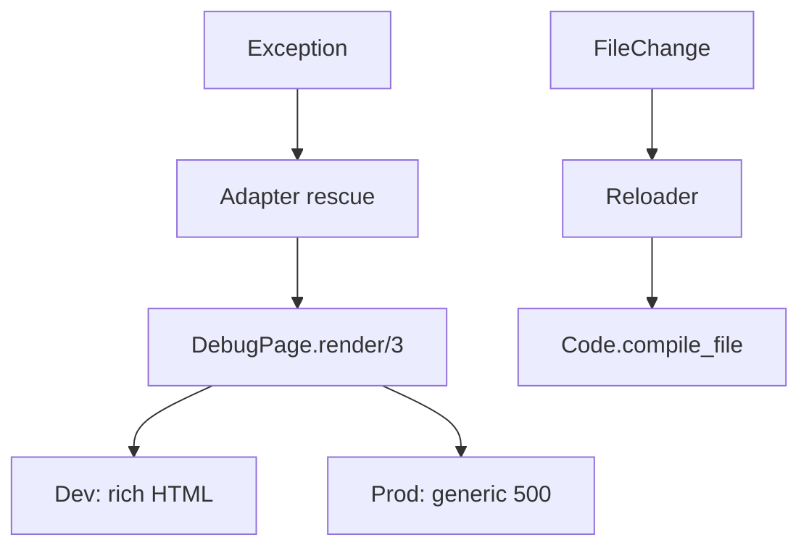

# DevTools

<!-- metadata: complexity=Moderate | files=4 | last-generated=2026-03-24 -->

[< Previous: Static Assets](./10-static-assets.md) | [Index](../00-index.json) | [Next: Sample App >](./12-sample-app.md)

---

## Purpose

Debug error page, hot code reloader, Mix tasks for route introspection and SSL cert generation.

## Key Files

| File | Purpose |
|------|---------|
| `lib/ignite/debug_page.ex` | Rich dev error page (generic in prod) |
| `lib/ignite/reloader.ex` | File watcher + `Code.compile_file/1` |
| `lib/mix/tasks/ignite.routes.ex` | `mix ignite.routes` |
| `lib/mix/tasks/ignite.gen.cert.ex` | `mix ignite.gen.cert` |

## Architecture



## Practice

```spot-the-bug
{
  "title": "Find the XSS Vulnerability",
  "language": "elixir",
  "code": "defp render_dev(exception, stacktrace, conn) do\n  message = Exception.message(exception)\n  \"<pre>#{message}</pre>\"\nend",
  "bug_lines": [3],
  "hints": ["What if the message contains user input like a URL path?"],
  "explanation": "Line 3 interpolates the message without HTML escaping. If a user visits /<script>alert(1)</script>, the script executes. Fix: html_escape(message) as the actual code does at lib/ignite/debug_page.ex:54."
}
```

> **Quiz:** Why HTML-escape exception messages?
>
> - A) Pretty output
> - B) Prevent XSS — messages may contain user-controlled input
>
> <details><summary>Show Answer</summary>**B)**</details>

---

[< Previous: Static Assets](./10-static-assets.md) | [Index](../00-index.json) | [Next: Sample App >](./12-sample-app.md)

---
