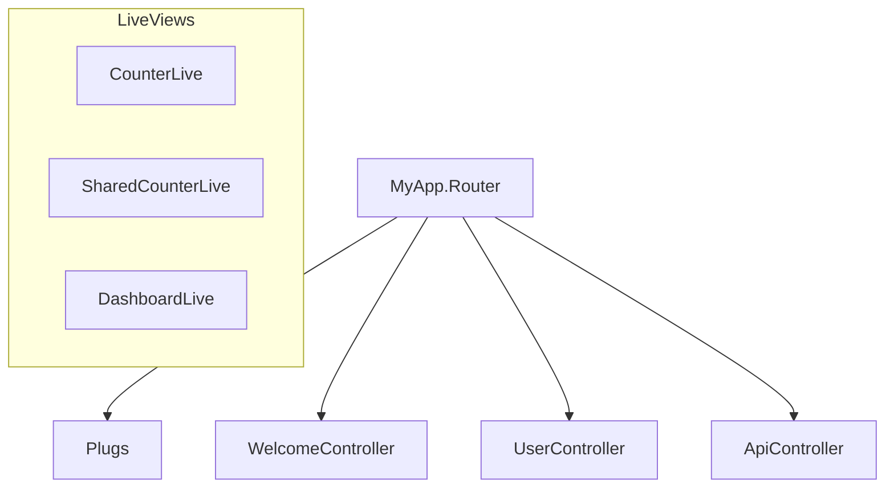

# Sample Application

<!-- metadata: complexity=Moderate | files=16 | last-generated=2026-03-24 -->

[< Previous: DevTools](./11-devtools.md) | [Index](../00-index.json) | [Next: Todo App >](./13-todo-app.md)

---

## Purpose

Demonstrates every framework feature: router with middleware, controllers, 9 LiveView demos.

## Key Files

| File | Purpose |
|------|---------|
| `lib/my_app/router.ex` | Plug pipeline + routes |
| `lib/my_app/controllers/` | Welcome, User, API, Upload controllers |
| `lib/my_app/live/` | 9 LiveView demos |

## Architecture



## Practice

```drag-match
{
  "title": "Match Route to Handler",
  "pairs": [
    {"concept": "GET /users/42", "description": "UserController.show via resources macro"},
    {"concept": "POST /api/echo", "description": "ApiController.echo under /api scope"},
    {"concept": "GET /health", "description": "ApiController.health — system status JSON"},
    {"concept": "/live/counter", "description": "CounterLive via Cowboy dispatch, NOT the router"}
  ]
}
```

> **Quiz:** If rate limiter returns 429, do CSP headers get set?
>
> - A) Yes
> - B) No — halted: true skips remaining plugs
>
> <details><summary>Show Answer</summary>**B)**</details>

---

[< Previous: DevTools](./11-devtools.md) | [Index](../00-index.json) | [Next: Todo App >](./13-todo-app.md)

---
