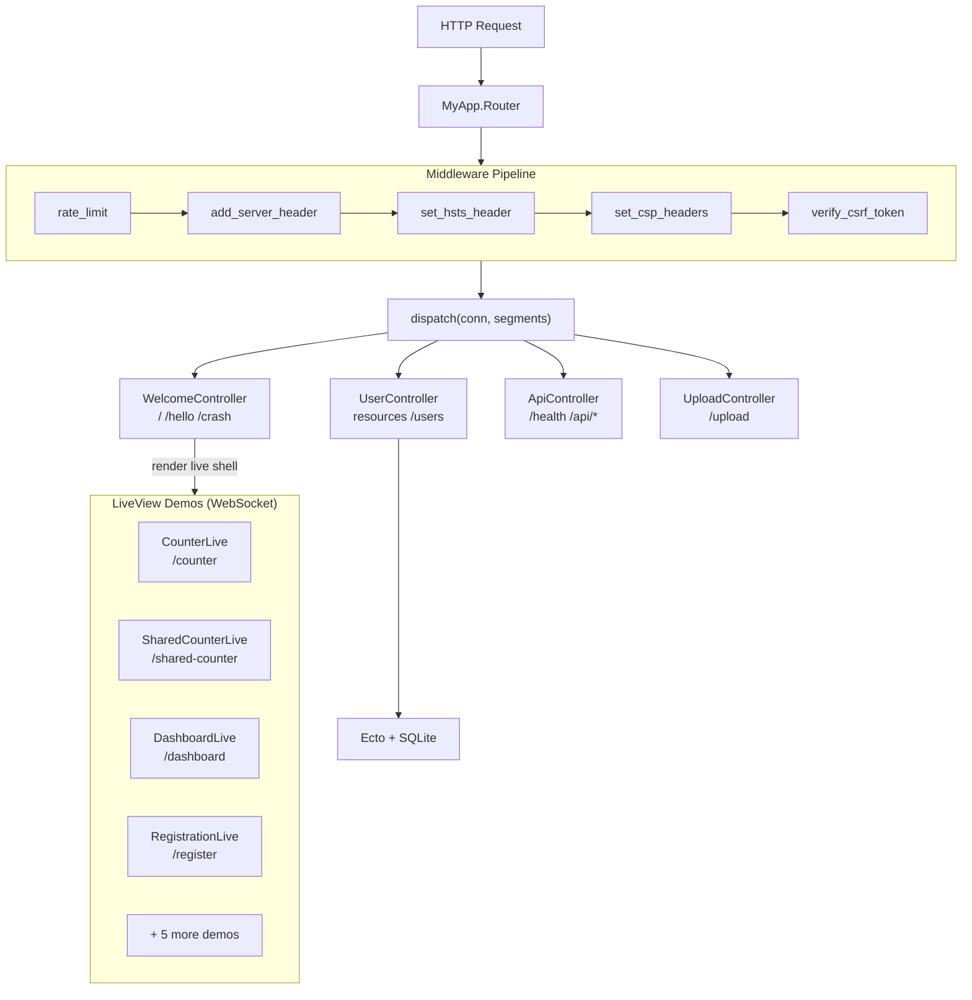

# Sample App

<!-- metadata: complexity=Moderate | files=15 | last-generated=2026-03-24 -->

[< Previous: DevTools](./11-devtools.md) | [Index](../00-index.json) | [Next: Flows ->](../flows/)

---

## Purpose

Demo application showcasing every Ignite framework feature end-to-end: a plug middleware pipeline, four controllers (welcome, users, API, uploads), nine LiveView demos (counter, shared counter, dashboard, registration, components, hooks, streams, uploads, presence), and a capstone Todo app with auth, CRUD, pagination, search, favorites, categories, and subtasks.

## Key Files

| File | Purpose |
|------|---------|
| `lib/my_app/router.ex` | Plug pipeline (rate limit, HSTS, CSP, CSRF) + all route definitions |
| `lib/my_app/controllers/welcome_controller.ex` | Homepage, LiveView shell pages, flash messages |
| `lib/my_app/controllers/api_controller.ex` | JSON endpoints: `/api/status`, `/api/echo`, `/health` |
| `lib/my_app/controllers/user_controller.ex` | Full CRUD via `resources` macro, Ecto + SQLite |
| `lib/my_app/controllers/upload_controller.ex` | Multipart file upload via HTTP POST |
| `lib/my_app/live/counter_live.ex` | Minimal LiveView: increment/decrement counter |
| `lib/my_app/live/shared_counter_live.ex` | PubSub-synced counter across tabs |
| `lib/my_app/live/dashboard_live.ex` | BEAM VM stats, auto-refresh via `Process.send_after` |
| `lib/my_app/live/registration_live.ex` | LiveView form with real-time validation |
| `lib/my_app/live/components_demo_live.ex` | LiveComponent reusable widgets |
| `lib/my_app/live/hooks_demo_live.ex` | JS Hooks client-side interop |
| `lib/my_app/live/stream_demo_live.ex` | LiveView Streams for efficient lists |
| `lib/my_app/live/upload_demo_live.ex` | Chunked file uploads over WebSocket |
| `lib/my_app/live/presence_demo_live.ex` | Presence tracking (who's online) |
| `examples/todo/live/todo_live.ex` | Capstone Todo app: auth, CRUD, pagination, search, categories, subtasks |

## Architecture



## How It Works

### Understanding the Router Configuration

**The Big Picture:** The router is a traffic cop. Every request passes through five security checkpoints (plugs), then gets dispatched to the right controller based on the URL path.

<details>
<summary>Intermediate: Plug pipeline + route macros</summary>

At `lib/my_app/router.ex:12-16`, five plugs are registered via `plug :name`. At compile time, `finalize_routes()` (line 46) generates a `call/1` function that runs each plug in order via `Enum.reduce` (see `lib/ignite/router.ex:347`). If any plug sets `halted: true` (e.g., rate limiter returns 429), remaining plugs and dispatch are skipped.

Routes use three patterns:
- **Direct routes** (lines 19-34): `get "/path", to: Module, action: :func`
- **Resource routes** (line 37): `resources "/users", MyApp.UserController` expands to GET/POST/PUT/PATCH/DELETE
- **Scoped routes** (lines 40-43): `scope "/api" do ... end` prefixes all nested paths with `/api`

</details>

<details>
<summary>Advanced: CSRF and security plugs</summary>

The CSRF plug at `lib/my_app/router.ex:94-121` has three code paths:
1. Safe methods (GET/HEAD/OPTIONS) pass through unconditionally (line 95)
2. JSON requests (content-type `application/json`) are exempt -- protected by SameSite cookies + CORS (line 102)
3. All other state-changing requests must include a `_csrf_token` form parameter that matches the session token, validated via `Ignite.CSRF.valid_token?/2` (line 109)

The `add_server_header` plug (line 58) adds `x-powered-by: Ignite` to every response. CSP generates a per-request nonce for inline script tags.

</details>

### Understanding Controllers

**The Big Picture:** Controllers are plain modules with functions that take a `conn` and return a modified `conn`. Each function is a page handler -- read the request, do some work, send a response.

<details>
<summary>Intermediate: The four controller modules</summary>

**WelcomeController** (`lib/my_app/controllers/welcome_controller.ex`): The largest controller. The `index/1` function (line 23) renders the homepage with flash messages, demo links, a create-user form with CSRF token, and a JSON echo demo. Most other functions (lines 119-193) render a LiveView shell page via `render(conn, "live", ...)`, passing a `@live_routes` JSON map (line 10) that maps HTTP paths to WebSocket paths for client-side navigation.

**UserController** (`lib/my_app/controllers/user_controller.ex`): Full CRUD backed by Ecto. `create/1` (line 36) builds an Ecto changeset, inserts via `Repo.insert/1`, and on success uses `put_flash/3` + `redirect/2` (lines 47-48). On validation failure, it flashes an error and redirects back (lines 53-55). `format_errors/1` (line 98) traverses changeset errors into a human-readable string.

**ApiController** (`lib/my_app/controllers/api_controller.ex`): Three JSON endpoints. `health/1` (line 24) returns BEAM introspection data: memory, process count, atoms, ports, schedulers, uptime.

**UploadController** (`lib/my_app/controllers/upload_controller.ex`): `upload_form/1` (line 8) renders an HTML form with `enctype="multipart/form-data"` and a CSRF token. `upload/1` (line 33) pattern-matches the file parameter against `%Ignite.Upload{}`, copies the file to `uploads/` with a timestamp-prefixed sanitized name (line 82), and renders a success page.

</details>

<details>
<summary>Advanced: LiveView shell rendering pattern</summary>

LiveView pages require an initial HTTP response containing the JavaScript client and a WebSocket connection point. The WelcomeController handles this by rendering a shared `"live"` template for each LiveView route, passing:
- `title` -- page title for the HTML head
- `live_path` -- the WebSocket path (e.g., `"/live/dashboard"`)
- `live_routes` -- a JSON-encoded map enabling client-side navigation between LiveViews without full page reloads

The `@live_routes` module attribute (line 10) is compiled once via `Jason.encode!/1`. This means the route map is a compile-time constant, not recomputed per request.

</details>

### Understanding LiveView Examples

**The Big Picture:** Three progressively complex demos. CounterLive is "hello world" for LiveView. SharedCounterLive adds cross-tab sync. DashboardLive adds server-push without user interaction.

<details>
<summary>Intermediate: How each demo works</summary>

**CounterLive** (`lib/my_app/live/counter_live.ex`): The simplest possible LiveView. `mount/2` (line 9) returns `{:ok, %{count: 0}}`. Two `handle_event/3` clauses (lines 14, 19) match `"increment"` and `"decrement"`, updating the count via map update syntax `%{assigns | count: assigns.count + 1}`. The `render/1` function (line 24) uses the `~L` sigil with `ignite-click` attributes on buttons.

**SharedCounterLive** (`lib/my_app/live/shared_counter_live.ex`): Adds PubSub. On mount (line 17), subscribes to the `"shared_counter"` topic. On click (lines 22-25), broadcasts `{:count_updated, new_count}` to all subscribers. `handle_info/2` (line 37) receives broadcasts from other tabs and updates local state.

**DashboardLive** (`lib/my_app/live/dashboard_live.ex`): No user events needed. `mount/2` (line 11) calls `Process.send_after(self(), :tick, 1000)` to schedule a message. `handle_info(:tick, ...)` (line 18) reschedules itself, creating a 1-second refresh loop. `gather_stats/0` (line 90) reads BEAM introspection: `:erlang.memory()`, `:erlang.system_info/1`, `:erlang.statistics(:wall_clock)`.

</details>

<details>
<summary>Advanced: Process model and lifecycle</summary>

Each LiveView tab runs as a separate Erlang process. CounterLive state is isolated per tab -- clicking in one tab does not affect another. SharedCounterLive breaks this isolation using PubSub: the broadcast goes through Erlang's `:pg` process groups, which means it works across nodes in a cluster without any external dependency (no Redis, no database).

DashboardLive's `Process.send_after` pattern is the idiomatic OTP way to implement periodic work. The process receives a `:tick` message, handles it (pushing new stats to the browser), and schedules the next tick. If the WebSocket disconnects, the process dies, and the timer is automatically cleaned up -- no leaked intervals.

</details>

### Understanding the Todo Capstone

**The Big Picture:** A full application combining auth, database CRUD, pagination, search, favorites, categories, and subtasks -- all in a single LiveView process. It demonstrates that Ignite can handle real-world complexity.

<details>
<summary>Intermediate: State and feature layers</summary>

The Todo app (`examples/todo/live/todo_live.ex`) organizes state into feature layers visible in `mount/2` (lines 28-73):
- **Auth** (Level 4-5): `current_user`, `auth_mode` (:login/:register), `auth_errors`
- **CRUD** (Level 0): `todos`, `new_title`, `editing_id`, `editing_title`, `confirm_delete_id`
- **Filter/Search** (Level 0, 2): `filter` (all/active/completed), `search`, `show_bookmarked`, `category_filter`
- **Pagination** (Level 1): `page`, `per_page`
- **Categories** (Level 6): `categories`, `show_category_mgmt`, CRUD fields
- **Subtasks** (Level 7): `active_todo_id`, `subtasks`, `new_subtask_title`
- **Bulk actions** (Level 0): `selected_ids` as a `MapSet`

Events follow a consistent pattern: `handle_event("register", params, assigns)` (line 86) builds a changeset, attempts `Repo.insert/1`, and on success loads categories and todos into the new user's session. Login (line 108) verifies password via `User.verify_password/2`. Logout (line 130) resets all state fields to defaults.

</details>

<details>
<summary>Advanced: Ecto integration patterns</summary>

The Todo app uses several Ecto patterns in a LiveView context:
- **Changesets for validation**: `User.registration_changeset/2` (line 88) validates username/email/password before insert
- **Associations**: Categories (one-to-one with todos) and Subtasks (one-to-many) via `import Ecto.Query` (line 19)
- **Query composition**: Filters, search, and pagination are composed as Ecto queries, allowing the database to do the heavy lifting rather than filtering in-memory

State reloading after mutations follows a pattern: mutate the database, then call `load_categories()` and `load_todos()` to refresh the assigns from the database (lines 98-99). This ensures the UI always reflects the true database state.

</details>

## Key Flows

```flow-trace
{
  "title": "Homepage Request (GET /)",
  "steps": [
    {"component": "Router", "action": "call/1 runs plug pipeline", "file": "lib/my_app/router.ex:12-16", "detail": "rate_limit → add_server_header → set_hsts_header → set_csp_headers → verify_csrf_token (pass-through for GET)"},
    {"component": "Router", "action": "Dispatch to WelcomeController.index", "file": "lib/my_app/router.ex:19", "detail": "get \"/\", to: MyApp.WelcomeController, action: :index"},
    {"component": "WelcomeController", "action": "Build flash HTML from session", "file": "lib/my_app/controllers/welcome_controller.ex:26-45", "detail": "get_flash(conn) returns flash map, renders colored divs per type"},
    {"component": "WelcomeController", "action": "Render homepage with CSRF form", "file": "lib/my_app/controllers/welcome_controller.ex:47-108", "detail": "html/2 returns inline HTML with demo links, create-user form, API echo widget"}
  ]
}
```

```flow-trace
{
  "title": "Counter LiveView Increment",
  "steps": [
    {"component": "Browser", "action": "User clicks + button", "file": "lib/my_app/live/counter_live.ex:30", "detail": "Button has ignite-click=\"increment\" attribute"},
    {"component": "ignite.js", "action": "Sends event over WebSocket", "file": "assets/ignite.js", "detail": "JSON: {\"event\": \"increment\", \"params\": {}}"},
    {"component": "CounterLive", "action": "handle_event(\"increment\", ...)", "file": "lib/my_app/live/counter_live.ex:14-15", "detail": "Returns {:noreply, %{assigns | count: assigns.count + 1}}"},
    {"component": "Engine", "action": "Diff previous vs new dynamics", "file": "lib/ignite/live_view/engine.ex:60", "detail": "Only count changed → sparse diff: {\"0\": \"1\"}"},
    {"component": "Browser", "action": "morphdom patches the text node", "file": "assets/ignite.js", "detail": "DOM update: \"0\" → \"1\" — no full page render"}
  ]
}
```

```flow-trace
{
  "title": "User Creation (POST /users)",
  "steps": [
    {"component": "Router", "action": "Run plug pipeline including CSRF check", "file": "lib/my_app/router.ex:99-120", "detail": "POST requires valid _csrf_token form param matching session token"},
    {"component": "Router", "action": "Dispatch to UserController.create", "file": "lib/my_app/router.ex:37", "detail": "resources \"/users\" expands POST /users → create/1"},
    {"component": "UserController", "action": "Build changeset and insert", "file": "lib/my_app/controllers/user_controller.ex:36-44", "detail": "User.changeset(%User{}, attrs) → Repo.insert(changeset)"},
    {"component": "UserController", "action": "Flash + redirect on success", "file": "lib/my_app/controllers/user_controller.ex:47-48", "detail": "put_flash(:info, msg) |> redirect(to: \"/\")"},
    {"component": "WelcomeController", "action": "Homepage renders flash", "file": "lib/my_app/controllers/welcome_controller.ex:26-45", "detail": "Green info banner: \"User 'alice' created!\""}
  ]
}
```

```chat
{
  "title": "Shared Counter: PubSub Broadcast",
  "participants": {
    "Tab A": {"color": "#4A90D9", "icon": "laptop"},
    "PubSub": {"color": "#50C878", "icon": "broadcast"},
    "Tab B": {"color": "#FF6B6B", "icon": "laptop"}
  },
  "messages": [
    {"from": "Tab A", "text": "User clicked +. My count is now 1.", "technical": "handle_event(\"increment\") at shared_counter_live.ex:22 → count = 0 + 1"},
    {"from": "Tab A", "text": "Broadcasting to everyone on this topic.", "technical": "Ignite.PubSub.broadcast(\"shared_counter\", {:count_updated, 1}) at line 24"},
    {"from": "PubSub", "text": "Delivering to all subscribers of \"shared_counter\".", "technical": ":pg process group sends message to all member PIDs"},
    {"from": "Tab B", "text": "Got the broadcast! Updating my count to 1.", "technical": "handle_info({:count_updated, 1}, assigns) at line 37 → {:noreply, %{assigns | count: 1}}"},
    {"from": "Tab B", "text": "Re-rendered. User sees 1 without clicking anything.", "technical": "Engine diffs dynamics, sends sparse update to Tab B's WebSocket"}
  ]
}
```

## Hot Paths

| Path | Why It Matters |
|------|---------------|
| Plug pipeline | Runs on every single request -- keep plugs fast and non-blocking |
| `@live_routes` compile-time encoding | `Jason.encode!/1` at module attribute level means zero runtime cost per request |
| DashboardLive `gather_stats/0` | Called every second -- uses only BEAM introspection (no I/O, no database) |
| PubSub broadcast fan-out | One broadcast triggers re-render in every subscribed process |

## Gotchas

- **LiveView routes are NOT in the router.** Routes like `/live/counter` are handled by the Cowboy WebSocket dispatch, not `MyApp.Router`. The router only serves the initial HTML shell page at `/counter`.
- **CSRF exemption for JSON.** The CSRF plug at `lib/my_app/router.ex:102` skips validation for `application/json` requests. This is safe because browsers enforce CORS on fetch requests, but means your JSON API relies on SameSite cookies for protection.
- **`resources` expands at compile time.** `resources "/users", MyApp.UserController` generates 7 routes. If you define a conflicting route like `get "/users/special"` after `resources`, the `resources` match for `GET /users/:id` will catch it first.
- **Upload filename sanitization.** `UploadController` strips path traversal characters (line 85) and prefixes with a timestamp, but stores files in a local `uploads/` directory. In production, use object storage.

## Practice

```drag-match
{
  "title": "Match Route to Handler",
  "pairs": [
    {"concept": "GET /", "description": "WelcomeController.index — renders homepage with flash and demo links"},
    {"concept": "GET /users/42", "description": "UserController.show — fetches user from SQLite via Ecto, renders profile template"},
    {"concept": "POST /api/echo", "description": "ApiController.echo — returns JSON echo of request body (CSRF exempt)"},
    {"concept": "GET /health", "description": "ApiController.health — BEAM introspection: memory, processes, uptime"},
    {"concept": "GET /counter", "description": "WelcomeController.counter — renders LiveView shell HTML (not the counter itself)"},
    {"concept": "POST /upload", "description": "UploadController.upload — handles multipart file, copies to uploads/ directory"}
  ]
}
```

```drag-match
{
  "title": "Match LiveView to Feature",
  "pairs": [
    {"concept": "CounterLive", "description": "Isolated per-tab state: increment/decrement with ignite-click"},
    {"concept": "SharedCounterLive", "description": "PubSub broadcast syncs count across all tabs in real time"},
    {"concept": "DashboardLive", "description": "Server-push via Process.send_after — no user interaction needed"},
    {"concept": "TodoLive", "description": "Capstone: auth, CRUD, pagination, search, categories, subtasks in one LiveView"}
  ]
}
```

```spot-the-bug
{
  "title": "Find the Missing Broadcast",
  "language": "elixir",
  "code": "def handle_event(\"increment\", _params, assigns) do\n  new_count = assigns.count + 1\n  {:noreply, %{assigns | count: new_count}}\nend",
  "bug_lines": [3],
  "hints": ["Compare with SharedCounterLive — what happens in other tabs?", "Check shared_counter_live.ex:24"],
  "explanation": "The code updates local state but never broadcasts. Other tabs will not see the change. Fix: add Ignite.PubSub.broadcast(@topic, {:count_updated, new_count}) before returning, as done at lib/my_app/live/shared_counter_live.ex:24."
}
```

```spot-the-bug
{
  "title": "Find the Changeset Pitfall",
  "language": "elixir",
  "code": "def create(conn) do\n  attrs = %{username: conn.params[\"username\"]}\n  user = Repo.insert!(%User{username: attrs.username})\n  redirect(conn, to: \"/\")\nend",
  "bug_lines": [3],
  "hints": ["What happens when username is blank or a duplicate?", "The real code at user_controller.ex:42-56 uses a changeset"],
  "explanation": "Using Repo.insert! with a raw struct skips validation and raises on constraint errors (crashing the request). Fix: build a changeset with User.changeset/2, pattern-match on {:ok, user} / {:error, changeset} as done at lib/my_app/controllers/user_controller.ex:42-56, and show validation errors via flash."
}
```

> **Quiz: Plug Pipeline Order**
>
> If the rate limiter returns a 429 response with `halted: true`, which plugs still run?
>
> - A) All five plugs run regardless
> - B) Only `rate_limit` -- the remaining four are skipped
> - C) `rate_limit` and `add_server_header` -- then it stops
>
> <details><summary>Show Answer</summary>
>
> **B)** The router's `call/1` (generated at `lib/ignite/router.ex:347`) checks `acc.halted` before each plug via `Enum.reduce`. Once `rate_limit` sets `halted: true`, the `if acc.halted, do: acc` short-circuit skips `add_server_header`, `set_hsts_header`, `set_csp_headers`, `verify_csrf_token`, and dispatch.
>
> </details>

> **Quiz: DashboardLive Refresh**
>
> What stops DashboardLive from leaking timers when the user closes the tab?
>
> - A) A cleanup function called on disconnect
> - B) The process dies, and `Process.send_after` messages to a dead PID are silently discarded
> - C) A global timer manager cancels the reference
>
> <details><summary>Show Answer</summary>
>
> **B)** When the WebSocket disconnects, the LiveView process terminates. `Process.send_after` delivers to a PID -- if that PID is dead, the message is silently dropped. No manual cleanup needed. This is the BEAM's "let it crash" philosophy in action.
>
> </details>

---

[< Previous: DevTools](./11-devtools.md) | [Index](../00-index.json) | [Next: Flows ->](../flows/)
