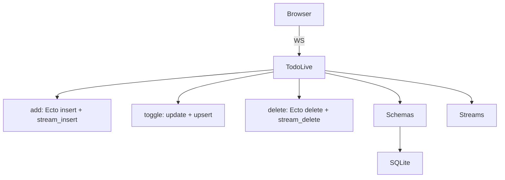

# Todo App (Capstone)

<!-- metadata: complexity=Complex | files=6 | last-generated=2026-03-24 -->

[< Previous: Sample App](./12-sample-app.md) | [Index](../00-index.json)

---

## Purpose

Capstone integrating Ecto, LiveView, `~F` templates, streams, PubSub, full CRUD.

## Key Files

| File | Purpose |
|------|---------|
| `examples/todo/live/todo_live.ex` | Main LiveView |
| `examples/todo/schemas/todo_item.ex` | TodoItem schema |
| `examples/todo/schemas/category.ex` | Category schema |
| `examples/todo/schemas/subtask.ex` | Subtask schema |

## Architecture



```chat
{
  "title": "Todo App Full Stack",
  "participants": {
    "User": {"color": "#4A90D9", "icon": "laptop"},
    "TodoLive": {"color": "#50C878", "icon": "server"},
    "Ecto": {"color": "#FF6B6B", "icon": "database"},
    "Stream": {"color": "#FFB347", "icon": "list"}
  },
  "messages": [
    {"from": "User", "text": "Add todo: 'Learn LiveView'", "technical": "ignite-submit → {event: \"add\", params: {title: \"Learn LiveView\"}}"},
    {"from": "TodoLive", "text": "Validating and saving.", "technical": "TodoItem.changeset |> Repo.insert!()"},
    {"from": "Ecto", "text": "Saved with id=5!", "technical": "INSERT INTO todo_items (title, completed) VALUES (...)"},
    {"from": "Stream", "text": "Rendering just this one item.", "technical": "stream_insert → {inserts: [{id: \"todos-5\", html: \"<div>...\"}]}"},
    {"from": "User", "text": "Appeared instantly! Nothing else re-rendered.", "technical": "applyStreamOps: appendChild — no morphdom, no full re-render"}
  ]
}
```

## Practice

```drag-match
{
  "title": "Match Todo Operations",
  "pairs": [
    {"concept": "stream_insert (existing ID)", "description": "Upsert — morphdom patches the existing element"},
    {"concept": "stream with reset: true", "description": "Clears all items before inserting filtered results"},
    {"concept": "stream_delete", "description": "Removes element by DOM ID"},
    {"concept": "Repo.insert!(changeset)", "description": "Persists validated data to SQLite"}
  ]
}
```

> **Quiz:** 100 items, one toggled. With vs without streams?
>
> - A) No difference
> - B) Full re-render sends 100 items; streams send only the toggled one
>
> <details><summary>Show Answer</summary>**B)**</details>

---

[< Previous: Sample App](./12-sample-app.md) | [Index](../00-index.json)

---
